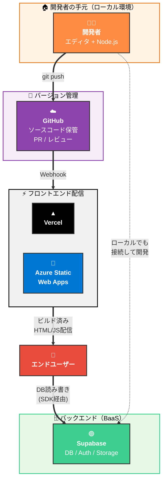
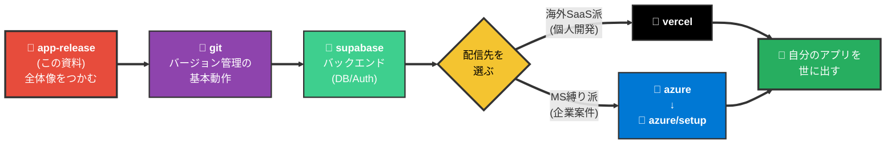
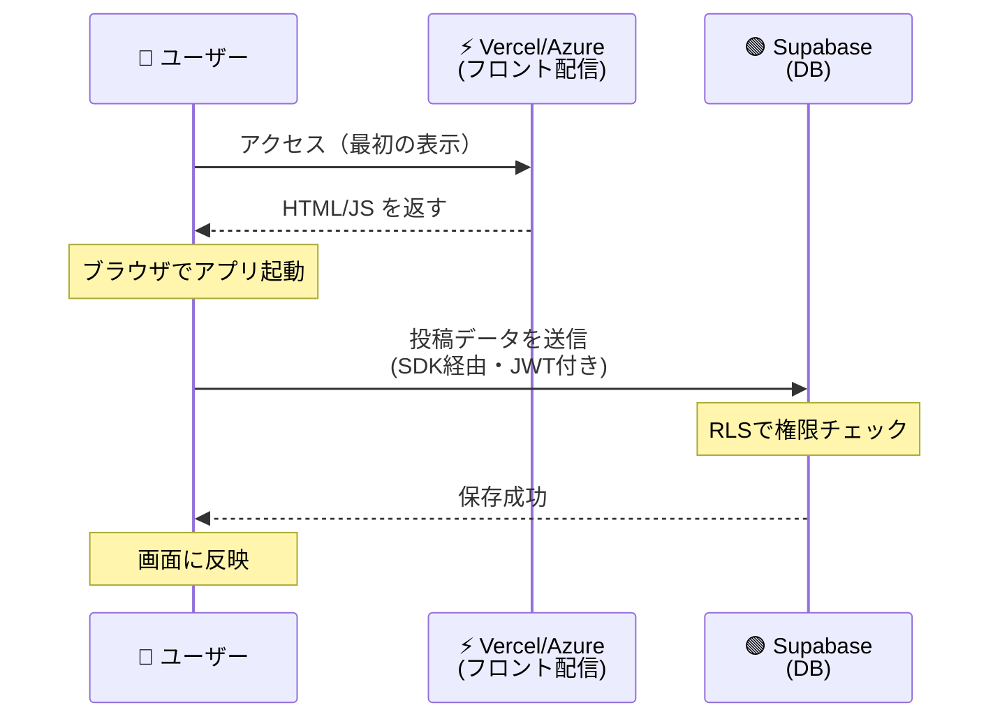
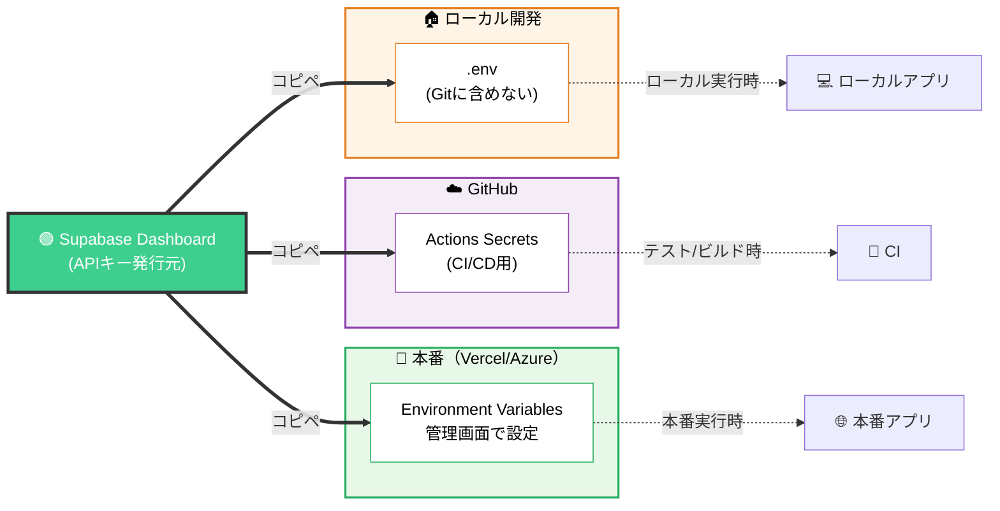
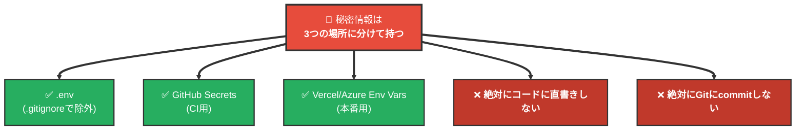
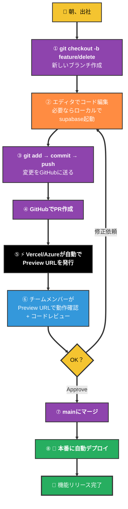
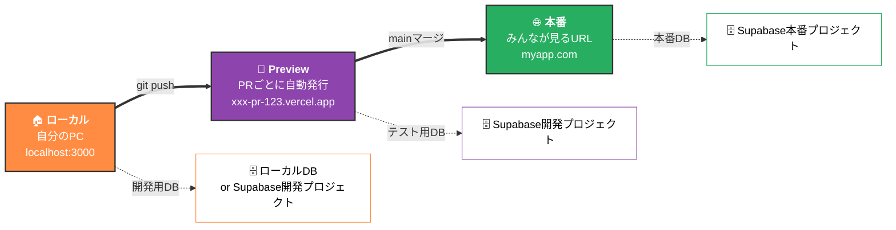
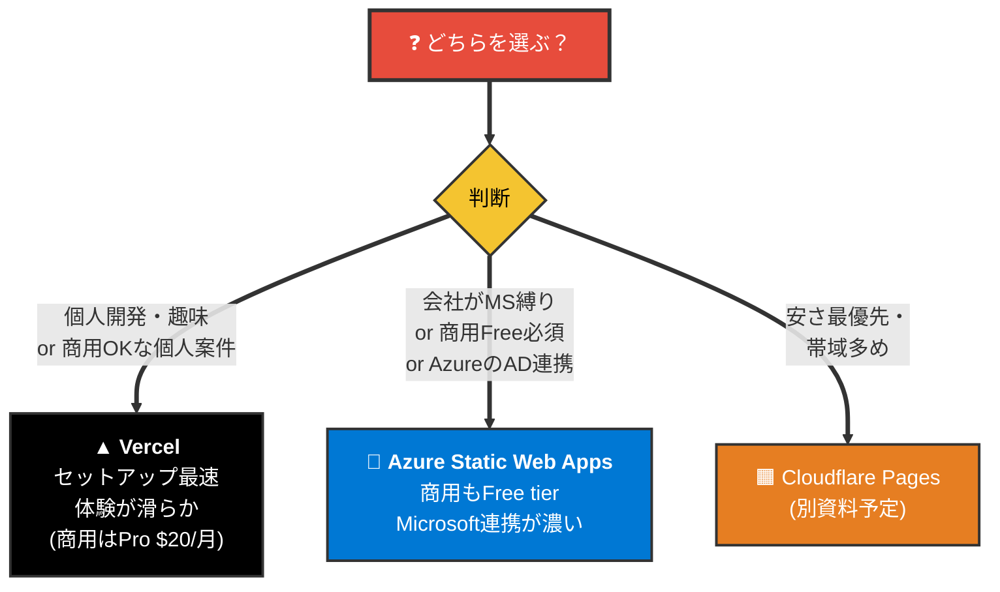
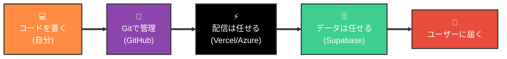

# アプリリリース全体像

> 📝 「Webアプリを作って世に出す」までに登場する**全部の登場人物**と、それらが**どう繋がっているか**を1枚で見渡すための資料。各サービスの詳細は個別資料に任せ、ここでは **「結局、何と何を組み合わせれば1個のアプリが世に出せるのか」** の地図を提供する。

---

## 1. 全体像 — 登場人物マップ

> 📝 **Vercel と Azure Static Web Apps は二者択一**。どちらか1つを選ぶ（両方同時には使わない）。配信先以外の登場人物（ローカル / GitHub / Supabase）は共通。

---

## 2. 推奨学習順

各資料をどの順で読めば理解が積み上がるかの地図。

> 📝 Git → Supabase → 配信先 の順で読むと、「ローカルで動くものをどう外の世界に出すか」が段階的に理解できる。Vercel と Azure は**どちらか片方だけでOK**。

---

## 3. 役割マップ — 誰が何を担当するか

「自分でやらないこと」を把握するのが大事。**サービスに任せる部分**と**自分で書く部分**の境界線を見る。

| 仕事 | 担当 | 自分で書くか |
| ---- | ---- | ----------- |
| アプリのソースコード | 自分 | ✅ |
| バージョン管理 | **Git/GitHub** | ❌（コマンドだけ覚える）|
| DBの構築・運用 | **Supabase** | ❌（テーブル設計だけ）|
| ユーザー認証（ログイン機能） | **Supabase Auth** | ❌（呼び出すだけ）|
| ファイル保管（画像など） | **Supabase Storage** | ❌（呼び出すだけ）|
| ビルド（ソース→公開用変換） | **Vercel / Azure** | ❌ |
| HTTPS化・SSL証明書 | **Vercel / Azure** | ❌（自動）|
| 世界中への配信（CDN） | **Vercel / Azure** | ❌（自動）|
| PR毎の検証環境 | **Vercel / Azure** | ❌（自動）|
| 本番への反映 | **Vercel / Azure** | ❌（mainマージで自動）|
| アプリのUI/UXを考える | 自分 | ✅ |
| データの構造を設計する | 自分 | ✅ |

> 📝 **「自分で書くのはコード本体とDB設計だけ」**。それ以外のインフラ仕事はサービスが肩代わりしてくれる、というのが現代のアプリ開発スタイル。

---

## 4. データの流れ — ユーザー操作からDB保存まで

例: ユーザーが「投稿ボタン」を押した時に何が起きるか。

ポイント:

- 最初の **HTML/JSの配信**は Vercel/Azure から
- それ以降の **データ通信**は ユーザーのブラウザ ↔ Supabase が直接やり取り
- **Vercel/Azureは中継しない**（フロント配信専門）

> 📝 つまりVercel/Azureが落ちてもDBは生きている、Supabaseが落ちても画面は表示できる、と**障害ドメインが分かれている**。これは利点でもあり、トラブルシュート時に「どっち側の問題か」を見分ける勘所でもある。

---

## 5. 環境変数の流れ — 秘密情報の旅

APIキーやDB接続先などの**秘密情報がどこから来てどこで使われるか**。3つの場所に同じ値を入れることになる。

### 鉄則

> 🚨 一度Gitにcommitした秘密情報は、**過去のコミット履歴に永遠に残る**。即座にSupabaseダッシュボードで再発行 → 古いキーは無効化、が正しい対処。詳細は [git.md](../02_git/git.md) §8、[supabase.md](../03_supabase/supabase.md) §12 参照。

---

## 6. 開発からリリースまで — 1日の作業フロー

「あるユーザーが投稿削除機能を追加する」という典型シナリオを通して、各サービスがどのタイミングで登場するかを見る。

> 📝 ⑤と⑨は**人間が何もしなくても勝手に起きる**。これが「現代のCI/CD」の正体。詳細は [git.md](../02_git/git.md) §4・[vercel.md](../04a_vercel/vercel.md) §5・[azure/azure.md](../04b_azure/azure.md) で。

---

## 7. ローカル / Preview / 本番 — 3つの環境

開発中に意識する「**3つの場所**」。それぞれ役割が違う。

| 環境 | 誰が触る | DBは | 壊れたら | 環境変数の置き場 |
| ---- | -------- | ---- | -------- | --------------- |
| ローカル | 自分だけ | ローカルDB or 開発用Supabase | 自分のPCを直すだけ | `.env` |
| Preview | レビュアー / QA | 開発用Supabase | 該当PRを直す | Vercel/Azure管理画面 |
| 本番 | エンドユーザー | 本番Supabase | 即ロールバック → 修正PR | Vercel/Azure管理画面 |

> 🚨 **本番DBを開発で触らない**こと。PreviewやローカルからはSupabaseの**別プロジェクト**を見るように環境変数で切り替える。「Previewで誤って本番DBを破壊」は最悪のシナリオ。

---

## 8. 配信先の選び方 — Vercel か Azure か

最初に「どっちで配信するか」を決める必要がある。判断軸は3つ。

| 観点 | Vercel | Azure Static Web Apps |
| --- | --- | --- |
| セットアップの楽さ | ⭐⭐⭐ | ⭐⭐ |
| 体感の速さ・UI | ⭐⭐⭐ | ⭐⭐ |
| Free tierでの商用利用 | ❌ Pro必須 | ✅ OK |
| 大企業案件との親和性 | △ | ⭐⭐⭐ |
| ドキュメント量 | ⭐⭐⭐ | ⭐⭐ |
| Next.jsとの相性 | ⭐⭐⭐（本家） | ⭐⭐ |

> 📝 迷ったら **個人で試すならVercel、仕事ならAzure** くらいの大雑把な分け方でOK。アプリの中身（コード）は両者で**ほぼ書き換え不要**なので、後から乗り換えも比較的容易。

---

## 9. 困ったらどこを見る？

トラブル種別 → どの資料の何節を読むか の早見表。

| 症状 | 見る資料 |
| ---- | -------- |
| Gitの操作で混乱 | [git.md](../02_git/git.md) §1（全体像）/ §7（やらかし時） |
| commitしてはいけないものをcommitした | [git.md](../02_git/git.md) §8 |
| RLSが効いてデータが取れない | [supabase.md](../03_supabase/supabase.md) §5・§13 |
| ログイン状態がアプリで取れない | [supabase.md](../03_supabase/supabase.md) §6 |
| usernameをどこに保存する？ | [supabase.md](../03_supabase/supabase.md) §7 |
| Vercelでビルド失敗 | [vercel.md](../04a_vercel/vercel.md) §11 |
| 本番でバグ→急いで戻したい | [vercel.md](../04a_vercel/vercel.md) §10（ロールバック）|
| 環境変数の設定が分からない | [vercel.md](../04a_vercel/vercel.md) §7 / [git.md](../02_git/git.md) §8 |
| Azureでサインアップから始めたい | [azure/setup.md](../04b_azure/setup.md) |
| Azureサービスの選び方 | [azure/azure.md](../04b_azure/azure.md) |

---

## 10. まとめ — 全体像の覚え方

**現代のアプリ開発は「自分で全部やる」のではなく、「コード以外は外部サービスに任せる」スタイル**。各サービスの境界線を理解すれば、トラブルが起きた時にも「どこを見ればいいか」が即座に分かる。

> 📝 全部を完璧に理解しなくても、**「自分で書くのはコード本体だけ。インフラはサービスがやってくれる」**という大枠さえ掴めれば、まずはアプリを世に出せる。詳細は走りながら学べばOK。
