# Git 全体像

> 📝 本資料の`main`ブランチは、古い呼称では`master`と同じものです。以降`main（master）`と表記します。

> 📝 **これは「読む」資料。** コマンドを暗記する必要はない。**どの言葉が何を指しているか**が分かれば十分。実際に手を動かす順番は [setup.md](setup.md) にある。

> 📝 **知らない言葉が出てきたら** → 巻末の **§11 用語集** に、読み方とひとこと説明をまとめてある。

---

## 0. そもそも Git とは何か

### ひとことで言うと「セーブポイントを自分で作れる仕組み」

ゲームでボスに挑む前にセーブするのと同じことを、**ファイルに対してやる道具**。

資料を直すたびにコピーを取って、フォルダがこうなった経験はないだろうか。

```text
企画書.docx
企画書_v2.docx
企画書_最終版.docx
企画書_最終版_v3.docx
企画書_最終版_v3_修正後.docx   ← 結局どれが最新？
```

Gitを使うと、**ファイルは `企画書.docx` の1つだけ**のまま、過去の状態はすべて履歴として別に残る。この「コピーを並べて版を残す」をきちんと仕組みにしたものがGitだと思えばいい。

| Gitがないと | Gitがあると |
| --- | --- |
| 壊したら手作業で戻す（戻せないことも多い） | コマンド1つで壊す前に戻る |
| ファイル名に `_v2` `_最終` を付けて管理 | **ファイルは1つ**。履歴だけが別に積まれる |
| 誰がどこを変えたか分からない | 1行ごとに「いつ・誰が・なぜ」を追える |
| 同じファイルを2人で触ると上書き事故 | Gitが差分を見て**自動で合体**させる |

---

### Git と GitHub は別物（ここが最初の関門）

名前が似ているだけで、**まったく別のもの**。

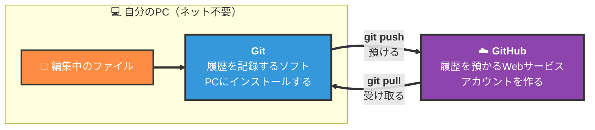

| | **Git** | **GitHub** |
| --- | --- | --- |
| 正体 | 自分のPCで動く**ソフト** | **Webサービス**（運営会社の名前でもある） |
| 役割 | 変更を**記録する・戻す** | 記録を**預ける・共有する** |
| ネット接続 | **要らない**（オフラインで完結） | 必要 |
| 他の選択肢 | 実質これ一択（業界標準） | GitLab / Bitbucket / Azure Repos など |
| 無いとどうなる | 履歴が取れない | **1人で作るぶんには困らない** |

> 📝 **先に Git だけ覚えればいい。** GitHub は「人に見せる / 別のPCから触る / PCが壊れても残す」が必要になってから。[setup.md](setup.md) もその順番（Part 1 = Git、Part 2 = GitHub）で組んである。

---

### この先ずっと出てくる3語

これだけ先に入れておくと、以降の図が読める。

| 用語 | 読み | ひとことで言うと |
| --- | --- | --- |
| **リポジトリ** | repository（リポジトリ） | 履歴が入った箱。**ふつうはプロジェクトのフォルダ1個**がリポジトリ1個 |
| **コミット** | commit（コミット） | **セーブポイント1個**。「この状態を記録する」操作、またはその記録そのもの |
| **ブランチ** | branch（ブランチ） | 作業用の**枝分かれ**。本体を壊さずに別の作業を進める仕組み |

> 📝 **「リポジトリ」は略して「リポ」とも言う。** GitHubの画面では repository と表記される。

---

## 1. 全体の流れ

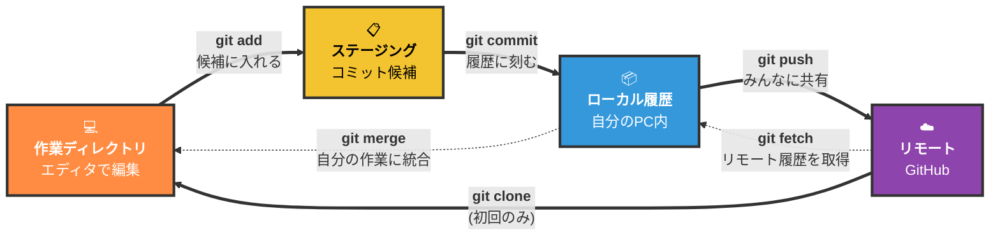

左から右が基本の流れ。commitまでは自分のPCだけ。pushしてはじめて共有される。

### 4つの場所 — それぞれ何が置いてある？

図の4つの箱は「**ファイルの状態の置き場**」。同じファイルが、進み具合によって違う場所にいる。

| # | 図の名前 | 正式な呼び名 | そこにあるもの | たとえると |
| --- | --- | --- | --- | --- |
| 1 | 作業ディレクトリ | Working Directory | **いま編集しているファイルそのもの**。保存した時点ではここ | 机の上 |
| 2 | ステージング | Staging Area / Index | 次のコミットに**入れると決めた**変更 | 封筒に入れた書類 |
| 3 | ローカル履歴 | Local Repository | **確定した履歴**。自分のPCの中だけ | 自分の引き出しの台帳 |
| 4 | リモート | Remote Repository | **チーム共有の履歴**。GitHub上 | 全員が見る棚 |

> 📝 **「ディレクトリ」＝「フォルダ」。** 同じものの呼び方違い。開発の文脈ではディレクトリと言うことが多い。

> 📝 **ステージングは `index`（インデックス）とも呼ばれる。** Gitのメッセージに `index` と出てきたら「ステージングのことか」と読み替える。同じものに名前が2つある、というだけ。

---

### なぜ `add` と `commit` の2段階なのか

初学者が一番「面倒」と感じるところ。理由は **コミットの中身を選べるようにするため**。

実際の作業では1回で5ファイルも10ファイルも触る。でも履歴としては「ログイン機能を追加した」「誤字を直した」のように**意味ごとに分けて残したい**。

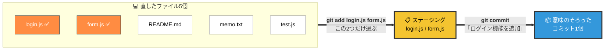

`add` は「**これとこれを、次のコミットに入れる**」という**選択**。`commit` は「**選んだものを履歴に確定する**」。

> 📝 **最初は `git add .` で全部まとめて入れてよい。** `.`（ドット）は「いまいるフォルダ以下ぜんぶ」の意味。2段階のありがたみは、コミットを分けたくなったときに分かる。

---

### コマンドの英単語を知っておくと、覚える量が減る

Gitのコマンド名は**ふつうの英単語**。意味を知れば暗記はほぼ不要。

| コマンド | 英単語の意味 | Gitでの動作 |
| --- | --- | --- |
| `git add` | 加える | コミット候補（ステージング）に入れる |
| `git commit` | 確定する・約束する | 履歴に刻む |
| `git push` | 押し出す | ローカルの履歴をリモートへ送る |
| `git pull` | 引っぱる | リモートの最新を取り込む |
| `git fetch` | 取ってくる | リモートの履歴だけ取得（**作業中のファイルは変わらない**） |
| `git merge` | 合流させる | 別の履歴を自分の作業に統合する |
| `git clone` | 複製する | リモートを丸ごと手元にコピー（**最初の1回だけ**） |
| `git status` | 状態 | いま何がどの場所にいるかを表示 |
| `git diff` | 差分 | 変更の中身（どの行がどう変わったか） |
| `git log` | 記録 | コミットの履歴一覧 |

> 📝 **`git pull` = `git fetch` + `git merge` のショートカット**
> 普段使うのは `git pull` ひとつでOK。「リモートから最新を取ってきて自分の作業に統合する」動作を一発でやってくれる。

---

### コマンドの読み方 — どこが「自分で決める部分」か

初学者が一番つまずくのは「このコマンドの**どこを自分の名前に書き換えるのか**」。例として：

```text
git commit -m "ログイン画面を追加"
```

| 部分 | 正体 |
| --- | --- |
| `git` | 呼び出す道具の名前。Gitのコマンドは**必ず**ここから始まる |
| `commit` | **サブコマンド**。「何をするか」 |
| `-m` | **オプション**。`-` で始まるのが目印。`-m` は `message` の m |
| `"ログイン画面を追加"` | **自分で決める値**（コミットメッセージ） |

よく出てくるオプションは、元の単語で覚えると楽。

| オプション | 元の単語 | 意味 |
| --- | --- | --- |
| `-m` | message | メッセージを付ける |
| `-b` | branch | ブランチを作る（`git checkout -b`） |
| `-c` | create | 作る（`git switch -c`） |
| `-d` | delete | 削除する（`git branch -d`） |
| `--oneline` | — | 1行ずつ簡潔に表示（`git log --oneline`） |

> 📝 **`-` 1つは頭文字、`--` 2つは単語そのまま**、という慣習がある。`-m` と `--message` は同じ意味。

そのうえで、**書き換える文字列**と**決まっている文字列**の区別。

| 文字列 | どっち | 説明 |
| --- | --- | --- |
| `feature/login` | **自分で決める** | ブランチ名。`/` で分類するのは**慣習だけ**で、Gitのルールではない |
| `"ログイン画面を追加"` | **自分で決める** | コミットメッセージ |
| `origin` | 決まっている（慣習） | `clone` してきたリモートに**自動で付く名前**。実質「GitHub上の自分のリポジトリ」 |
| `main` | ほぼ決まっている | 既定のブランチ名（→ §10） |
| `HEAD` | **決まっている** | 「いま自分がいるコミット」を指すGitの予約語（→ §7） |

---

## 2. よくある勘違い

Gitで最初につまずくのは、だいたいこの2つ。どちらも「**どこまで進んだか**」の思い違い。

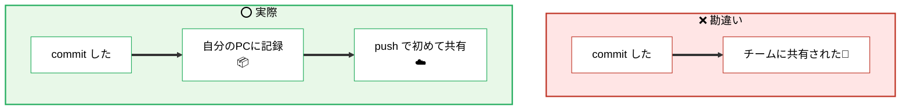

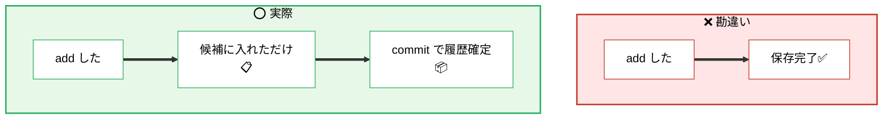

**覚え方**: `add` は「封筒に入れた」、`commit` は「引き出しにしまった」、`push` は「棚に出した」。**棚に出すまで、誰にも見えない。**

---

## 3. ブランチとマージ

> 📝 **ブランチ**（branch＝木の枝）とは: 履歴を枝分かれさせて、**`main` を触らずに作業する**ための仕組み。
> 文書作業でいえば「`企画書.docx` を `企画書_コピー.docx` にして、そっちを書き換える」に近い。違うのは、**書き終わったあとに元のファイルへきれいに取り込める**こと。その取り込みが **merge（マージ＝合流）**。

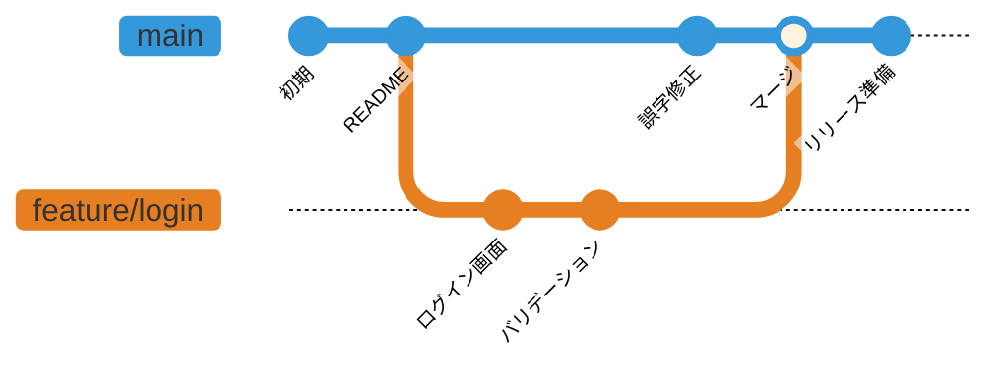

main（master）に影響を与えずに作業するため、機能ごとに枝分かれ（ブランチ）を作る。完成したらmain（master）に合流させる（merge）。

> 📝 **上の図（gitGraph）の読み方**
> - **丸ひとつ = コミット1個**
> - **左から右が時間の流れ**
> - **横に分かれた線がブランチ**（上が `main`、下が `feature/login`）
> - **線が合流している点が merge**
>
> つまりこの図は「`README` まで作ったあと `feature/login` に分かれて2回作業し、その間 `main` 側では誤字修正が入り、最後に合流した」と読む。

### 実際のコマンド順序

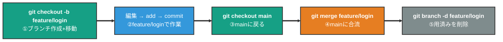

> 📝 §1で見せた「全体の流れ」は4つの**場所**をまたぐコマンド。こちらは`Local Repository`の**内部**でのブランチ操作。

### `checkout` と `switch` — どっちを使う？

2019年の Git 2.23 から、**ブランチの移動は `git switch`**、**ファイルを戻すのは `git restore`** という専用コマンドが用意された。`git checkout` は昔から**その両方**ができるため、混乱の元になっていた。

| やりたいこと | 新しい書き方 | 昔からの書き方 |
| --- | --- | --- |
| ブランチを作って移動 | `git switch -c feature/login` | `git checkout -b feature/login` |
| ブランチを移動 | `git switch main` | `git checkout main` |
| ファイルの変更を破棄 | `git restore ファイル名` | `git checkout -- ファイル名` |

**どちらでも動く。** ネット上の資料は `checkout` が圧倒的に多いので、**読めるようにしておいて、書くときは `switch` / `restore`** が今のおすすめ。

---

## 4. Pull Request フロー

> 📝 **Pull Request（PR、プルリク）とは**: 「このブランチの変更を `main` に入れていいですか？」という**申請書**。**Gitのコマンドではなく、GitHubの画面上で作る**。差分が一覧で見え、行ごとにコメントが書け、承認が記録される。
>
> 名前が「pull（引っぱる）request（お願い）」なのは、**「自分のブランチをそちらに引っぱって取り込んでください」**というお願いだから。GitLab では **Merge Request（MR）** と呼ぶ。同じもの。

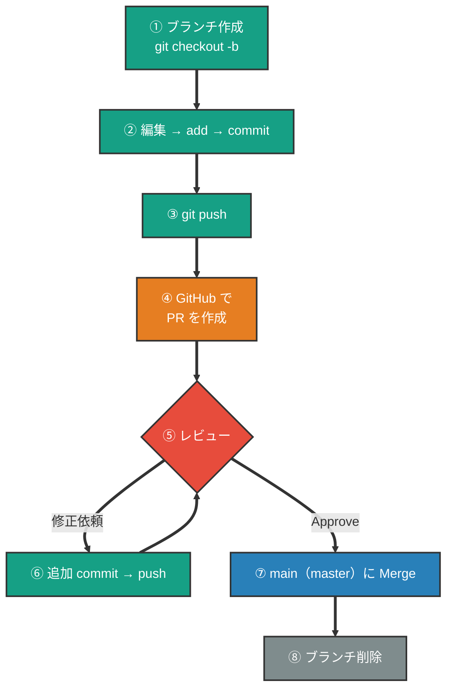

main（master）に直接commitしない。必ずブランチ→PR→レビュー→mergeの流れ。

### PR まわりの用語

| 用語 | 読み | 意味 |
| --- | --- | --- |
| **レビュー** | review | 他の人が差分を読んでコメントする工程 |
| **Approve** | アプルーブ | 「入れてOK」の承認。これが揃わないとMergeできない設定が一般的 |
| **Request changes** | — | 「直してから出し直して」の差し戻し |
| **Merge** | マージ | `main` に実際に取り込む操作。GitHubの緑のボタン |
| **origin** | オリジン | `clone` 元のリモートに付く既定の名前。実質「GitHub上のこのリポジトリ」 |
| **fork** | フォーク | 他人のリポジトリを**自分のアカウントに丸ごとコピー**するGitHubの機能。書き込み権限がない相手にPRを送るときに使う |
| **Branch protection** | — | 「`main` への直接pushを禁止」などをGitHub側で強制する設定 |

> 📝 **`clone` と `fork` の違い**: `clone` は **GitHub → 自分のPC**（手元にコピー）。`fork` は **GitHub → GitHub**（自分のアカウントにコピー）。方向が違う。

---

## 5. 迷ったら叩くコマンド

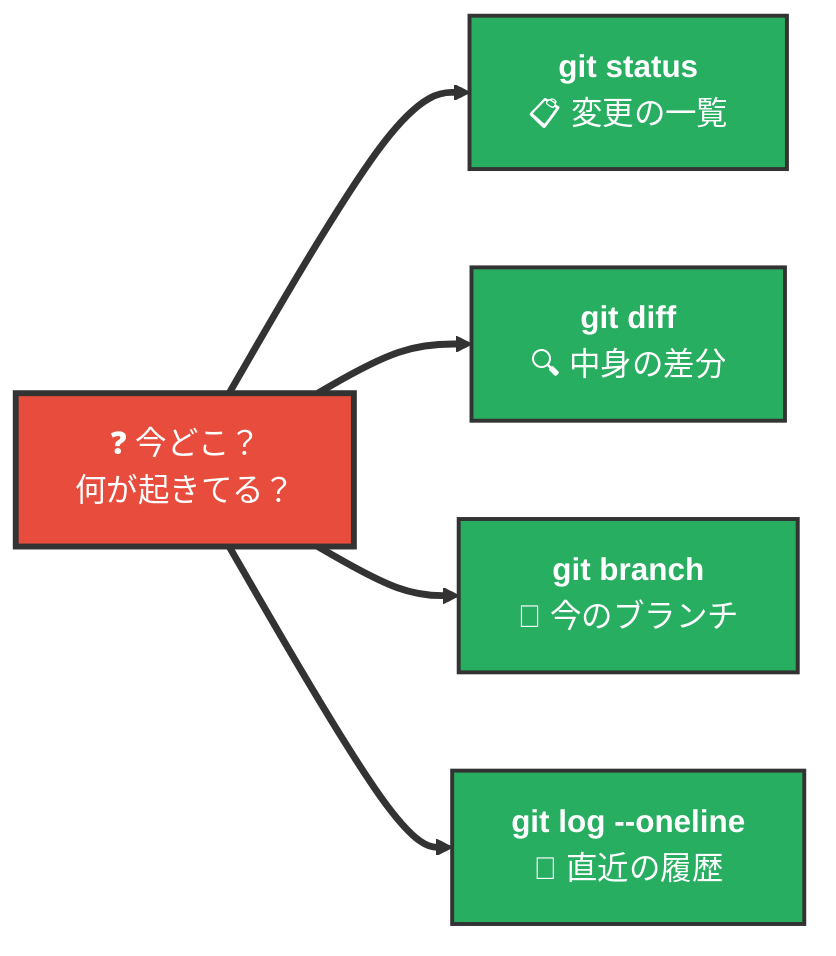

---

### `git status` の読み方 — これが読めれば7割わかる

いちばん使うコマンド。実際の出力はこうなる。

```text
$ git status
On branch main
Changes to be committed:
  (use "git restore --staged <file>..." to unstage)
        modified:   README.md

Changes not staged for commit:
  (use "git add <file>..." to update what will be committed)
  (use "git restore <file>..." to discard changes in working directory)
        modified:   main.py

Untracked files:
  (use "git add <file>..." to include in what will be committed)
        .env
```

英語で怖く見えるが、**言っているのは3つだけ**。しかも §1 の4つの場所と対応している。

| 英語の見出し | 日本語 | どの場所の話か | 次にやること |
| --- | --- | --- | --- |
| `Changes to be committed` | コミットされる予定の変更 | **ステージング**（add済み） | `commit` すれば確定 |
| `Changes not staged for commit` | まだ add していない変更 | **作業ディレクトリ** | `add` すればステージへ |
| `Untracked files` | Gitがまだ知らないファイル | **作業ディレクトリ**（新規作成） | `add` するか `.gitignore` へ（→ §8） |

> 📝 **1行目の `On branch main` は「いま `main` にいる」。** 最初の1行で現在地が分かる。

> 📝 **括弧の中は Git からの提案。** `(use "git add <file>..." ...)` は「次はこれを打つといいよ」という親切で、**エラーではない。**

短縮表示 `git status -s`（または `--short`）も覚えておくと速い。

```text
$ git status -s
M  README.md
 M main.py
?? .env
```

記号は**2文字**で、**1文字目がステージング、2文字目が作業ディレクトリ**の状態を表す。

| 記号 | 意味 |
| --- | --- |
| `M ` | ステージ済みの変更（add した） |
| ` M` | 未ステージの変更（まだ add していない） |
| `MM` | add したあと、さらに編集した |
| `A ` | 新規ファイルをステージした |
| `??` | 未追跡ファイル（Gitが知らない） |
| `UU` | 両方が変更＝**コンフリクト**（→ §6） |

---

### `git diff` の読み方

**どの行がどう変わったか**を見る。

```text
$ git diff
diff --git a/main.py b/main.py
index 11b15b1..3ef823c 100644
--- a/main.py
+++ b/main.py
@@ -1 +1,2 @@
 print("hello")
+print("world")
```

| 行 | 意味 |
| --- | --- |
| `--- a/main.py` | **変更前**のファイル |
| `+++ b/main.py` | **変更後**のファイル |
| `@@ -1 +1,2 @@` | 位置情報。「変更前は1行目から1行」「変更後は1行目から2行」 |
| 先頭が半角スペース | 変わっていない行（前後の文脈として表示される） |
| 先頭が `+` | **追加された行** |
| 先頭が `-` | **削除された行** |

> 📝 **`git diff` だけでは「まだ add していない変更」しか出ない。** add 済みの分も見たいときは `git diff --staged`。

> 📝 **`index 11b15b1..3ef823c` は中身の管理用ID。読まなくてよい。**

---

### `git log --oneline` の読み方

```text
$ git log --oneline
42c62e9 main.py と README を追加
61683cb 最初のコミット
```

**上が新しい**。左の `42c62e9` が**コミットID**（ハッシュ）＝コミット1個に付く固有の番号。

> 📝 **コミットIDは本当は40文字**ある長い文字列で、先頭7文字くらいに短縮して表示されている。`git revert 42c62e9` のように**短縮形のまま指定できる**（→ §7）。

---

## 6. コンフリクト（衝突）の解決

2人が**同じファイルの同じ行**を別々に変えると、Gitは「どっちを残すか決めて」と聞いてくる。これがコンフリクト。

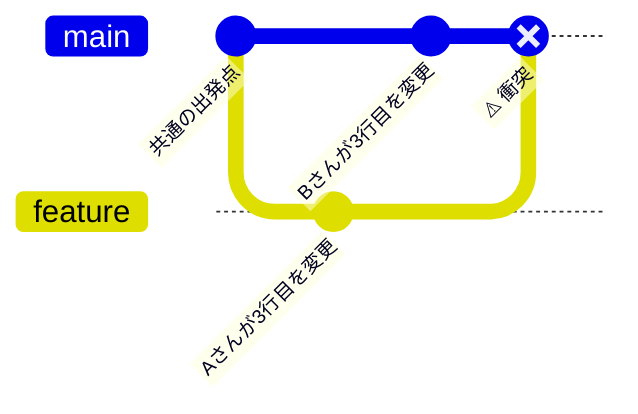

この状態で `git merge` を実行すると、ターミナルにこう出る。

```text
$ git merge feature
Auto-merging price.md
CONFLICT (content): Merge conflict in price.md
Automatic merge failed; fix conflicts and then commit the result.
```

> 📝 **`CONFLICT` は失敗ではなく「お伺い」。** 最後の行は「衝突を直してからコミットしてね」と言っているだけ。

そして**衝突したファイルの中身が、こう書き換わる**。これが**マーカー**。

```text
# 商品一覧

<<<<<<< HEAD
価格: 900円（Bさんが変更）
=======
価格: 1200円（Aさんが変更）
>>>>>>> feature
```

| マーカー | 意味 |
| --- | --- |
| `<<<<<<< HEAD` | ここから下が**いま自分がいる側**（この例では `main`）の内容 |
| `=======` | 区切り線。**上と下に2つの案が並んでいる** |
| `>>>>>>> feature` | ここまでが**取り込もうとしている側**（`feature`）の内容 |

> 📝 **`HEAD` は「いま自分がいる場所」。** `main` にいて `feature` を merge しているので、`HEAD` 側 = `main` 側の変更になる（`HEAD` の詳細は §7）。

**解決の3ステップ:**

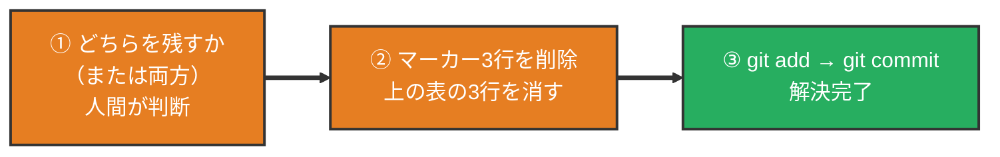

コンフリクトはエラーではなく、**人間に判断を求めているだけ**。怖くない。

> 📝 **「いったん無かったことにしたい」とき**: `git merge --abort` で **merge を始める前の状態に戻る**。マーカーも消える。落ち着いてから再挑戦すればいい。

> 📝 **どのファイルが衝突しているか分からなくなったら `git status`。** `Unmerged paths` / `both modified:` の欄に出る（短縮表示では `UU`）。

---

## 7. やらかした時の戻し方

「どこまで進んだか」で使うコマンドが変わる。

> 📝 **先に `HEAD`（ヘッド）だけ説明しておく。** `HEAD` は「**いま自分がいるコミット**」を指すGitの予約語。カセットテープの再生ヘッドのように「**現在位置を指している矢印**」だと思えばいい。
> - `HEAD` = いまのコミット
> - `HEAD^` = その**1つ前**
> - `HEAD~2` = **2つ前**

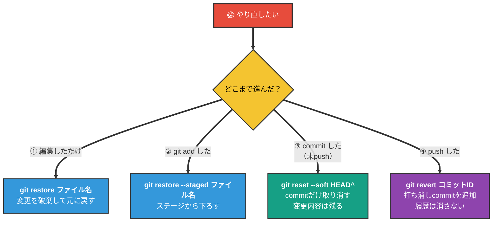

**鉄則:** pushした後は`reset`ではなく`revert`。履歴を書き換えるとチーム全員が死ぬ。

> 🚨 **`git reset --hard` は打つ前に一度止まる。** 上の図で使っている `--soft` は「コミットだけ取り消して変更内容は残す」。一方 `--hard` は**作業中の変更ごと消える**。消えたものは基本的に戻らない。

> 📝 **`revert` は「打ち消しのコミットを新しく積む」。** 履歴を書き換えないので、push済みでも安全に使える。「消す」のではなく「取り消した事実を残す」のが revert。

---

## 8. .gitignore — 追跡しないファイル

`.gitignore`に書いたファイルは、Gitから見えなくなる（commit対象外）。

> 📝 **「追跡」（track）とは**: Gitが「このファイルの変更を見張っている」状態のこと。一度 `git add` したファイルは**追跡されている**。`git status` の `Untracked files` は「**まだ見張っていないファイル**」という意味（→ §5）。`.gitignore` は、この**見張りの対象から外すリスト**。

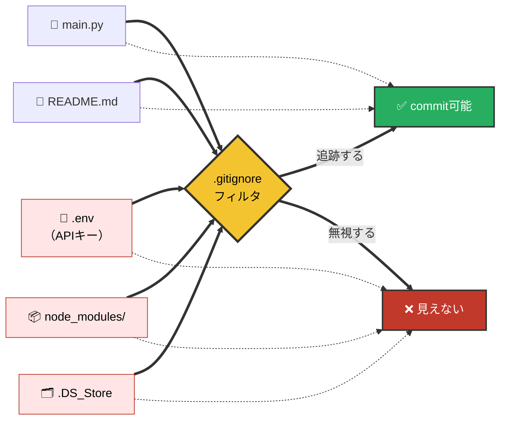

**絶対にcommitしてはいけないもの:**

- 🔐 `.env` / APIキー / パスワード → 漏洩事故の常連
- 📦 `node_modules/` / `venv/` → 巨大で再生成可能
- 🗂 `.DS_Store` / エディター設定 → OS/個人依存のゴミ

> 📝 **`.env` と環境変数**: `.env` は「**環境変数**」（プログラムに外から渡す設定値）を書き込んでおくファイル。`API_KEY=abc123` のように「名前=値」のペアで書き、コードからは名前で呼び出す。**コード本体に秘密情報を書かないための仕組み**。本番ではVercelやSupabaseの管理画面側に同じ環境変数を登録する（[vercel.md](../04a_vercel/vercel.md) §7 / [supabase.md](../03_supabase/supabase.md) §12参照）。

このリポジトリの[.gitignore](../../.gitignore)が実例なので見てみよう。

### ⚠️ よくある罠: 「すでに追跡中のファイルは無視できない」

`.gitignore`は**新しく追加されるファイル**にしか効かない。一度commitしてしまったファイルは、後から`.gitignore`に書いても無視されない。

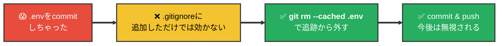

> 🚨 APIキーなどを一度pushしてしまった場合、`git rm --cached`だけでは**過去のコミット履歴には残る**。外部に漏れた可能性があるなら、**そのキーは無効化して再発行**するのが鉄則。

---

## 9. git stash（作業中の変更を一時退避）

**stash**は、作業ディレクトリにある**まだコミットしていない変更**を、いったん**別の場所に退避**する仕組みです。別ブランチに切り替えたいが変更を捨てたくない、急ぎの修正に移りたい、などのときに使います（コミットではないので、履歴には残りません）。

> 📝 **読みは「スタッシュ」。** stash は英語で「こっそりしまっておく」。`git stash` と打つだけで使えて、**コミットではない**ので履歴が汚れない。

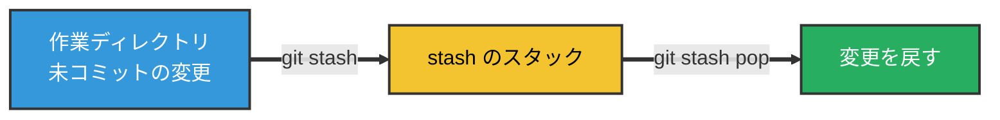

> 📝 イメージは「**机の上の作業を、一旦引き出しにしまう**」感覚。あとで引き出しから取り出して続きを再開できる。

### こんなときに使う（具体例）

#### 例1: 作業中に緊急バグの修正依頼が来た

`feature/login`で開発中、まだコミットできるキリのいい状態じゃない。でも本番でバグが見つかり、急いで`main`で修正したい、という王道シナリオ。

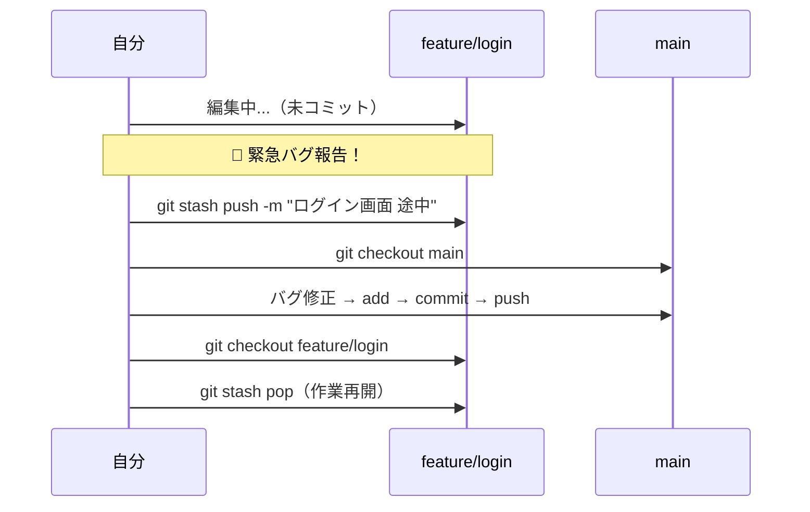

> 💡 commitしてからブランチを移ることもできるが、**「中途半端な状態を履歴に残したくない」**ときにstashが便利。

#### 例2: ブランチを間違えて作業していた

`main`で作業を始めてしまい、コミット直前に「これ`feature`ブランチでやるやつだ…」と気づいたとき。

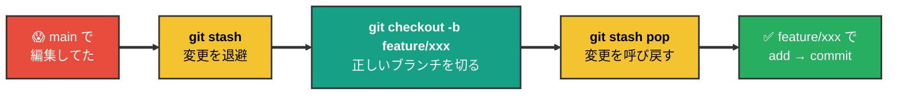

#### 例3: `git pull` したら「変更を確定してくれ」と怒られた

リモートに新しいcommitが入っていて取り込みたいが、ローカルに未コミットの変更があるとpullが拒否されることがある。

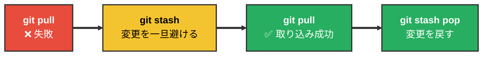

#### 例4: 「この変更を一時的に外した状態」で挙動を確認したい

書きかけのコードを残したまま、**変更前の状態でちゃんと動くか確認したい**ときも便利。

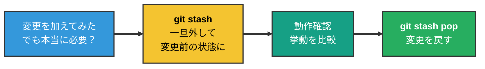

### よく使うコマンド

| コマンド | 説明 |
|---------|------|
| `git stash` | 追跡中ファイルの変更を退避（メッセージは自動） |
| `git stash push -m "メモ"` | メモ付きで退避 |
| `git stash push -u` | **未追跡ファイルも含めて**退避（新規ファイルも一緒に避けたいとき） |
| `git stash list` | 退避一覧を表示 |
| `git stash pop` | いちばん新しい stash を**適用してから削除** |
| `git stash apply` | 適用するが**stash は残す**（同じ内容を複数ブランチに当てたいとき） |
| `git stash drop stash@{n}` | 指定した stash だけ削除 |
| `git stash clear` | stash を**すべて削除**（取り消しにくいので注意） |

### 注意点

- `pop` したブランチによっては**コンフリクト**が出ることがある（退避時と違うコードが入っている場合）。
- stash はローカル向けの退避であり、**`git push` ではリモートに送られない**（チーム共有の仕組みではない）。

---

## 10. 補足: `main` と `master` の違い

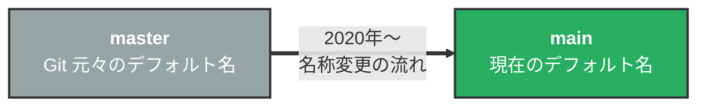

**結論: 技術的には完全に同じもの。名前が違うだけ。**

- Gitのデフォルトブランチ名は元々`master`
- 2020年頃、用語への配慮から業界的に`main`への変更が広がった
- GitHubは2020年10月以降、新規リポジトリのデフォルトが`main`
- 古いチュートリアルでは`master`、最近のものは`main`で書かれている

### 設定方法

```mermaid
flowchart TB
    A["🆕 これから作るリポジトリ"] ==> A1["<b>git config --global init.defaultBranch main</b><br/>以降 git init すると main で始まる"]

    B["🔄 既存の master リポジトリを main に変えたい"] ==> B1["<b>git branch -m master main</b><br/>ローカルのブランチ名変更"]
    B1 ==> B2["<b>git push -u origin main</b><br/>リモートに main を push"]
    B2 ==> B3["GitHub画面で<br/>Default branch を main に変更<br/>(Settings → Branches)"]
    B3 ==> B4["<b>git push origin --delete master</b><br/>リモートの master を削除"]

    style A fill:#3498DB,color:#FFFFFF,stroke:#333,stroke-width:2px
    style A1 fill:#27AE60,color:#FFFFFF,stroke:#333,stroke-width:2px
    style B fill:#E67E22,color:#FFFFFF,stroke:#333,stroke-width:2px
    style B1 fill:#16A085,color:#FFFFFF,stroke:#333,stroke-width:2px
    style B2 fill:#16A085,color:#FFFFFF,stroke:#333,stroke-width:2px
    style B3 fill:#F4C430,color:#000,stroke:#333,stroke-width:2px
    style B4 fill:#16A085,color:#FFFFFF,stroke:#333,stroke-width:2px
```

> 📝 現在自分の環境で何がデフォルトか確認: `git config --global init.defaultBranch`

---

## 11. 用語集

知らない言葉が出てきたらここに戻る。

### 場所・もの

| 用語 | 読み | ひとことで言うと | 出てくる節 |
| --- | --- | --- | --- |
| **Git** | ギット | 変更の履歴を記録・復元する**ソフト**。自分のPCで動く | §0 |
| **GitHub** | ギットハブ | 履歴を預けて共有する**Webサービス**。Gitとは別物 | §0 |
| **リポジトリ（リポ）** | repository | 履歴が入った箱。ふつうはプロジェクトのフォルダ1個 | §0 |
| **作業ディレクトリ** | Working Directory | いま編集しているファイルそのものがある場所 | §1 |
| **ステージング（index）** | Staging Area | 次のコミットに入れると決めた変更の置き場 | §1 |
| **ローカルリポジトリ** | Local Repository | 自分のPC内の、確定した履歴 | §1 |
| **リモート（リポジトリ）** | Remote Repository | GitHub上の、共有された履歴 | §1 |
| **origin** | オリジン | cloneしてきたリモートに自動で付く名前 | §1 §4 |
| **コミット** | commit | セーブポイント1個。またはその記録 | §0 §1 |
| **コミットID（ハッシュ）** | — | コミット1個に付く固有の文字列。先頭7文字くらいで指定できる | §5 |
| **ブランチ** | branch | 本体を触らずに作業するための枝分かれ | §3 |
| **main / master** | メイン / マスター | 既定のブランチ名。技術的には同じもの | §10 |
| **HEAD** | ヘッド | 「いま自分がいるコミット」を指す予約語 | §6 §7 |
| **マージ** | merge | 枝分かれした履歴を合流させること | §3 |
| **コンフリクト** | conflict | 同じ行を別々に変えたため、Gitが判断を人間に求めている状態 | §6 |
| **Pull Request（PR）** | プルリク | 「mainに入れていいですか」の申請書。GitHubの機能 | §4 |
| **fork** | フォーク | 他人のリポジトリを自分のアカウントにコピーするGitHubの機能 | §4 |
| **追跡（track）** | — | Gitがそのファイルの変更を見張っている状態 | §8 |
| **.gitignore** | — | 追跡しないファイルを書いておくリスト | §8 |
| **環境変数 / .env** | — | コードに直接書きたくない設定値を、外から渡す仕組み | §8 |
| **stash** | スタッシュ | 未コミットの変更の一時退避場所 | §9 |

### 操作（コマンド）

| コマンド | 何をするか | 出てくる節 |
| --- | --- | --- |
| `git clone <URL>` | リモートを丸ごと手元にコピー（最初の1回） | §1 |
| `git status` | いま何がどの場所にいるかを表示 | §5 |
| `git diff` | 変更の中身（行単位の差分）を表示 | §5 |
| `git add <ファイル>` | ステージングに入れる（`.` で全部） | §1 |
| `git commit -m "メモ"` | ステージングの内容を履歴に確定 | §1 |
| `git push` | ローカルの履歴をリモートへ送る | §1 |
| `git pull` | リモートの最新を取り込む（= `fetch` + `merge`） | §1 |
| `git log --oneline` | 履歴を1行ずつ表示 | §5 |
| `git branch` | ブランチの一覧と現在地 | §5 |
| `git switch <名前>` | ブランチを移動（`-c` で作って移動） | §3 |
| `git merge <名前>` | 別のブランチを現在のブランチに合流 | §3 |
| `git merge --abort` | コンフリクトしたmergeを中止して元に戻す | §6 |
| `git restore <ファイル>` | 編集を破棄して元に戻す | §7 |
| `git restore --staged <ファイル>` | ステージングから下ろす | §7 |
| `git reset --soft HEAD^` | 直前のコミットだけ取り消す（変更は残る） | §7 |
| `git revert <コミットID>` | 打ち消しコミットを積む（push後の正解） | §7 |
| `git rm --cached <ファイル>` | 追跡から外す（ファイル自体は残る） | §8 |
| `git stash` / `git stash pop` | 未コミットの変更を退避 / 戻す | §9 |

---

## 次に読むもの

| 資料 | 内容 |
| --- | --- |
| [setup.md](setup.md) | **実際に手を動かす順番**。インストール → 初期設定 → 最初のコミット（Part 1）／GitHubアカウント → 認証 → push（Part 2） |
| [app-release.md](../01_app-release/app-release.md) | Git がリリース全体の流れの中でどこに位置するか |

> 📝 **用語が分からないときは、AIに聞くのがいちばん速い。** 「Gitの〇〇という用語を、プログラミング初学者向けに説明して」で十分な答えが返る。エラーが出たときは**要約せず原文のまま貼る**のがコツ（[setup.md](setup.md) の「詰まったら、AI に聞く」参照）。
