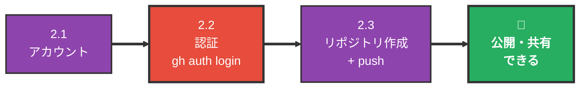
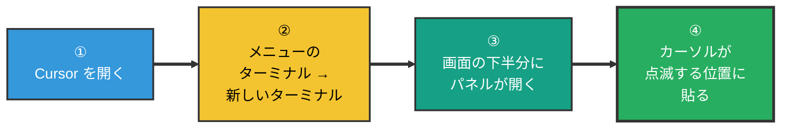
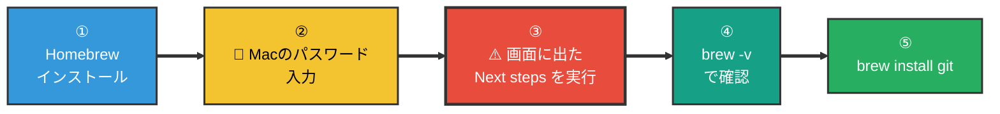
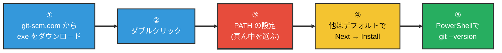
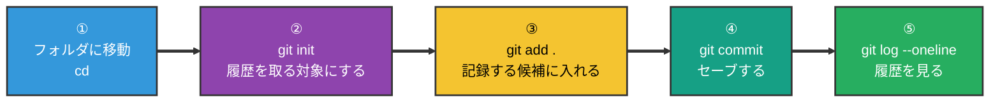
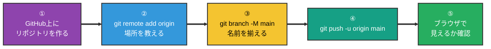

# Git / GitHub 環境構築手順 — インストールから初めての push まで

> 📝 [git.md](git.md) が**概念の地図**なら、このドキュメントは**実際に手を動かす順番**。**Part 1（Git）だけで「壊したコードを戻せる」状態になる。** GitHub は必要になってから Part 2 を開けばよい。

🧠 想定する到達点:

- `git --version` でバージョンが表示される
- 自分のフォルダで `git init` → `git commit` ができる
- 間違えたとき `git restore` で直前の状態に戻せる
- （Part 2）GitHub にリポジトリを作って `git push` できる

---

## 0. 全体マップ

### 🟢 Part 1 — Git（30分）


> ⬇️ **ここで一度止まってよい。** 「人に見せたい / 別のPCから触りたい / PCが壊れても残したい」が出てきたら、下へ進む。

### 🟡 Part 2 — GitHub（15分）



| Part | 内容 | 所要時間 | いつやる |
| --- | --- | --- | --- |
| 1 | Git のインストール + 初期設定 + 最初のコミット | 30分 | **最初に** |
| 2 | GitHub アカウント + 認証 + 初めての push | 15分 | 人に見せたくなったとき |

> 📝 **Part 1 と Part 2 は切り離してよい。** Part 1 だけでバージョン管理は成立する（自分のPCの中に履歴が残る）。GitHub は「人に見せる / 別のPCから触る / PCが壊れても残す」ための箱で、**無くても作業は進む**。

---

# Part 1: Git

ここだけで「壊しても戻せる」状態になる。

## 1.0 ターミナルを開く — コマンドはすべてここに打つ

🚨 **この手順書に出てくるコマンドは、すべて Cursor のターミナルに打つ。** 別のアプリを開く必要はない。



| | やること |
| --- | --- |
| 開き方 | Cursor 上部メニューの **ターミナル** → **新しいターミナル** |
| ショートカット | `Ctrl` + `` ` ``（バッククォート） |
| 開いた合図 | 画面の下半分に `TERMINAL` のパネルが出て、カーソルが点滅する |
| 打つ場所 | その**カーソルの位置**。貼って `Enter` |


**この画面の見方:**

| 場所 | 何が映っているか |
| --- | --- |
| 画面の下半分 | `TERMINAL` タブ。**ここが打つ場所** |
| `MacBook-Pro-2:test ...$` の行 | プロンプト。`$` の右でカーソルが点滅している |
| `$` の右の四角 | カーソル。**ここに貼って `Enter`** |

> 📝 **行末の記号は環境で違う。** `$`（この画面）／`%`（zsh）／`>`（Windows の PowerShell）。**どれでもよい。カーソルが点滅していれば打てる状態。**

> 📝 **上のほうに英語のメッセージが出ていても気にしない。** この画面の `The default interactive shell is now zsh.` のように、ターミナルは起動時にお知らせを出すことがある。エラーではない。

> 📝 **バッククォートの場所**: 日本語キーボードは `Shift` + `@`。英語キーボードは `Esc` の下。
> 📝 **Windows でも同じ。** Cursor のターミナルは PowerShell が開く。

### コマンドの打ち方 — 4つのルール

| ルール | なぜ |
| --- | --- |
| 🟢 **コードブロックの右上のコピーボタンで貼る** | 手で打つと必ずどこか間違える。GitHub 上ではブロックにマウスを乗せると右上にボタンが出る |
| 🚨 **1行コピーしたら 1行 Enter。まとめて貼らない** | 途中で失敗したとき、どこまで進んだかが分かる |
| 🚨 **`#` で始まる行は打たない** | 説明文。打っても何も起きないが、混乱する |
| 🚨 **`<` `>` で囲まれた部分は自分の値に置き換える** | 例: `git restore <ファイル名>` → `git restore index.html` |

> 🚨 **何も表示されなくても、たいてい成功している。** Git は成功したとき黙っているコマンドが多い。**エラーが出ていなければ次へ進む。**

---

## 1.1 Git がすでに入っているか確認

1.0 で開いたターミナルに、これを貼って Enter。**入っていればインストールは丸ごと不要。**

```sh
git --version
```

| 出た結果 | 次にやること |
| --- | --- |
| `git version 2.39.3` のようにバージョンが出た | **1.3 へ飛ぶ。インストールは不要** |
| `command not found: git` | 1.2 でインストール |
| 「コマンドライン・デベロッパ・ツール」のダイアログが出た（Mac） | 「インストール」を押す。終わったらもう一度 `git --version`。これで入れば 1.3 へ |

> 📝 **Mac には最初から Git が入っていることが多い。** Xcode Command Line Tools に同梱されているため。バージョンが少し古いことはあるが、学習やふつうの開発には問題ない。

---

## 1.2 インストール（入っていなかった場合だけ）

### Mac — Homebrew 経由



**操作の要点:**

| ステップ | やること | 注意 |
| --- | --- | --- |
| ① | 下のコマンドを1行まるごと貼って Enter | **5〜10分かかる。** 文字が流れ続けるが、待っていればよい |
| ② | Mac のログインパスワードを入力 | 🚨 **打っても画面には1文字も出ない。** そのまま Enter |
| ③ | 最後に出た `==> Next steps:` の行を実行 | 🚨 **ここだけは自分の画面を見る。** 機種で中身が変わる |
| ④ | `brew -v` | `Homebrew 4.x.x` と出れば成功 |
| ⑤ | `brew install git` → `git --version` | |

**① Homebrew のインストール:**

```sh
/bin/bash -c "$(curl -fsSL https://raw.githubusercontent.com/Homebrew/install/HEAD/install.sh)"
```

> 📝 **Homebrew とは**: Mac に開発ツールを入れるための道具。`brew install 〇〇` でツールが入る。この先 `gh`（GitHub CLI）など何度か使う。

> 🚨 **③が最大の詰まりどころ。** インストールが終わると、画面の最後にこう出る。

```text
==> Next steps:
- Run these commands in your terminal to add Homebrew to your PATH:
    echo >> /Users/あなたの名前/.zprofile
    echo 'eval "$(/opt/homebrew/bin/brew shellenv)"' >> /Users/あなたの名前/.zprofile
    eval "$(/opt/homebrew/bin/brew shellenv)"
```

この**インデントされた行だけ**を選んでコピーし、ターミナルに貼って Enter。

⚠️ **この手順書に書いてある行ではなく、自分の画面に出た行を使う。** Apple シリコンは `/opt/homebrew`、Intel Mac は `/usr/local` と、パスが変わる。

> 🚨 **`brew: command not found` が出たら**: ③が終わっていない。上の行を貼り直す。

> 📝 **なぜ2種類の行があるのか**: `echo ... >> ~/.zprofile` は「**次にターミナルを開いたとき**のための設定ファイルへの追記」、`eval "$(...)"` は「**いま開いているターミナル**への即時反映」。役割が違うので両方必要。片方だけだと、閉じたら消える／今は使えない、のどちらかになる。

> 🚨 **それでも `brew` が見つからないときは、ターミナルを開き直す。** Cursor のターミナルパネル右上の 🗑 でいまのターミナルを閉じ、`Ctrl` + `` ` `` でもう一度開く。`.zprofile` が読み直されて `brew` が使えるようになる。

### Windows — 公式インストーラー



**選択肢が出る画面だけ、選ぶものを決めておく:**

| 画面 | 選ぶもの | なぜ |
| --- | --- | --- |
| Adjusting your PATH environment | **Git from the command line and also from 3rd-party software**（真ん中） | PowerShell でも VSCode でも Git が使える |
| Choosing HTTPS transport backend | **Use the native Windows Secure Channel library** | Windows の証明書をそのまま使える |
| Configuring the line ending conversions | **Checkout Windows-style, commit Unix-style**（既定） | 1.3 の `core.autocrlf` と同じ効果 |
| それ以外 | すべて既定のまま Next | 変える理由がない |

> 🚨 **インストールが終わったら Cursor を再起動する。** Windows は起動中のアプリに PATH の変更が届かないため、再起動しないと Cursor のターミナルで `git --version` が `command not found` のままになる。

> 📝 Git for Windows には **Git Credential Manager** が同梱されている。Part 2 の認証が、初回 push のときにブラウザが開いて終わる。

---

## 1.3 初期設定（2つだけ）

コミットに「誰がやったか」を刻むための設定。🚨 **これをしないとコミットできない。**

```sh
git config --global user.name "Taro Yamada"
git config --global user.email "you@example.com"
```

確認:

```sh
git config --global --list
```

| 項目 | 何に使われるか | 注意 |
| --- | --- | --- |
| `user.name` | コミット履歴に出る名前 | 本名でもハンドルネームでもよい |
| `user.email` | コミット履歴に出るメール | 🚨 Part 2 で GitHub を使うなら、**GitHub に登録したメールと同じにする** |

> 🚨 **メールアドレスは公開される。** GitHub に上げると、コミット履歴から誰でも見える。隠したい場合は GitHub の `noreply` アドレス（`12345678+username@users.noreply.github.com`）を使う。GitHub の Settings → Emails → **Keep my email addresses private** で確認できる。

> 🚨 **ここが違うと、自分のコミットとして数えられない。** GitHub 上で草（Contributions）が生えず、アイコンも出ない。あとから直すのは面倒なので、Part 2 をやる予定があるなら最初から揃えておく。

**改行コードの設定（Windows のみ）:**

```sh
git config --global core.autocrlf true
```

> 📝 Windows と Mac / Linux で改行の文字が違う。これを入れておくと「**1文字も直していないのに全行が変更扱いになる**」が起きにくい。

---

## 1.4 最初のコミット



```sh
cd ~/path/to/your-project
git init
git add .
git commit -m "最初のコミット"
git log --oneline
```

| コマンド | 意味 |
| --- | --- |
| `git init` | このフォルダを「履歴を取る対象」にする（隠しフォルダ `.git` ができる） |
| `git add .` | 今の状態を「記録する候補」に入れる |
| `git commit -m "..."` | セーブする |
| `git log --oneline` | セーブ履歴を1行ずつ見る |

> 📝 `.git` を消すと履歴も消える。**フォルダをコピーするときは `.git` ごとコピー**する。

> 📝 作業ディレクトリ → ステージング → ローカルリポジトリ、という3段構えの意味は [git.md](git.md) の「全体の流れ」を読む。

---

## 1.5 戻し方（Part 1 の目的はここ）

**コードを大きく書き換える前に `commit` しておけば、壊れても戻せる。** これが Part 1 をやる理由。

```sh
git diff                 # 最後のコミットから何が変わったか見る
git restore <ファイル名>   # そのファイルだけ、最後のコミットの状態に戻す
git restore .            # 編集を全部捨てて、最後のコミットの状態に戻す
```

> 🚨 **`git restore` は編集を消す。取り消せない。** 残したい変更があるなら、先に `git commit` する。迷ったら `git diff` で中身を見てから。

> 📝 **AI にコードを書き換えてもらうなら、指示を出す前に1回 `commit` しておくのがいちばん安い保険。** 気に入らなければ `git restore .` で指示前に戻る。

> 📝 もっと踏み込んだ戻し方（コミット済みを取り消す / 直前のコミットを直す）は [git.md](git.md) の「やらかした時の戻し方」にある。

---

### ✅ Part 1 のチェック

- [ ] `git --version` でバージョンが出る
- [ ] `git config --global --list` に `user.name` と `user.email` がある
- [ ] 自分のフォルダで `git log --oneline` にコミットが1つ以上出る
- [ ] ファイルを適当に書き換えて `git diff` で差分が見える
- [ ] `git restore .` で元に戻る

**ここまでできたら、GitHub は後回しでよい。**

---

# Part 2: GitHub

> 📝 **必要になってから開く。** 「コードを人に見せたい」「別のPCから触りたい」「PCが壊れても残したい」のどれかが出てきたタイミング。

## 2.1 アカウントを作る

| ステップ | やること | 注意 |
| --- | --- | --- |
| ① | [github.com](https://github.com) で Sign up | |
| ② | メールアドレスを認証 | 🚨 **1.3 の `user.email` と同じメールにする**（違う場合は Settings → Emails で追加登録する） |
| ③ | 2要素認証（2FA）を設定 | 必須。アプリ（Authenticator 等）かSMS |

> 🚨 **2FA は必須化されている。** 後回しにすると、ある日ログインできなくなる。リカバリーコードは必ず保存する。

---

## 2.2 認証（ここが一番詰まる）

🚨 **GitHub のパスワードは `git push` に使えない。** 2021年に廃止されたので、別の方法で認証する。

| 方法 | 手間 | 向き |
| --- | --- | --- |
| 🅰️ **GitHub CLI**（`gh auth login`） | **2分** | 🟢 まずこれ。自分でトークンを保管しなくてよい |
| 🅱️ VSCode / Cursor のサインイン | 3分 | エディタの中で完結させたい |
| 🅲 パーソナルアクセストークン（PAT） | 10分 | CLI が入れられない環境 / CI |

### 🅰️ GitHub CLI（推奨）

```sh
brew install gh      # Mac
# Windows は Git for Windows 同梱の Credential Manager でもよい（初回 push でブラウザが開く）
gh auth login
```

対話で聞かれるので、こう答える。

| 質問 | 選ぶ |
| --- | --- |
| What account do you want to log into? | **GitHub.com** |
| What is your preferred protocol for Git operations? | **HTTPS** |
| Authenticate Git with your GitHub credentials? | **Yes** |
| How would you like to authenticate GitHub CLI? | **Login with a web browser** |

→ 8桁のコードが表示される。Enter でブラウザが開くので、そのコードを貼って承認。

確認:

```sh
gh auth status
```

> 📝 **順番はバージョンで少し変わる。** 聞かれた内容で判断する。
> 🚨 `Authenticate Git with your GitHub credentials?` を **Yes** にしないと、`gh` のログインは通るのに `git push` だけ失敗する。

### 🅲 PAT（CLI が使えないとき）

GitHub → Settings → Developer settings → Personal access tokens → **Fine-grained tokens** → Generate new token

| 項目 | 入れる値 |
| --- | --- |
| Token name | 用途がわかる名前（`macbook-push` など） |
| Expiration | 90日（長すぎるものを作らない） |
| Repository access | Only select repositories → 対象のリポジトリ |
| Permissions → Contents | **Read and write** |

🚨 **表示されたトークンは一度しか見られない。** その場でパスワードマネージャーに保存する。

> 📝 **失くしても作り直せばよい。** 消して新しく発行するだけで、リポジトリには何も起きない。
> 🚨 **`Tokens (classic)` ではなく `Fine-grained tokens` を使う。** classic は権限が粗く、リポジトリ単位の制限ができない。
> 🚨 **トークンを `.env` やコードに書かない。** 一度 commit すると履歴に残り続ける。

push 時に聞かれたら、Username は GitHub のユーザー名、**Password の欄にトークンを貼る**。

---

## 2.3 リポジトリを作って push



**GitHub CLI があるなら1行で済む:**

```sh
gh repo create my-app --private --source=. --remote=origin --push
```

**手でやる場合:**

```sh
# GitHubで「空の」リポジトリを作ってから（README を追加しない）
git remote add origin https://github.com/あなたのユーザー名/リポジトリ名.git
git branch -M main
git push -u origin main
```

> 🚨 **最初は `--private` にする。** 公開は後からいつでも切り替えられるが、一度公開したものは取り消せない。API キーなどを混ぜていた場合に手遅れになる。

> 📝 2回目以降は `git push` だけでよい（`-u` で紐づけ済みのため）。

---

## 2.4 詰まったときの対処表

| 出たメッセージ | 原因 | 対処 |
| --- | --- | --- |
| `Support for password authentication was removed` | パスワードを入れている | 2.2 の認証をやる |
| `remote origin already exists` | すでに origin が登録されている | `git remote set-url origin <新しいURL>` |
| `src refspec main does not match any` | コミットが1つもない | 1.4 の `git commit` を先にやる |
| `failed to push some refs` / `fetch first` | GitHub 側に自分が持っていないコミットがある | `git pull --rebase origin main` → もう一度 push |
| `Permission denied` / `403` | 別アカウントの認証が残っている | `gh auth logout` → `gh auth login` |
| `Repository not found` | URL のタイポ、または private への権限不足 | `git remote -v` で URL を確認 |
| push は成功したが自分のコミットとして出ない | `user.email` が GitHub のメールと違う | 1.3 を直す（過去分は残る） |
| `gh` は通るのに `git push` で聞かれる | `Authenticate Git with your GitHub credentials?` を No にした | `gh auth login` をやり直す |

---

### ✅ Part 2 のチェック

- [ ] `gh auth status` が通る（または初回 push が成功した）
- [ ] ブラウザで自分のリポジトリにファイルが見える
- [ ] 適当に1行変えて `commit` → `push` が通る
- [ ] GitHub 上でそのコミットが**自分のアイコン付き**で出ている

---

## 次に読むもの

| | 内容 |
| --- | --- |
| [git.md](git.md) | ブランチ / Pull Request / コンフリクト解決 / `.gitignore` / `git stash` |
| [../01_app-release/app-release.md](../01_app-release/app-release.md) | このGitが、デプロイまでどう繋がるか |
