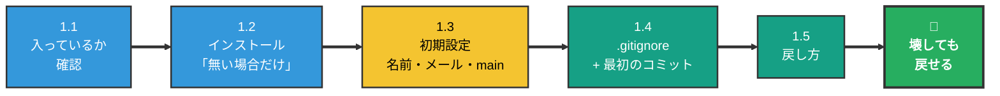
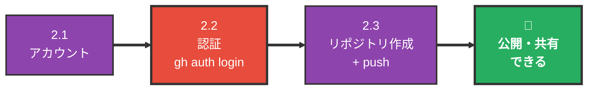

# Git / GitHub 環境構築手順 — インストールから初めての push まで

> 📝 [git.md](git.md) が**概念の地図**なら、このドキュメントは**実際に手を動かす順番**。**Part 1（Git）だけで「壊したコードを戻せる」状態になる。** GitHub は必要になってから Part 2 を開けばよい。

🧠 想定する到達点:

- 自分のフォルダで `git commit` ができ、履歴が残る
- 間違えたとき、直前の状態に戻せる
- （Part 2）GitHub にリポジトリを作って `git push` できる

---

## 0. 全体マップ

### 🟢 Part 1 — Git（30分）



> ⬇️ **ここで一度止まってよい。** 「人に見せたい / 別のPCから触りたい / PCが壊れても残したい」が出てきたら、下へ進む。

### 🟡 Part 2 — GitHub（15分）



> 📝 **Part 1 と Part 2 は切り離してよい。** Part 1 だけでバージョン管理は成立する（自分のPCの中に履歴が残る）。GitHub は「人に見せる / 別のPCから触る / PCが壊れても残す」ための箱で、**無くても作業は進む**。

> 🔧 **うまくいかないときは、巻末の[困ったとき](#困ったとき)を見る。** エラーメッセージから引けるようにしてある。

---

# Part 1: Git

## 1.0 はじめに — 進め方の約束

### ターミナルを開く

🚨 **この手順書のコマンドは、すべて Cursor のターミナルに打つ。** 別のアプリを開く必要はない。

| | やること |
| --- | --- |
| 開き方 | Cursor 上部メニューの **ターミナル** → **新しいターミナル**（英語表示なら **Terminal** → **New Terminal**） |
| ショートカット | `Ctrl` + `` ` ``（バッククォート。日本語キーボードは `Shift` + `@`） |
| 打つ場所 | 下半分に出たパネルの、**カーソルが点滅している位置**。貼って `Enter` |


行末の記号は環境で違う（`$` / `%` / Windows は `>`）。**どれでもよい。カーソルが点滅していれば打てる状態。**

> 📝 **起動時に英語のメッセージが出ても気にしない。** 上の画面の `The default interactive shell is now zsh.` のような案内が出ることがある。エラーではない。

### コマンドの打ち方 — 5つのルール

| ルール | なぜ |
| --- | --- |
| 🟢 **コードブロックの右上のコピーボタンで貼る** | 手で打つと必ずどこか間違える |
| 🚨 **1行コピーしたら 1行 Enter。まとめて貼らない** | 途中で失敗したとき、どこまで進んだかが分かる |
| 🚨 **`#` で始まる行は打たない** | 説明文。打っても何も起きないが、混乱する |
| 🚨 **`<` `>` で囲まれた部分は自分の値に置き換える** | 例: `git restore <ファイル名>` → `git restore index.html` |
| 🚨 **行頭の `$` や `%` はコマンドの一部ではない** | 他のサイトや AI の答えは `$ git status` のように書くことがある。**`$` を除いた `git status` だけを打つ** |

> 🚨 **何も表示されなくても、たいてい成功している。** Git は成功したとき黙っているコマンドが多い。**エラーが出ていなければ次へ進む。**

### 止まった・間違えたときの3つのキー

**これだけ覚えておけば、どんな画面になっても抜けられる。**

| 状況 | 押すキー | 何が起きるか |
| --- | --- | --- |
| **貼り間違えた / 打ち間違えた** | `Ctrl` + `C` | 打ちかけの行が捨てられ、新しい行から打ち直せる |
| **画面が文字で埋まって止まった** | `q` | 出力が長いとページャが開く。**壊れていない** |
| **見慣れない編集画面になった** | `Esc` → `:q!` → `Enter` | エディタが開いている。保存せずに閉じる |

> 🚨 **`Ctrl` + `C` は、インストールが走っている最中には押さない。** 途中で止めると中途半端な状態になる。**打ち間違えたときと、「待っているだけで何も進まない」ときに使う。**

### 詰まったら、AI に聞く

⭐ **この手順書どおりに進まないことは必ず起きる。** 画面の表示が違う、知らないエラーが出る、など。そのときは **Cursor のチャット**（`Cmd` + `L`）に聞くのがいちばん早い。Claude Code を入れていればそれでもよい。

**聞き方は1つだけ覚える — エラーをそのまま貼る。**

| ⛔ 伝わらない | 🟢 解決する |
| --- | --- |
| 「git が動きません」 | **ターミナルに出た文字を全部そのままコピーして貼る** ＋「何をしようとして、何をしたか」を1行 |

> 📝 **要約しないのがコツ。** 自分で「たぶんこういうエラー」とまとめると、肝心の情報が落ちる。**原文のまま貼るのがいちばん速い。**

> 🚨 **AI の答えをそのまま実行しない3つ。** 返ってきたコマンドに `rm` / `--force`・`-f` / `reset --hard` が入っていたら、実行する前に「**これは何をするコマンドですか。元に戻せますか**」ともう一度聞く。AI は「直す」ために、**作業を消すコマンドを提案することがある。**

> 🚨 **トークンやパスワードは貼らない。** エラーに混ざっていたら、その部分を `****` に置き換えてから貼る。

---

## 1.1 Git がすでに入っているか確認

ターミナルにこれを貼って Enter。**入っていればインストールは丸ごと不要。**

```sh
git --version
```

| 出た結果 | 次にやること |
| --- | --- |
| `git version 2.39.3` のようにバージョンが出た | 🟢 **1.2 は読まずに飛ばして、1.3 へ** |
| `command not found: git` | 1.2 でインストール |
| 「コマンドライン・デベロッパ・ツール」のダイアログが出た（Mac） | 「インストール」を押す。終わったらもう一度 `git --version`。入れば **1.2 は飛ばして 1.3 へ** |

> 🚨 **バージョンが出た人は、1.2 をやってはいけない。** Homebrew のインストールに10分かかるうえ、**入れる必要がまったくない**。⭐ **読み飛ばして 1.3 に進むのが正解。**

> 📝 **Mac には最初から Git が入っていることが多い。** Xcode Command Line Tools に同梱されているため。少し古くても、学習やふつうの開発には問題ない。

---

## 1.2 インストール（入っていなかった場合だけ）

### Mac — Homebrew 経由

| | やること | 注意 |
| --- | --- | --- |
| ① | 下のコマンドを貼って Enter | |
| ② | 🚨 **`Press RETURN/ENTER to continue` で止まる** | **`Enter` を1回押す。** 他のキーを押すと中断される |
| ③ | Mac のログインパスワードを入力 | 🚨 **打っても画面には1文字も出ない。** そのまま Enter（Apple ID ではなく、**Macにログインするときのパスワード**） |
| ④ | インストールが走る | **5〜10分かかる。** 文字が流れ続けるが、ここは待つだけ |
| ⑤ | 最後に出た `Next steps:` の行を実行 | 🚨 **ここだけは自分の画面を見る**（下で説明） |
| ⑥ | `brew -v` で確認 | `Homebrew 4.x.x` と出れば成功 |
| ⑦ | `brew install git` → `git --version` | |

> 🚨 **②と③で画面が止まるが、固まったのではない。** インストーラーが返事を待っている。②は `Enter`、③はパスワードを打って `Enter`。

**① Homebrew のインストール:**

```sh
/bin/bash -c "$(curl -fsSL https://raw.githubusercontent.com/Homebrew/install/HEAD/install.sh)"
```

🚨 **このコマンドの中にも `$` が入っているが、気にしなくてよい。** 貼るとこうなる。


| 場所 | 中身 |
| --- | --- |
| `MacBook-Pro-2:test ...$` | **プロンプト。もとから出ている。自分で打つものではない** |
| その右の `/bin/bash -c "$(curl ...` | **貼り付けた中身。ここだけがコピーした分** |

この状態で `Enter`。あとは待つ。

> 📝 **Homebrew とは**: Mac に開発ツールを入れるための道具。`brew install 〇〇` でツールが入る。この先 `gh`（GitHub CLI）でも使う。

**⑤ 最大の詰まりどころ。** インストールが終わると、画面の最後にこう出る。

```text
==> Installation successful!

==> Homebrew has enabled anonymous aggregate formulae and cask analytics.
（英語の説明が数行続く）

==> Next steps:
- Run these commands in your terminal to add Homebrew to your PATH:
    echo >> /Users/あなたの名前/.zprofile                                                      ← ここから
    echo 'eval "$(/opt/homebrew/bin/brew shellenv)"' >> /Users/あなたの名前/.zprofile
    eval "$(/opt/homebrew/bin/brew shellenv)"                                                 ← ここまで
- Run brew help to get started
- Further documentation:
    https://docs.brew.sh
```

**`==> Next steps:` の下の、字下げされた3行**だけを使う（`←` の印はこの手順書で付けたもので、実際の画面には出ない）。

| 行 | 使う？ |
| --- | --- |
| `Installation successful!` | 見るだけ。**ここまで来れば成功** |
| `analytics` の説明 | 読まなくてよい |
| `Next steps:` の下の**字下げされた3行** | 🟢 **1行ずつコピーして、ターミナルに貼って Enter** |
| `Run brew help` / `docs.brew.sh` | 実行しなくてよい |

> 📝 **上にスクロールしないと見えないときは、ターミナルのパネルをマウスでスクロールして `Next steps:` を探す。** 文字が流れて見失っても、インストールは成功している。

🚨 **この手順書の行ではなく、自分の画面に出た行を使う。** Apple シリコンは `/opt/homebrew`、Intel Mac は `/usr/local` と、パスが変わる。

> 📝 **なぜ2種類の行があるのか**: `echo ... >> ~/.zprofile` は「**次にターミナルを開いたとき**のための設定ファイルへの追記」、`eval "$(...)"` は「**いま開いているターミナル**への即時反映」。役割が違うので両方必要。

### Windows — 公式インストーラー

[git-scm.com](https://git-scm.com/) から `Git-*.exe` をダウンロードして実行する。**選択肢が出る画面だけ、選ぶものを決めておく。**

| 画面 | 選ぶもの | なぜ |
| --- | --- | --- |
| Adjusting your PATH environment | **Git from the command line and also from 3rd-party software**（真ん中） | PowerShell でも Cursor でも Git が使える |
| Choosing HTTPS transport backend | **Use the native Windows Secure Channel library** | Windows の証明書をそのまま使える |
| Configuring the line ending conversions | **Checkout Windows-style, commit Unix-style**（既定） | 改行コードの違いを自動で吸収する |
| それ以外 | すべて既定のまま Next | 変える理由がない |

> 🚨 **終わったら Cursor を再起動する。** Windows は起動中のアプリに PATH の変更が届かない。

> 📝 Git for Windows には **Git Credential Manager** が同梱されている。Part 2 の認証が、初回 push のときにブラウザが開いて終わる。

---

## 1.3 初期設定（3つだけ）

コミットに「誰がやったか」を刻むための設定。🚨 **これをしないとコミットできない。**

**1行ずつ**貼って、`<>` を自分の値に置き換えてから Enter。

```sh
git config --global user.name "<あなたの名前>"
```

```sh
git config --global user.email "<あなたのメールアドレス>"
```

→ 例: `git config --global user.name "Taro Yamada"`

3つ目は**そのまま貼って** Enter（書き換える部分はない）。

```sh
git config --global init.defaultBranch main
```

> 📝 **これは「最初のブランチ名を `main` にする」設定。** Mac に最初から入っている Git は、何もしないと昔の名前の `master` で始まり、`git init` のたびに黄色い `hint:` が何行も出る。GitHub は `main` が標準なので、ここで揃えておく（詳しくは [git.md](git.md) の §10）。

確認:

```sh
git config --global --list
```

| 項目 | 何に使われるか | 注意 |
| --- | --- | --- |
| `user.name` | コミット履歴に出る名前 | 本名でもハンドルネームでもよい |
| `user.email` | コミット履歴に出るメール | 🚨 Part 2 で GitHub を使うなら、**GitHub に登録したメールと同じにする** |
| `init.defaultbranch` | `git init` したときの最初のブランチ名 | `main` になっていればよい（一覧では小文字で表示される） |

> 🚨 **メールアドレスは公開される。** GitHub に上げると、コミット履歴から誰でも見える。隠したい場合は GitHub の `noreply` アドレス（`12345678+username@users.noreply.github.com`）を使う。Settings → Emails → **Keep my email addresses private** で確認できる。

> 🚨 **ここが違うと、自分のコミットとして数えられない。** GitHub の自分のページに出る活動記録（緑のマス目）が増えず、コミットの横に自分のアイコンも出ない。あとから直すのは面倒なので、Part 2 をやる予定があるなら最初から揃えておく。

> 📝 **Windows でインストーラーの改行設定を既定のまま進めたなら、追加の設定は要らない。** 変えてしまった場合だけ `git config --global core.autocrlf true` を実行する。

---

## 1.4 最初のコミット

### ① フォルダを開く — `cd` は打たない

🚨 **Cursor で「作業したいフォルダ」を開いていれば、ターミナルは最初からそのフォルダにいる。** 移動のコマンドは要らない。

| | やること |
| --- | --- |
| フォルダが無い人 | 先にデスクトップなどに**新しいフォルダを1つ作る**（名前は `my-app` など半角英数字で） |
| 開き方 | Cursor 上部メニューの **ファイル** → **フォルダを開く**（英語表示なら **File** → **Open Folder**）→ そのフォルダを選ぶ |

> 🚨 **「このフォルダー内のファイルの作成者を信頼しますか？」と聞かれる。** 初めて開くフォルダでは必ず出る。**自分で作ったフォルダなので「はい、作成者を信頼します」を選ぶ**（英語表示なら **Yes, I trust the authors**）。

フォルダを開いたら、**ターミナルを開き直す。**

| | やること |
| --- | --- |
| すでに開いている場合 | ターミナルパネル右上の **🗑（ゴミ箱）** で閉じてから、`Ctrl` + `` ` `` で開き直す |
| 開いていない場合 | `Ctrl` + `` ` `` |

いま自分がどこにいるかを確認する:

```sh
pwd
```

→ **自分のプロジェクトのフォルダ名で終わっていればOK。**

> 🚨 **ここが違うと、関係ないフォルダの履歴を取り始める。** `/Users/あなたの名前` で終わっていたら、フォルダを開けていないか、ターミナルを開き直していない。

### ② `.gitignore` を作る — `git add` より先に

🚨 **これを先に作らないと、記録してはいけないファイルまで記録される。**

Cursor の左のファイル一覧で右クリック → **新しいファイル**（英語表示なら **New File...**）→ `.gitignore` という名前で作り、中にこれを貼る。

```text
.env
.env.local
node_modules/
.DS_Store
```

| 書いたもの | なぜ除外するか |
| --- | --- |
| `.env` / `.env.local` | 🔴 **APIキーやパスワードが入っている。** 一度記録すると履歴に残り続け、あとから消すのは非常に面倒 |
| `node_modules/` | ライブラリの置き場。数万ファイルあり、記録する意味がない（`npm install` で作り直せる） |
| `.DS_Store` | Mac が勝手に作る管理ファイル |

🚨 **貼ったら `Cmd` + `S`（Windows は `Ctrl` + `S`）で保存する。** タブのファイル名の横に `●` が出ている間は、まだ保存されていない。

> 🚨 **一度 `commit` したファイルは、あとから `.gitignore` に書いても記録され続ける。** だから `git add` より先に作る。

### ③ 練習用のファイルを1つ作る

新しく作ったフォルダだと、中身は `.gitignore` だけ。これでは 1.5 で「戻す」練習ができないので、**ふつうのファイルを1つ作っておく。**

② と同じやり方で `memo.txt` を作り、中に1行書いて**保存**する。

```text
はじめてのGit
```

> 📝 **もとからファイルが入っているフォルダなら、③ は飛ばしてよい。** 1.5 の練習は、そのファイルで代わりにできる。

### ④ 履歴を取り始める

**1行ずつ**貼って Enter。

```sh
git init
```

何が記録されようとしているか、先に見ておく:

```sh
git status
```

> 🚨 **ここに `.env` が出てきたら、② をやり直す。** `.gitignore` に書けていない。

```sh
git add .
```

```sh
git commit -m "最初のコミット"
```

確認:

```sh
git log --oneline
```

→ `a1b2c3d 最初のコミット` のように出れば成功。

| コマンド | 意味 |
| --- | --- |
| `git init` | このフォルダを「履歴を取る対象」にする（隠しフォルダ `.git` ができる） |
| `git status` | いまの状態を見る。**迷ったらこれ** |
| `git add .` | 今の状態を「記録する候補」に入れる |
| `git commit -m "..."` | セーブする |
| `git log --oneline` | セーブ履歴を1行ずつ見る |

> 📝 `.git` を消すと履歴も消える。**フォルダをコピーするときは `.git` ごとコピー**する。

> 📝 作業ディレクトリ → ステージング → ローカルリポジトリ、という3段構えの意味は [git.md](git.md) の「全体の流れ」を読む。

---

## 1.5 戻し方（Part 1 の目的はここ）

**コードを大きく書き換える前に `commit` しておけば、壊れても戻せる。** これが Part 1 をやる理由。

**まず、何が変わったかを見る:**

```sh
git diff
```

**1ファイルだけ戻す:**

```sh
git restore <ファイル名>
```

**編集を全部捨てて戻す:**

```sh
git restore .
```

> 🚨 **`git restore` は編集を消す。取り消せない。** 残したい変更があるなら、先に `git commit` する。**迷ったら必ず `git diff` で中身を見てから。**

> 📝 **新しく作ったファイルは消えない。** `git restore .` が戻すのは「すでに記録されたことがあるファイルへの編集」だけ。新規ファイルはそのまま残るので、不要なら手で削除する。

> 📝 **AI にコードを書き換えてもらうなら、指示を出す前に1回 `commit` しておくのがいちばん安い保険。** 気に入らなければ `git restore .` で指示前に戻る。

> 📝 もっと踏み込んだ戻し方（コミット済みを取り消す / 直前のコミットのメッセージを直す）は [git.md](git.md) の「やらかした時の戻し方」にある。

---

### ✅ Part 1 のチェック

- [ ] `git --version` でバージョンが出る
- [ ] `git config --global --list` に `user.name` と `user.email` と `init.defaultbranch=main` がある
- [ ] `pwd` が自分のプロジェクトのフォルダを指している
- [ ] `git status` に `.env` が出てこない
- [ ] `git log --oneline` にコミットが1つ以上出る

**最後に、戻せることを1回だけ試す:**

1. 1.4 の ③ で作った `memo.txt` を開いて、**消えても困らない1行**を足して保存する
2. `git diff` → その1行が出る
3. `git restore .` → 足した1行が消えて、元に戻る

> 🚨 **この練習は、保存していない大事な編集が無い状態でやる。** `git restore .` は、まだ `commit` していない編集を**すべて**消す。

**ここまでできたら、GitHub は後回しでよい。**

---

# Part 2: GitHub

> 📝 **必要になってから開く。** 「コードを人に見せたい」「別のPCから触りたい」「PCが壊れても残したい」のどれかが出てきたタイミング。

## 2.1 アカウントを作る

| | やること | 注意 |
| --- | --- | --- |
| ① | [github.com](https://github.com) で Sign up | 画面の案内のとおりで迷わない |
| ② | メールアドレスを認証 | 🚨 **1.3 の `user.email` と同じメールにする**（違う場合は Settings → Emails で追加登録する） |
| ③ | 2要素認証（2FA）を設定 | 必須。下を読む |

**③ 2要素認証（2FA）— ここだけ丁寧に**

🚨 **GitHub は 2FA が必須。** 設定しないまま使い続けると、アカウントが制限される。

| | やること |
| --- | --- |
| 1 | スマホに認証アプリを入れる（**Google Authenticator** / **Microsoft Authenticator** / 1Password など） |
| 2 | GitHub の **Settings** → **Password and authentication** → **Enable two-factor authentication** |
| 3 | 画面に出た QRコードを、認証アプリで読み取る |
| 4 | アプリに出た6桁の数字を GitHub に入力 |
| 5 | 🔴 **リカバリーコードが表示される。必ずダウンロードして保存する** |

> 🚨 **5を飛ばさない。** スマホを機種変更したり失くしたりすると、**リカバリーコードが無い限りアカウントに二度と入れなくなる。** パスワードマネージャーに入れるか、印刷して手元に置く。

---

## 2.2 認証（ここが一番詰まる）

🚨 **GitHub のパスワードは `git push` に使えない。** 2021年に廃止されたので、別の方法で認証する。

| 方法 | 手間 | 向き |
| --- | --- | --- |
| 🅰️ **GitHub CLI**（`gh auth login`） | **2分** | 🟢 まずこれ。自分でトークンを保管しなくてよい |
| 🅱️ パーソナルアクセストークン（PAT） | 10分 | CLI が入れられない環境 / CI |

### 🅰️ GitHub CLI（推奨）

```sh
brew install gh
```

> 🚨 **`brew: command not found` と出たら、Homebrew が入っていない。** 1.1 で Git がすでに入っていた人はこの状態になる。**1.2 の「Mac — Homebrew 経由」の ①〜⑥ だけ**をやってから戻る（`brew install git` は不要）。

> 📝 **Windows** は Git Credential Manager でもよい（初回 push でブラウザが開いて終わる）。`gh` を使うなら `winget install GitHub.cli`。

```sh
gh auth login
```

対話で聞かれるので、こう答える。

| 質問 | 選ぶ |
| --- | --- |
| What account do you want to log into? | **GitHub.com** |
| What is your preferred protocol for Git operations? | **HTTPS** |
| Authenticate Git with your GitHub credentials? | **Yes** |
| How would you like to authenticate GitHub CLI? | **Login with a web browser** |

→ 8桁のコードが表示される。Enter でブラウザが開くので、そのコードを貼って承認。確認は `gh auth status`。

> 📝 **順番はバージョンで少し変わる。** 聞かれた内容で判断する。

> 🚨 `Authenticate Git with your GitHub credentials?` を **Yes** にしないと、`gh` のログインは通るのに `git push` だけ失敗する。

### 🅱️ PAT（CLI が使えないとき）

GitHub → Settings → Developer settings → Personal access tokens → **Fine-grained tokens** → Generate new token

| 項目 | 入れる値 |
| --- | --- |
| Token name | **使う場所が分かる名前**（`macbook-cursor` など） |
| Expiration | **90日（おすすめ）**／`No expiration`（無期限）も選べる |
| Repository access | **All repositories** |
| Permissions → Contents | **Read and write**（これだけ） |

**Expiration の選び方:**

| 選択 | 向いている場面 | 代償 |
| --- | --- | --- |
| 🟢 **90日（おすすめ）** | ふだんの学習・個人開発 | 90日ごとに作り直す（2分） |
| ⚠️ `No expiration` | 作り直す手間を絶対に避けたい | **漏れたら、自分で消すまで永久に有効** |

> 🟢 **期限を切るのをすすめる理由はひとつ。** トークンは、うっかりコードに書いてしまったり、画面共有に映ったりして漏れることがある。**期限があれば、漏れたことに気づかないままでも、いつかは自然に無効になる。**

> 📝 **期限切れは、知っていれば怖くない。** 起きるのは `fatal: Authentication failed` が出て push が止まることだけで、**壊れたわけでも履歴が消えたわけでもない。** 作り直せば2分で戻る。期限が近づくと GitHub からメールも届く。

> 📝 **Repository access は All repositories でよい。** Only select にすると、新しくリポジトリを作るたびに設定を変えに行くことになる。

> 🚨 **そのかわり、Permissions は必要な1つだけにする。** `Contents: Read and write` だけなら、仮に漏れても**ファイルの読み書き**までで止まる。⛔ Administration（リポジトリの削除）や Secrets には触らせない。

🚨 **表示されたトークンは一度しか見られない。** その場でパスワードマネージャーに保存する。push 時に聞かれたら、Username は GitHub のユーザー名、**Password の欄にトークンを貼る**。

> 🚨 **漏らしたかもしれないと思ったら、すぐ Delete する。** Fine-grained tokens の画面から消せば、**その瞬間に無効**になる。期限を待つ必要はない。

> 🚨 **`Tokens (classic)` ではなく `Fine-grained tokens` を使う。** classic は `repo` にチェックを入れた時点で、コードの読み書きだけでなく**リポジトリの削除・設定変更・Webhook まで全部できる**トークンになる。

> 🚨 **トークンを `.env` やコードに書かない。** 一度 commit すると履歴に残り続ける。

---

## 2.3 リポジトリを作って push

**GitHub CLI があるなら1行で済む:**

```sh
gh repo create my-app --private --source=. --remote=origin --push
```

**手でやる場合:** まず GitHub 上で**空の**リポジトリを作る（**README にチェックを入れない**）。そのあと**1行ずつ**貼る。

```sh
git remote add origin https://github.com/<ユーザー名>/<リポジトリ名>.git
```

→ GitHub のリポジトリ画面に出ている URL をそのままコピーするのが確実。

```sh
git branch -M main
```

```sh
git push -u origin main
```

> 🚨 **最初は `--private` にする。** 公開は後からいつでも切り替えられるが、**一度公開したものは取り消せない。** APIキーなどを混ぜていた場合に手遅れになる。

> 📝 2回目以降は `git push` だけでよい（`-u` で紐づけ済みのため）。

---

### ✅ Part 2 のチェック

- [ ] `gh auth status` が通る（または初回 push が成功した）
- [ ] ブラウザで自分のリポジトリにファイルが見える
- [ ] 適当に1行変えて `commit` → `push` が通る
- [ ] GitHub 上でそのコミットが**自分のアイコン付き**で出ている

---

## 困ったとき

エラーメッセージや症状から引く。**ここに無いものは、1.0 の「詰まったら、AI に聞く」。**

### Part 1 — Git

| 症状 | 原因 | 対処 |
| --- | --- | --- |
| 画面が文字で埋まって止まった | 出力が長く、ページャが開いた | **`q` を押す。** 壊れていない |
| 貼り間違えた / 打ち間違えた | — | **`Ctrl` + `C`** で打ちかけの行を捨てて、打ち直す |
| 見慣れない編集画面になって `q` も効かない | エディタが開いている | **`Esc` → `:q!` → `Enter`** |
| `Press RETURN/ENTER to continue` で止まった | インストーラーが返事を待っている | **`Enter` を1回押す**（他のキーは中断） |
| パスワードを打っても1文字も出ない | 仕様 | **そのまま打って Enter。** 正しく入力されている |
| `command not found: git` | Git が入っていない | 1.2 |
| `brew: command not found` | Homebrew が入っていない、または PATH が通っていない | 1.2 の ⑤ をやる。それでも駄目ならターミナルを開き直す |
| Windows: インストールしたのに `git` が見つからない | PATH が届いていない | **Cursor を再起動する** |
| `Please tell me who you are` | `user.name` / `user.email` が未設定 | 1.3 |
| `git status` に `.env` が出る | `.gitignore` に書けていない | 1.4 の ② |
| `pwd` が `/Users/あなたの名前` で終わる | フォルダを開けていない | 1.4 の ① |
| `git restore .` したのにファイルが残る | 新規作成したファイルは対象外 | 手で削除する |

### Part 2 — GitHub

| 出たメッセージ | 原因 | 対処 |
| --- | --- | --- |
| `Support for password authentication was removed` | パスワードを入れている | 2.2 の認証をやる |
| `fatal: Authentication failed for 'https://github.com/...'` | 🔴 **トークンの期限切れ**、または値が違う | 2.2 🅱️ で作り直す（2分）。**履歴は無事なので慌てない** |
| `remote origin already exists` | すでに origin が登録されている | `git remote set-url origin <新しいURL>` |
| `src refspec main does not match any` | コミットが1つもない | 1.4 の `git commit` を先にやる |
| `failed to push some refs` / `fetch first` | GitHub 側に自分が持っていないコミットがある | `git pull --rebase origin main` → もう一度 push |
| `Permission denied` / `403` | 別アカウントの認証が残っている | `gh auth logout` → `gh auth login` |
| `Repository not found` | URL のタイポ、または private への権限不足 | `git remote -v` で URL を確認 |
| push は成功したが自分のコミットとして出ない | `user.email` が GitHub のメールと違う | 1.3 を直す（過去分は残る） |
| `gh` は通るのに `git push` で聞かれる | `Authenticate Git with your GitHub credentials?` を No にした | `gh auth login` をやり直す |

---

## 次に読むもの

| | 内容 |
| --- | --- |
| [git.md](git.md) | ブランチ / Pull Request / コンフリクト解決 / `.gitignore` / `git stash` |
| [../01_app-release/app-release.md](../01_app-release/app-release.md) | このGitが、デプロイまでどう繋がるか |
