# Vercel 全体像

> 📝 Vercel は「**作ったWebアプリを、ネット上に公開する作業をまるごと肩代わりしてくれるサービス**」。GitHubにpushすると、自動でビルド（ソースを公開用のファイルに変換）してネットに配信し、HTTPS化（鍵マーク🔒）まで全部やってくれる。サーバーを自分で用意しなくていい。

🧠 先に押さえておきたい2つの言葉:

- **CDN**: 世界中にサーバーのコピーを置いて、ユーザーの近くから速く配信する仕組み。日本から見ると東京、アメリカから見るとアメリカのサーバーが返事してくれる。
- **サーバーレス**: サーバーを常時起動せず、**呼ばれたときだけ瞬間起動する**処理の置き場。使った分だけしか課金されない。

---

## 1. Vercelが提供するもの

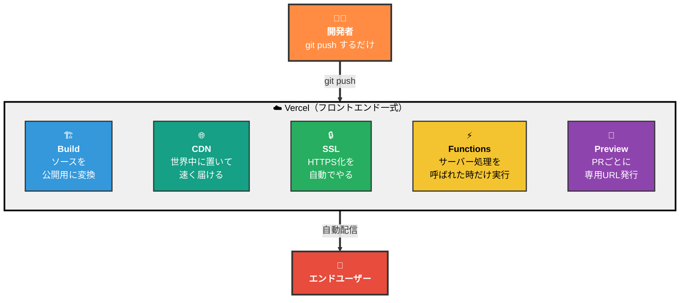

開発者はGitHubに変更を**push**するだけ。Vercelが裏で「ビルド → CDNに配信 → HTTPS化」を全部やって、ユーザーがアクセスできるURLを発行する。サーバーの面倒は一切見なくていい。

> 📝 中心にあるのは **CDN（コンテンツ配信網）**。HTMLや画像のような「変わらないもの」は世界中のサーバーにコピーが置かれ、API（プログラムから呼び出すための窓口）のような「動的処理」はサーバーレス関数で動く。「全部CDNとサーバーレスに乗っている」と理解すると見通しがよくなる。

---

## 2. よくある勘違い

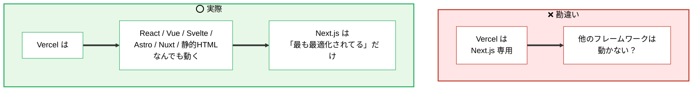

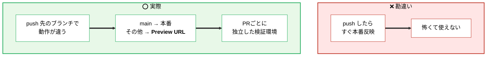

---

## 3. はじめの一歩

何から始めるのか、迷わないように流れだけ押さえる。

> 📝 GitHub連携してリポジトリを選ぶと、Vercelが自動で「これはNext.js／Reactね」と検出し、適切なビルド設定をかけてくれる。**設定ファイルを書かなくても動く**のがVercelの売り。

各ステップを補足すると:

| ステップ | 何をする | 補足 |
| -------- | -------- | ---- |
| ① サインアップ | GitHubアカウントでログイン | メアド登録だけでもOK |
| ② New Project | 公開したいリポジトリを選ぶ | Vercelに権限を渡す |
| ③ 自動検出 | Next.js / React等を判定 | 後述 §6 |
| ④ 環境変数 | APIキーなどの設定値を入力 | 後述 §7。空でもまず動く |
| ⑤ Deploy | ボタンを押すだけ | 数十秒〜数分待つ |
| ⑥ URL発行 | `xxx.vercel.app` が即発行 | 完了！ |

### 💸 無料枠（Hobby plan）の主な制限

| 項目 | 上限 | 詰まったら |
| ---- | ---- | --------- |
| 帯域幅 | 100GB/月 | Pro($20/月)へ |
| ビルド時間 | 6,000分/月 | Pro($20/月)へ |
| Functions実行 | 100,000回/日 | 大量呼び出しに注意 |
| Function実行時間 | 10秒/回 | Edge Functionsへ移行 |
| 商用利用 | ❌ 不可 | Pro必須 |
| チーム共有 | 個人専用 | Proでチーム機能 |

> 🚨 個人開発や趣味なら無料枠で十分。**商用サービスはPro必須**（ライセンス的に）。スタートアップが本番運用するなら最低Pro。

---

## 4. Git連携とデプロイの流れ

Vercelの核は**Gitとの連携**。pushがそのままデプロイ（=公開作業）のトリガーになる。

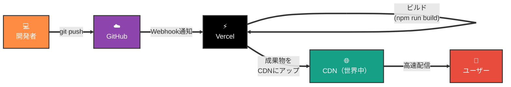

> 📝 **Webhook（ウェブフック）** = 「何かが起きたら、別のサービスに自動で電話する」仕組み。ここではGitHubが「新しいpushが来たよ！」とVercelに知らせている。これがあるからVercelは**push直後に動き始められる**。

### ブランチによって行き先が変わる

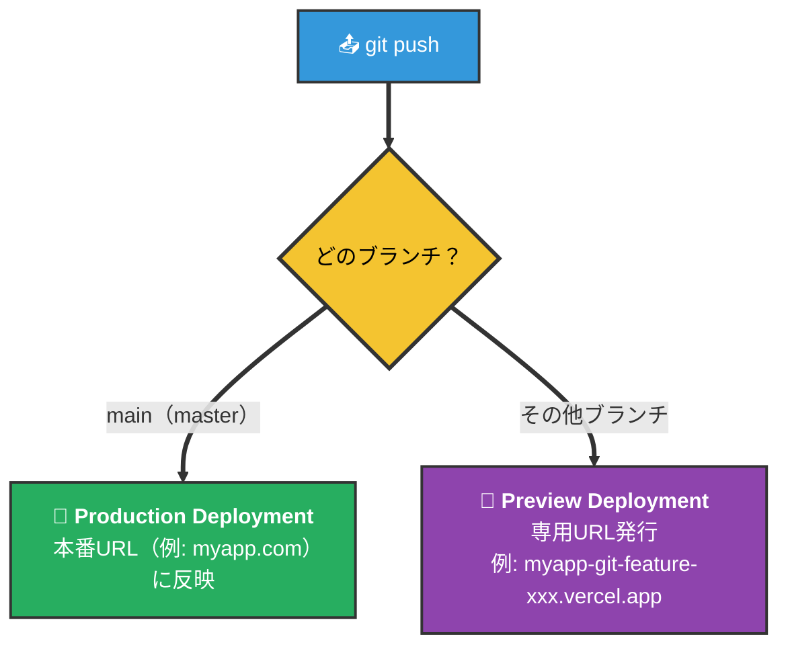

> 📝 「**Production = mainブランチ**」が初期設定。設定で別ブランチを本番にすることもできるが、まずはこの形で覚えればOK。詳細は [git.md](../02_git/git.md) §4 のPRフローと組み合わせて読むと理解が深まる。

---

## 5. Preview Deployment — PRごとの検証URL

VercelのいちばんユニークなところがこのPreview。**プルリクエストごとに独立したURL**が自動で発行される。

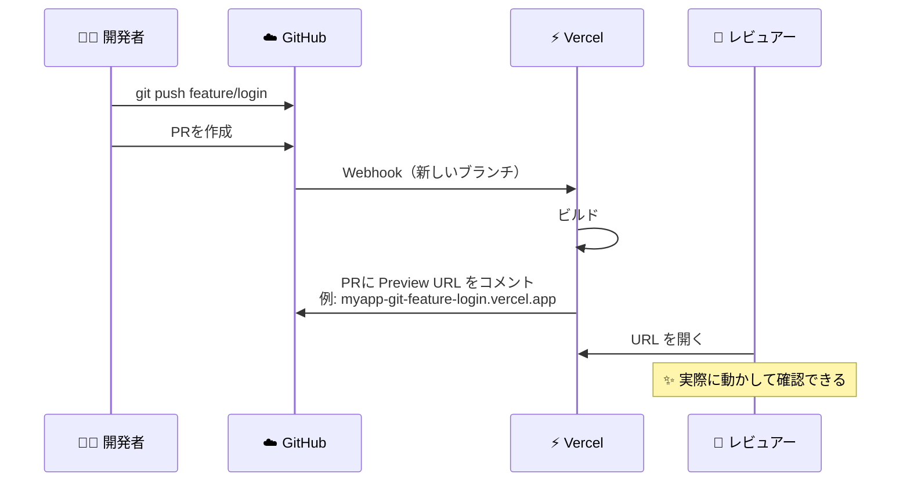

### 何が嬉しいの？

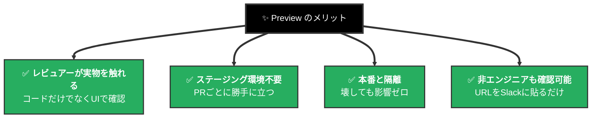

> 📝 PRをマージするまでPreview URLは生きている。マージ後は自動的に**Production**へ反映され、Preview URLは履歴として残る。

---

## 6. プロジェクトとフレームワーク自動検出

Vercelは`package.json`を見て、フレームワークを推測する。**設定ファイルを書かなくても動く**のが基本。

> 📝 **package.json** = JavaScript/TypeScriptプロジェクトの「設計書」。「このアプリは何を使ってるか（React、Next.jsなど）」「ビルドするときのコマンドは何か」が書かれている。Vercelはこれを覗いて判断する。

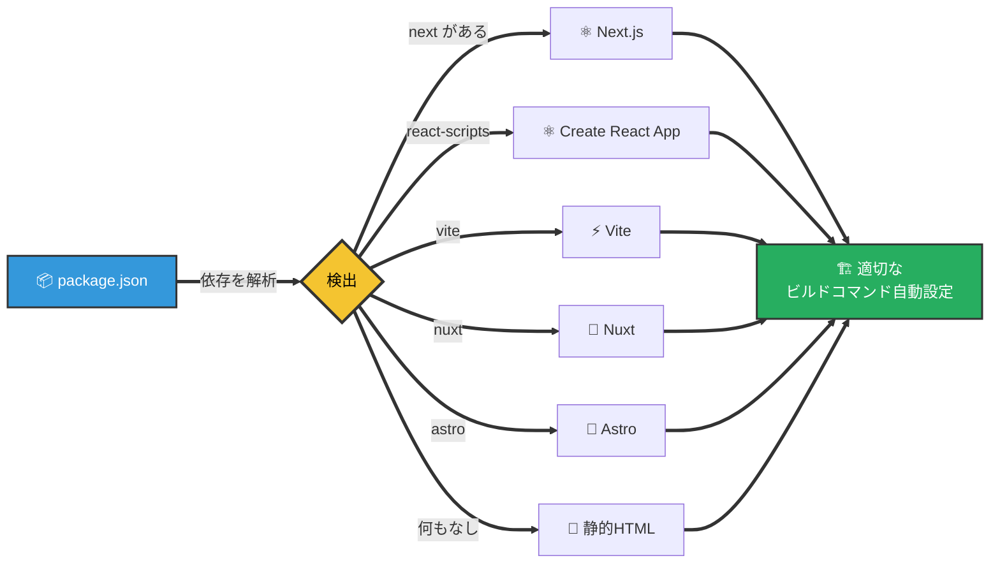

### 主なビルド設定の項目

| 項目 | 何を指定する | デフォルト |
| ---- | ----------- | --------- |
| Framework Preset | フレームワーク名 | 自動検出 |
| Build Command | ビルド時に実行 | `npm run build` |
| Output Directory | 成果物の場所 | フレームワーク準拠 |
| Install Command | 依存インストール | `npm install` |
| Root Directory | プロジェクトのルート | リポジトリ直下 |

> 📝 モノレポ（1つのリポジトリに複数アプリ）の場合、**Root Directory**で「このアプリは`apps/web/`を見て」と指定するのが定番。

---

## 7. 環境変数 — 3つの環境を使い分ける

> 📝 **環境変数** = APIキー・パスワード・DBの接続先など、「**コードに直接書き込みたくない設定値**」を外から渡す仕組み。たとえば`API_KEY=abc123`のように「名前と値」のペアで持つ。コードからは「名前」で呼び出す。Git管理から外したい秘密情報の置き場として標準的（[git.md](../02_git/git.md) §8 の `.env` の話と地続き）。

VercelはAPIキーなどを**3つの環境（Production / Preview / Development）ごとに分けて持てる**のが特徴。

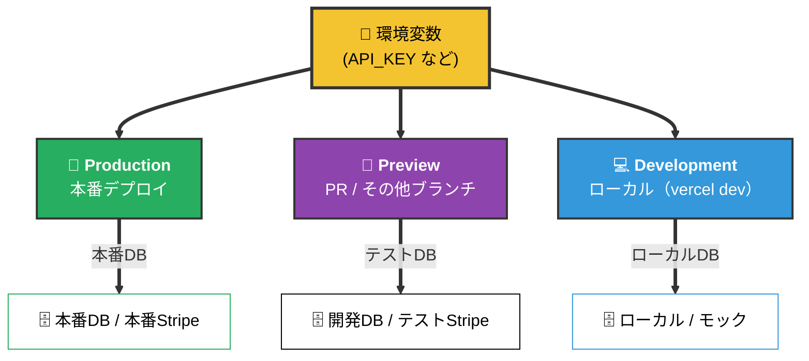

> 📝 「Previewに本番DBのキーを入れない」が鉄則。PreviewはPRごとに自動で立つので、**間違ったマイグレーションを誤って本番に流す事故**を防ぐ。

### 環境変数を入れる場所

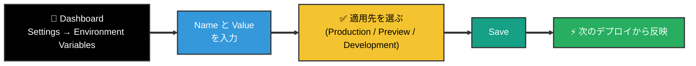

> 🚨 環境変数を変えても、**既にデプロイ済みのバージョンには反映されない**。再デプロイ（Redeploy）が必要。「変えたのに動かない」のほぼ全部がこれ。

---

## 8. ドメインとSSL

Vercelでデプロイすると、最初から **`xxx.vercel.app`** という無料のサブドメインがもらえる。独自ドメインも数分で接続できる。

> 📝 **ドメイン**は「`example.com` のような住所」。**DNS**は「住所からサーバーの実体（IPアドレス）に変換する仕組み」、いわば**インターネットの住所録**。独自ドメインを使うときは、ドメイン業者の管理画面で「このドメインはVercelを指してください」とDNSに書き込む。

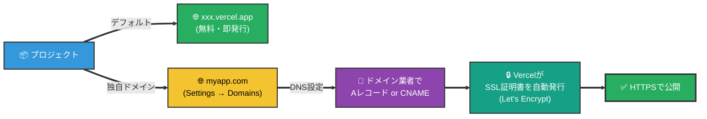

> 📝 **SSL / HTTPS** = ブラウザとサーバー間の通信を暗号化する仕組み。鍵マーク🔒の正体。**Let's Encrypt** という無料で証明書を発行してくれる団体があり、Vercelは内部でこれを使う。**証明書の更新も含めて完全自動**。昔は手動でLet's Encryptを叩いていた作業が、Vercelでは「ドメイン繋ぐ」だけで終わる。

---

## 9. Functions — サーバー処理を書きたいとき

「APIを置きたい」「DBに書き込みたい」「外部サービスを叩きたい」など**サーバー処理**が必要なら、Vercelでは**関数（function）を1ファイル置くだけで動く**。

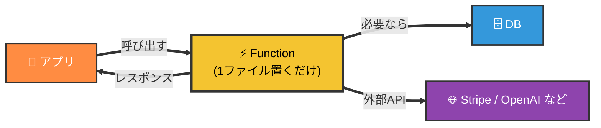

> 📝 サーバーを自分で立てる必要はない。**呼ばれたときだけ瞬間起動して、返事したら消える**（=サーバーレス）。常時稼働しないので、安く・スケールしやすい。

### 実は2種類ある: Serverless と Edge

最初はあまり気にしなくていいが、Vercelの関数には2タイプある。**「速さ重視か、何でもできる重視か」の違い**と思えばOK。

| | 🖥️ **Serverless Functions** | 🌐 **Edge Functions** |
| --- | --- | --- |
| 実行場所 | 固定リージョン（例: 東京） | 世界中（ユーザー近く） |
| 速さ | 普通 | 超速い |
| できること | **なんでもできる**（Node.jsの全機能、npmパッケージ自由） | **軽い処理だけ**（認証チェック・リダイレクトなど） |
| 実行時間 | 長め（数秒〜数十秒OK） | 短い（数百ミリ秒推奨） |
| 迷ったら | **こちらが基本** | レイテンシ最優先のときに |

> 📝 Next.jsの場合、`app/api/xxx/route.ts` を置けば自動的にServerless Functionになる。「Edge化」は1行追加するだけで切り替え可能。**まずはServerlessから始めて、必要に応じてEdgeにする**のが順当。

---

## 10. ロールバック — 過去のデプロイに戻す

本番に問題が出たら、**過去の任意のデプロイに1クリックで戻せる**。これがVercel運用の安心感の正体。

> 📝 過去のビルド成果物はそのまま残っているので、**「もう一度ビルド」が要らない**のがポイント。再デプロイではなく、配信先を切り替えるだけ。

注意点として、DBのスキーマ（テーブル構造）が変わっている場合は古いコードが新しいDBで動かないこともある。コードだけで完結する変更でないなら、慎重にロールバック。

> 🚨 [supabase.md](../03_supabase/supabase.md) §11のマイグレーション運用と合わせて考える。

---

## 11. ビルドキャッシュとビルドログ

毎回フルビルドだと時間がかかるので、Vercelは**ビルド成果物をキャッシュ**する（再利用のために取っておく）。

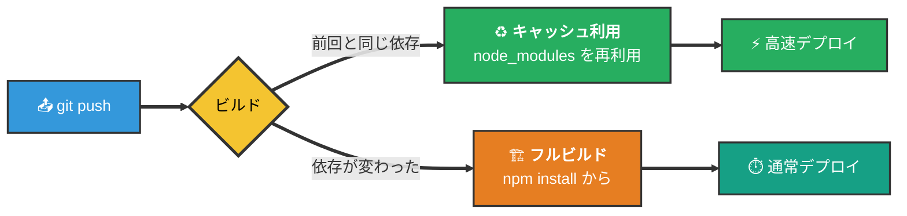

### ビルドが失敗したら？

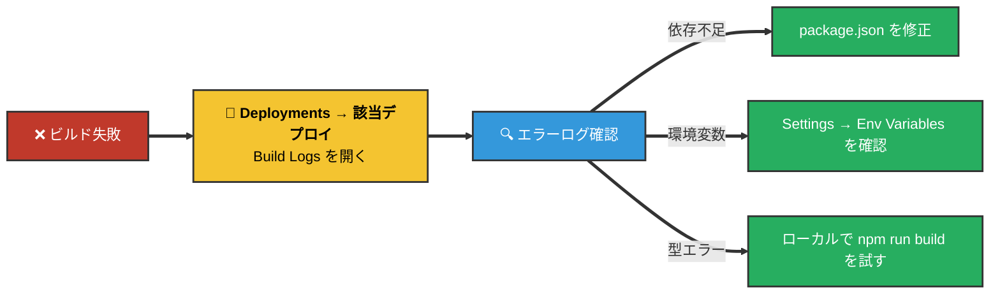

> 📝 「ローカルで動くのにVercelで動かない」のほとんどは**環境変数の設定漏れ**か**Node.jsバージョンの差**。Settings → General で Node version も指定できる。

---

## 12. 迷ったらどこを見る？

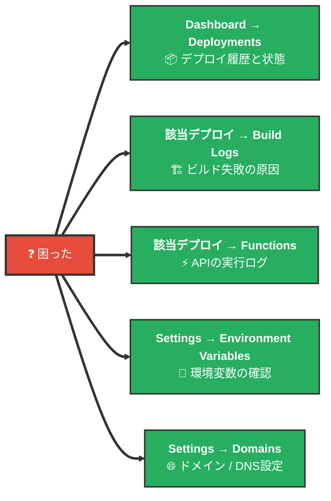

「デプロイは成功してるのに動かない」のほとんどは**環境変数の未設定**か**反映漏れ**。まずSettings → Env Variablesを疑う。

---

## 13. 補足: Netlify / Cloudflare Pages / Azure SWA との違い

```mermaid
flowchart TB
    subgraph VC["⚡ Vercel"]
        direction TB
        V1["Next.js に最適化"]
        V2["Serverless / Edge<br/>両対応"]
        V3["Preview URL が秀逸"]
    end

    subgraph NL["💚 Netlify"]
        direction TB
        N1["フレームワーク中立"]
        N2["Forms / Identity など<br/>独自機能多め"]
        N3["老舗・安定"]
    end

    subgraph CF["🟧 Cloudflare Pages"]
        direction TB
        C1["CDN最強・無料枠が広い"]
        C2["Workers と統合"]
        C3["ネットワーク層が強力"]
    end

    subgraph AZ["🔷 Azure Static Web Apps"]
        direction TB
        A1["総合クラウドの一部"]
        A2["Free tierでも商用OK"]
        A3["エンプラ/社内縛りに強い"]
    end

    style VC fill:#F0F0F0,stroke:#000,stroke-width:2px,color:#000
    style NL fill:#E8F8E8,stroke:#27AE60,stroke-width:2px,color:#000
    style CF fill:#FFF4E5,stroke:#E67E22,stroke-width:2px,color:#000
    style AZ fill:#E5F1FB,stroke:#0078D4,stroke-width:2px,color:#000
    style V1 fill:#fff,color:#000,stroke:#000
    style V2 fill:#fff,color:#000,stroke:#000
    style V3 fill:#fff,color:#000,stroke:#000
    style N1 fill:#fff,color:#000,stroke:#27AE60
    style N2 fill:#fff,color:#000,stroke:#27AE60
    style N3 fill:#fff,color:#000,stroke:#27AE60
    style C1 fill:#fff,color:#000,stroke:#E67E22
    style C2 fill:#fff,color:#000,stroke:#E67E22
    style C3 fill:#fff,color:#000,stroke:#E67E22
    style A1 fill:#fff,color:#000,stroke:#0078D4
    style A2 fill:#fff,color:#000,stroke:#0078D4
    style A3 fill:#fff,color:#000,stroke:#0078D4
```

**結論: 4者とも「Gitに繋いでpushすればデプロイ」という体験は同じ。差は周辺機能と最適化の方向性。**

- **Vercel**: Next.jsを作っている会社が運営。Next.jsを使うなら最短ルート
- **Netlify**: 一番老舗。Vercelより前からこのモデルを作った
- **Cloudflare Pages**: 帯域無料・ネットワーク強力。コストとパフォーマンス重視ならアリ
- **Azure Static Web Apps**: Microsoftの総合クラウドの一部。**Free tierで商用OK**（Vercel Hobbyより緩い）、エンプラ/社内環境縛りなら本命（[azure.md](../04b_azure/azure.md) §6参照）

> 📝 「**CDN 1個に、Build / Functions / Preview URL を全部生やしたもの**」というのが一番しっくりくる説明。Supabaseが「**Postgresに全部生やしたもの**」、Azureが「**クラウドのデパートに全部並べたもの**」だったのと対になる構造（[supabase.md](../03_supabase/supabase.md) §14 / [azure.md](../04b_azure/azure.md) §16 参照）。
