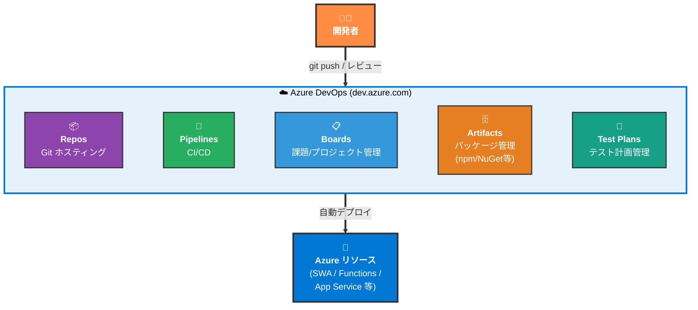
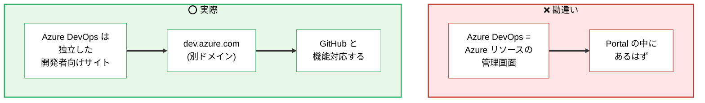
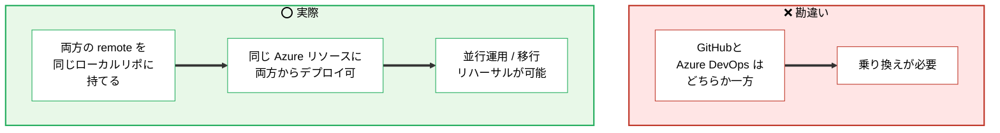
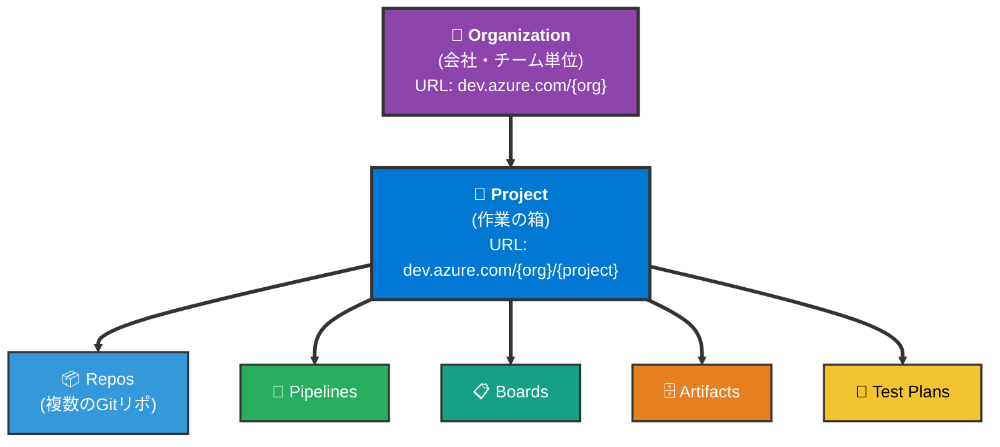
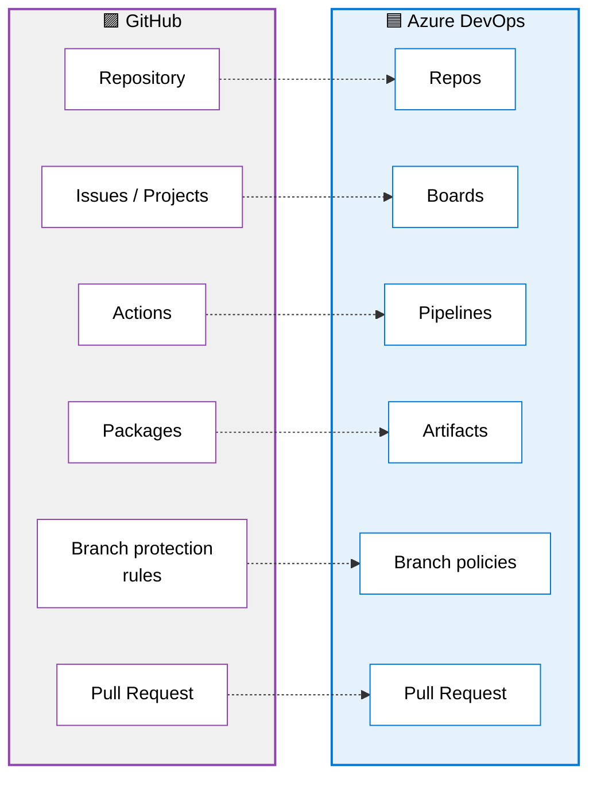
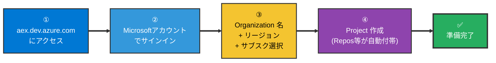
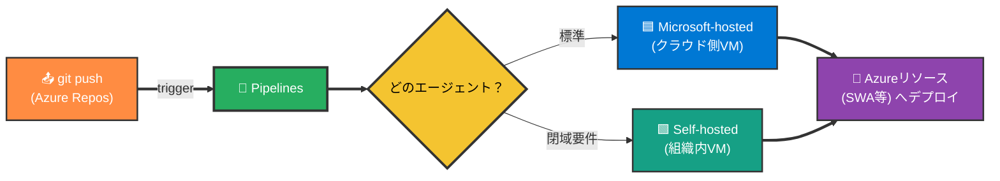
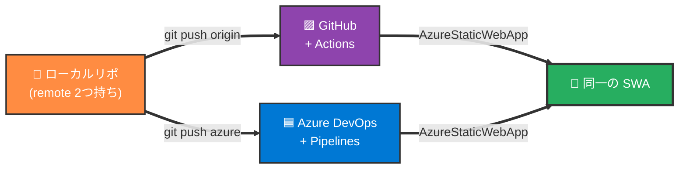
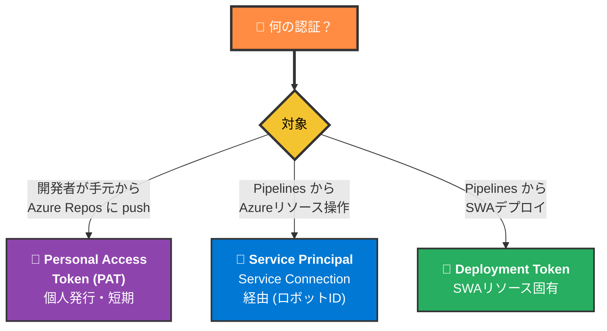
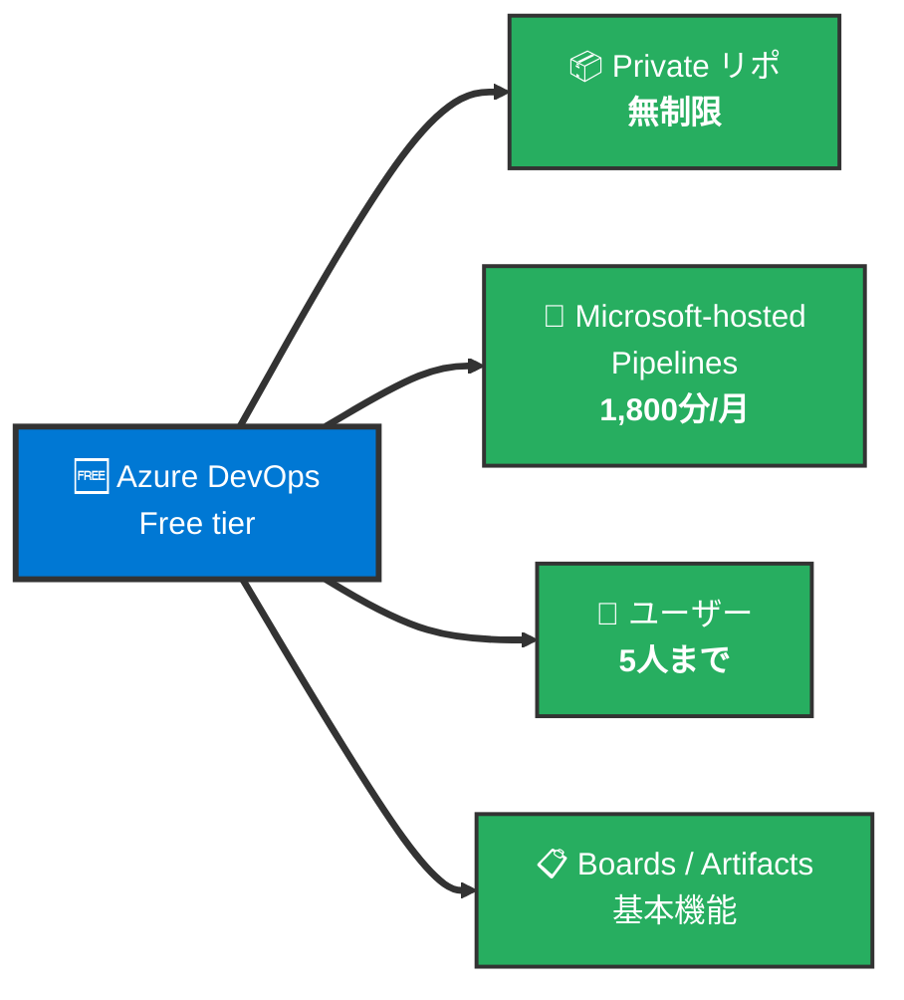

# Azure DevOps 全体像

> 📝 [azure.md](azure.md) が **Azure クラウドの全体像**、[setup.md](setup.md) が **アプリリリースの実手順** だったのに対し、本資料は **Azure DevOps (旧 VSTS)** という「**Microsoft 版の GitHub**」の全体像をまとめる。Azure 本体 (`portal.azure.com`) とは別サイト (`dev.azure.com`) で動く、コード管理 + CI/CD + 課題管理の総合スイート。

🧠 先に押さえておきたい3つの言葉:

- **Azure DevOps**: Microsoft が提供する開発者向け総合プラットフォーム。GitHub 相当の機能を1つのスイートにまとめたもの。
- **Organization**: Azure DevOps の最上位のまとまり (会社・チーム単位)。URL: `dev.azure.com/{organization}`
- **Project**: Organization の中に作る、Repos / Pipelines / Boards 等を内包する作業の箱。GitHub の Repository より粒度が大きい (1 Project に複数の Repos を持てる)。

---

## 1. Azure DevOps が提供するもの

`dev.azure.com` 配下に5つのサービスがまとまっており、**個別に取捨選択して使える**。一番よく使うのは Repos + Pipelines の組み合わせ。

> 📝 Azure DevOps は **Azure 本体 (`portal.azure.com`) とは別サイト**。よくある混同として「Azure に CI/CD を構築する」=「Portal で何かを設定する」と思いがちだが、実際は別ドメインの別サービスを開いて作業する。

---

## 2. よくある勘違い

---

## 3. 階層構造 — Organization / Project / Repos

Azure DevOps の階層は GitHub と微妙に違い、**Organization → Project → 各サービス** という3階層構造。

| 階層 | 役割 | GitHub の対応 |
| ---- | ---- | --- |
| 🏢 **Organization** | 全体の入れ物 | GitHub Organization (≒) |
| 📁 **Project** | 1つの製品・サービスごとに作る箱 | （GitHub には対応概念なし） |
| 📦 **Repos** | Git リポジトリ (Project に複数持てる) | Repository |

> 📝 GitHub では「Organization の直下に Repository」だが、Azure DevOps では **間に Project が1つ挟まる**。1 Project に複数 Repos を持てるため、関連する複数のリポを1箱にまとめられる。

---

## 4. GitHub ⇔ Azure DevOps 対応表

git そのもの (branch / commit / merge / pull / push) は**完全に同一**。違うのは「コードホスティングの UI」と「課題管理の概念」のみ。

### 主要機能の対応表

| 概念 | GitHub | Azure DevOps | 違い |
| --- | --- | --- | --- |
| Git ホスティング | Repository | Repos | 構造的にはほぼ同じ |
| CI/CD | GitHub Actions | Pipelines | YAML 構造が似ている (詳細は [azure.md §11.2](azure.md)) |
| 課題管理 | Issues / Projects | Boards | Boards の方が WBS 寄りで重厚 |
| パッケージ | GitHub Packages | Artifacts | — |
| テスト計画 | (なし) | Test Plans | Azure 独自 |
| ブランチ保護 | Branch protection rules | Branch policies | 機能はほぼ同じ、用語違い |
| 必須レビュワー | Required reviewers | Required reviewers | 完全同一 |
| CI 必須化 | Required status checks | Build validation | 機能同じ |
| マージ後の自動削除 | Auto-delete branches | Delete source branch after merge | 機能同じ |
| Draft PR | Draft pull request | Draft pull request | 完全同一 |
| Issue 紐付け記法 | `Closes #123` | `AB#123` (Boards) | 記法違い、仕組み同じ |
| 認証トークン | Personal Access Token | Personal Access Token (PAT) | 用語同一 |

> 📝 **ローカル側の git コマンドは完全に何も変わらない** (`git checkout` / `commit` / `push` 等)。違うのは「PR を開く UI」と「ブランチ保護の設定画面」だけ。

---

## 5. はじめの一歩 (Organization 作成まで)

> 🚨 **`dev.azure.com` が Azure Portal にリダイレクトされる罠**: 既存の Azure ログインセッションがあると、`dev.azure.com` を開いても `portal.azure.com` に飛ばされることがある。確実なのは **`https://aex.dev.azure.com/`** (Organization 作成専用ページ) を直接叩く方法。
>
> 🚨 **リージョンは地域単位**: Azure 本体は「Japan East」等の国単位だが、**Azure DevOps の選択肢は地域単位** (`Asia Pacific` / `East US` 等)。日本ラベルは出ない。日本向けは Asia Pacific を選ぶ (実体はシンガポール or 香港 DC)。

具体的な手順とハマりどころは [setup.md §2-B Step ①](setup.md) を参照。

---

## 6. CI/CD: Pipelines

Azure Pipelines は **GitHub Actions の Azure DevOps 版**。

| 観点 | GitHub Actions | Azure Pipelines |
| --- | --- | --- |
| 定義ファイル | `.github/workflows/*.yml` | `azure-pipelines.yml` (リポ直下) |
| シークレット | GitHub Secrets | Pipeline Variables / Variable Group |
| エージェント | GitHub-hosted (Microsoft管理) | Microsoft-hosted (Azure管理) / Self-hosted |
| Azure 公式タスク | `Azure/static-web-apps-deploy@v1` | `AzureStaticWebApp@0` |

> 📝 YAML の概念対応表は [azure.md §11.2](azure.md) に詳細あり。`trigger` / `jobs` / `steps` / `task` の構造はそっくりで翻訳が容易。

---

## 7. 並行運用パターン

「GitHub を本番のホストにしつつ、Azure DevOps を**学習・移行リハーサル・冗長化**のために並行で動かす」という構成が現実的に有用。

### 同一ローカルリポに 2 つの remote を持つ

| コマンド | 用途 |
| --- | --- |
| `git remote add azure <Azure Repos URL>` | Azure Repos を 2nd remote として追加 |
| `git push origin main` | GitHub 側に push → GitHub Actions が起動 |
| `git push azure main` | Azure Repos 側に push → Pipelines が起動 |
| `git push origin main && git push azure main` | 両方に push → 両方の CI/CD が起動 (同じ SWA にデプロイ) |

> 📝 **デプロイトークンは同じものを両方で使う**ため、SWA リソースは1つで済む。同じ SWA に対して GitHub Actions / Azure Pipelines のどちらが直近に push したかで内容が反映される動作になる。

### 並行運用が活きる場面

| 用途 | 詳細 |
| --- | --- |
| **移行リハーサル** | GitHub Actions で動くものを残しつつ Azure DevOps を試し、動作確認後に切替 |
| **学習・比較** | 同じ処理を2つの CI/CD で動かして UI と挙動の差分を体感 |
| **冗長化** | 片方の CI/CD が障害でも、もう片方からデプロイ継続可能 |

---

## 8. 認証 — PAT と Service Principal

| 認証種別 | 用途 | 取得場所 |
| --- | --- | --- |
| **Personal Access Token (PAT)** | 個人ユーザーが Azure Repos に git push する時の認証 | Azure DevOps → ユーザーアイコン → Personal access tokens |
| **Service Principal** | Pipelines が Azure 全般のリソースを操作する時の認証 (App Service デプロイ等) | Azure DevOps → Project Settings → Service connections |
| **Deployment Token** | Pipelines が **SWA に絞って**デプロイする時の認証 (Service Principal より軽量) | Azure Portal → SWA → デプロイトークンの管理 |

> 🚨 **PAT は表示直後にコピー必須**: 発行時の画面を閉じると**再表示できない**。コピーし忘れた場合は新しいトークンを作り直す。Scope は最小限 (`Code (Read & write)` 等) に絞るのが推奨。
>
> 📝 **SWA だけが目的なら Service Connection は不要**。Deployment Token を Variable に登録すれば動く。Service Connection が必要になるのは App Service / Container Apps / Key Vault 等の汎用リソース操作の時。

---

## 9. PR とブランチ運用

git そのものの概念は GitHub と完全同一 ([git.md §3〜§4](../02_git/git.md) と同じ)。違いは UI と用語のみ。

### Branch Policies で強制できるルール

GitHub の **Branch protection rules** に相当する機能。Project Settings → Repositories → 対象リポ → Policies で設定。

| ポリシー | 内容 |
| --- | --- |
| Require a minimum number of reviewers | レビュー必須人数 |
| Check for linked work items | Boards の作業項目との紐付け強制 |
| Build validation | 指定 Pipeline の成功を merge 条件にする |
| Limit merge types | Merge / Squash / Rebase のうち許可する方式を絞る |
| Automatically delete the source branch | merge 後にブランチ削除 |

> 📝 Azure DevOps は **GitHub よりやや「ガッチリ管理する文化」寄りの UI**。チーム規模や業務要件で細かいポリシーを設定したい場合に向いている。

---

## 10. 個人・小規模利用の無料枠

> 📝 個人検証や小規模チームなら Free tier の範囲内で十分。Microsoft-hosted Agent の 1,800分/月は、軽量 SWA デプロイなら1回数分で済むため**月数百回のビルドが可能**。

---

## 11. 関連資料

- [azure.md](azure.md) — Azure クラウド全体像 (Compute / DB / Identity / DevOps)
  - §11 GitHub以外からのCI/CD — Azure Pipelines の詳細比較
- [setup.md](setup.md) — Azure 環境構築手順
  - §2-B Azure Pipelines版 — DevOps からの実デプロイ手順
- [git.md](../02_git/git.md) — Git 全体像 (Azure Repos でも完全に同じ)
- [vercel.md](../04a_vercel/vercel.md) — 比較対象 (Git連携CI/CDの別パターン)

> 📝 「**GitHub と同じことを Microsoft 配下で完結させたい時の選択肢**」というのが Azure DevOps の位置づけ。業務利用での要件 (Entra ID連携 / 閉域 / 監査) が出てきた時の選択肢としても有効。
