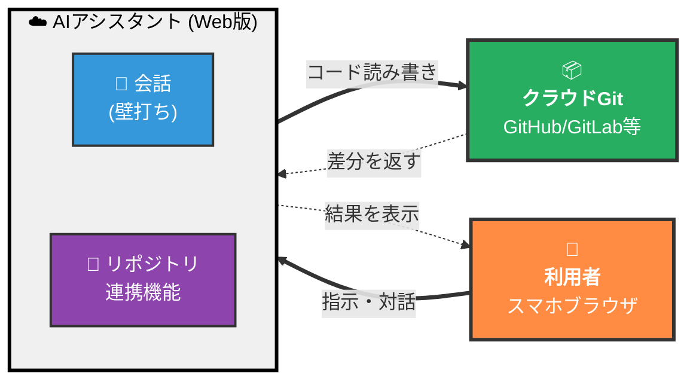
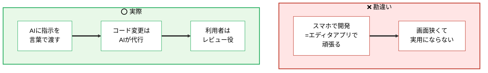
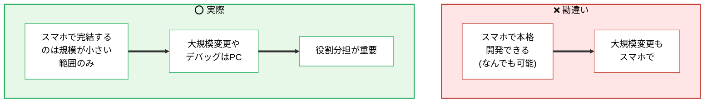
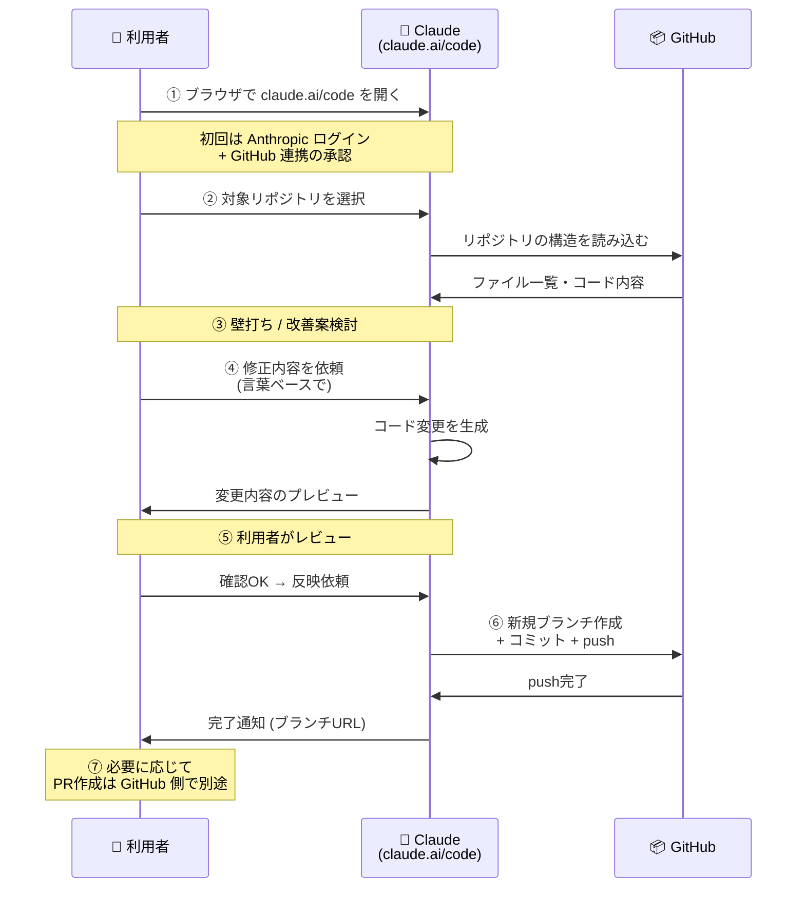
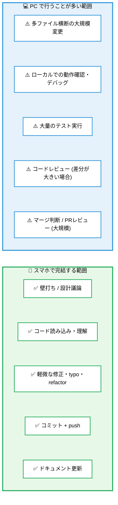
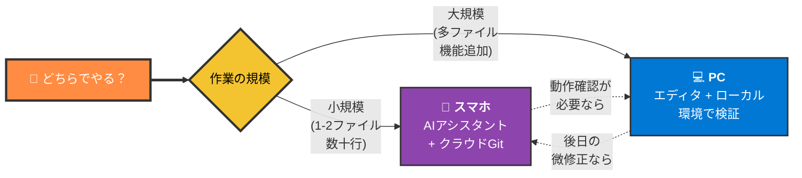
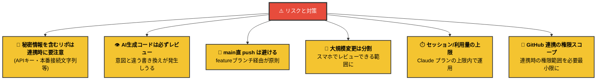
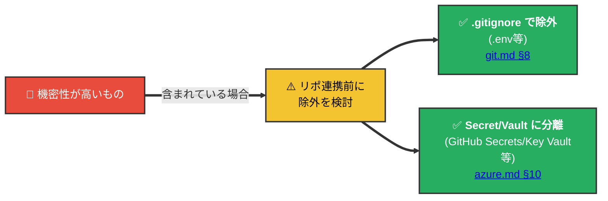
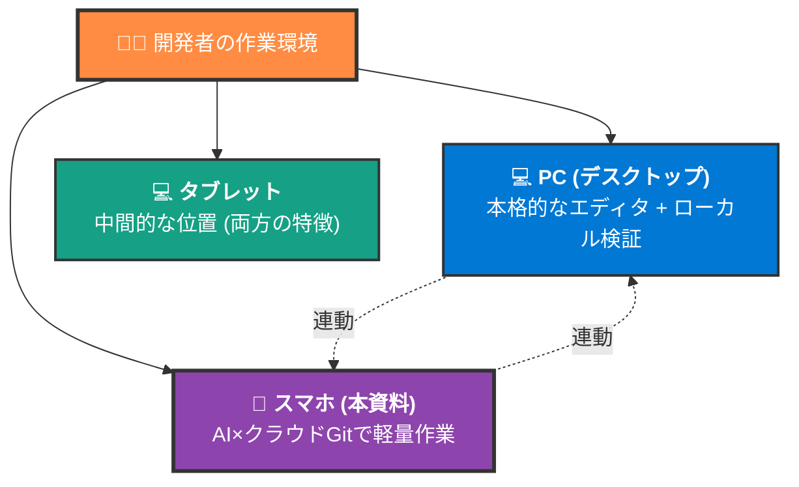

# スマホ開発ワークフロー — AIアシスタント × クラウドGit

> 📝 「スマホで開発」は従来「コードエディタアプリで頑張る」という発想だった。**AIアシスタントの登場で構図が変わり**、スマホブラウザ → AIアシスタント → クラウドGit という流れで、**コードの修正・コミット・push までスマホで完結**できる。本資料はその全体像と境界を整理する。

🧠 先に押さえておきたい言葉:

- **AIアシスタント (Web版)**: ブラウザでアクセスできるAIサービス。Claude.ai / ChatGPT / Gemini など。
- **リポジトリ連携機能**: AIアシスタントが Git ホスト (GitHub等) のリポジトリを直接読み書きできる機能。サービス毎に名称が異なる (Claude Code on the web、ChatGPT Codex、GitHub Copilot Workspace など)。
- **クラウドGit**: GitHub / GitLab / Bitbucket / Azure Repos など、ブラウザからアクセス可能な Git ホスティングサービス。

---

## 1. 全体像

利用者は**スマホブラウザから AI アシスタントと対話**するだけ。実際の「リポジトリを読む」「ファイルを編集する」「コミット・push する」操作は AI が代行する。

> 📝 この構図の本質は、**「キーボード入力 + エディタ画面」というコーディングの前提を取り払った**こと。発想を言葉で渡せばコードに落ちる。スマホの狭い画面でもエディタを開く必要がなくなる。

---

## 2. よくある勘違い

---

## 3. 必要な前提

本資料では **Claude Code on the web** + **GitHub** の組み合わせを代表例として説明する (他の組み合わせは §4 参照)。

> 📝 専用アプリのインストールは**不要**。スマホ標準のブラウザだけで完結する。

> 📝 Claude には無料プランと有料プランがあり、Claude Code on the web の利用範囲・トークン上限はプランによって異なる。継続的に使う場合は有料プランの利用が想定される。

---

## 4. Claude Code on the web の位置づけ

本資料は **Claude Code on the web** (URL: `claude.ai/code`) を代表例として説明する。Anthropic 公式のブラウザ版で、Claude とのチャット形式の対話だけで GitHub リポジトリを読み・書き・コミット・push まで実行できる。

| 項目 | 内容 |
| --- | --- |
| **入口** | `claude.ai/code` (ブラウザでアクセス) |
| **必要なもの** | Anthropic アカウント + GitHub アカウント連携 |
| **対象 Git ホスト** | GitHub (公開・非公開の両方) |
| **できること** | リポジトリ読み込み・コード変更・ブランチ作成・コミット・push |
| **PR / マージ** | GitHub 側で別途実行 (本資料の範囲外) |

> 📝 **同種の選択肢**として、ChatGPT の Codex、GitHub Copilot Workspace、Gemini Code Assist などもある。本資料は Claude Code on the web を中心に書くが、考え方や注意点は他のサービスでも概ね適用できる。具体的な機能差は各サービスの公式ドキュメントを参照。

---

## 5. 典型的なワークフロー

スマホブラウザから `claude.ai/code` にアクセスし、対象 GitHub リポジトリに対して**壁打ち → 変更 → push**まで実行する流れ。

> 📝 **ブランチ運用**は [git.md §3〜§4](../02_git/git.md) と同じ考え方。スマホからは **featureブランチに push まで** をスコープにし、main へのマージは PR 経由で別途行うのが安全。Claude Code on the web は**作業ごとにブランチを切る**動作が基本で、同じ対話内で複数の修正を依頼する場合も Claude 側でブランチを分けて push してくれることが多い (詳細挙動は公式ドキュメント参照)。

---

## 6. スマホで完結する範囲 / 完結しない範囲

> 📝 「**スマホで何でもできる**」と思い込まないことが重要。AIアシスタントは指示通りにコードを生成するが、**生成結果の正しさ・本番影響の判断は利用者の責任**。狭い画面で多ファイル差分を読むのは認知負荷が高く、見落としが発生しやすい。

---

## 7. PC との使い分け

| 観点 | スマホで足りる | PC が必要 |
| --- | --- | --- |
| 修正範囲 | 1〜数ファイル、数十行 | 機能追加・多ファイル横断 |
| 検証 | コードレビューだけで判断可能 | ローカル起動・動作確認が必要 |
| 思考の種類 | 壁打ち・発想出し・小修正 | 集中して書く・デバッグ |
| 作業時間 | 隙間時間 (移動中・休憩) | まとまった時間 (デスクで) |

> 📝 **「スマホでアイデア出し → 軽微な修正は push まで → 大規模実装はPCで完成」**という流れが、両者の強みを活かす一つのパターン。

---

## 8. 注意点とコツ

> 📝 Claude Code on the web は対話ごとにトークンを消費し、プランによって**1日 / 1ヶ月の利用量上限**が定められている。スマホでの長時間連続作業は上限に当たりやすいため、**1セッション=1まとまった作業**として区切ると効率的。
>
> 🚨 **GitHub 連携時の権限スコープ**: 初回連携時に「すべてのリポジトリへのアクセス」と「特定のリポジトリのみ」が選択できる。**特定のリポジトリのみ**を選び、対象を明示的に限定するのが推奨。後から GitHub 設定 → Applications で範囲を変更可能。

### 秘密情報の取り扱い

> 🚨 リポジトリ自体に `.env` 等のシークレットファイルがコミットされていれば、AIアシスタント側からも閲覧可能になる。スマホ運用かどうかに関わらず、**秘密情報は事前にリポから除外**するのが原則 ([git.md §8](../02_git/git.md))。

---

## 9. 全体像の位置づけ

> 📝 スマホ単体での完結を目指すのではなく、**PCワークフローを補完する位置づけ**として捉えるのが現実的。「PCのときだけ開発」から「移動中も思考と軽作業を進める」への拡張、と考えるとイメージしやすい。

---

## 10. 関連資料

- [git.md](../02_git/git.md) — ブランチ・push・PR の基本概念 (§3〜§4)
- [git.md §8 .gitignore](../02_git/git.md) — 秘密情報をリポに残さないための除外設定
- [azure.md §10](../04b_azure/azure.md) — 環境変数とシークレット管理
- [app-release.md](../01_app-release/app-release.md) — 全体のリリースフローでの位置づけ
