# スマホ開発ワークフロー — AIアシスタント × クラウドGit

> 📝 「スマホで開発」は従来「コードエディタアプリで頑張る」という発想だった。**AIアシスタントの登場で構図が変わり**、スマホブラウザ → AIアシスタント → クラウドGit という流れで、**コードの修正・コミット・push までスマホで完結**できる。本資料はその全体像と境界を整理する。

🧠 先に押さえておきたい言葉:

- **AIアシスタント (Web版)**: ブラウザでアクセスできるAIサービス。Claude.ai / ChatGPT / Gemini など。
- **リポジトリ連携機能**: AIアシスタントが Git ホスト (GitHub等) のリポジトリを直接読み書きできる機能。サービス毎に名称が異なる (Claude Code on the web、ChatGPT Codex、GitHub Copilot Workspace など)。
- **クラウドGit**: GitHub / GitLab / Bitbucket / Azure Repos など、ブラウザからアクセス可能な Git ホスティングサービス。

---

## 1. 全体像

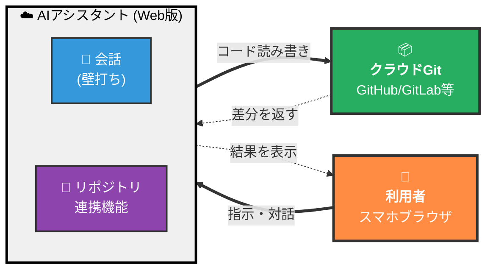

利用者は**スマホブラウザから AI アシスタントと対話**するだけ。実際の「リポジトリを読む」「ファイルを編集する」「コミット・push する」操作は AI が代行する。

> 📝 この構図の本質は、**「キーボード入力 + エディタ画面」というコーディングの前提を取り払った**こと。発想を言葉で渡せばコードに落ちる。スマホの狭い画面でもエディタを開く必要がなくなる。

---

## 2. よくある勘違い

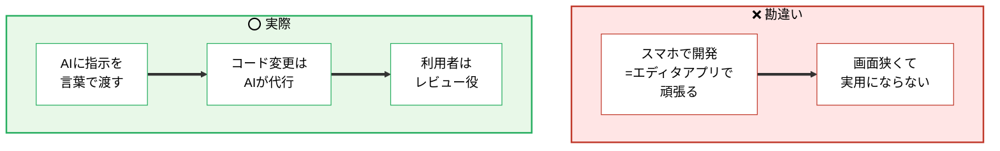

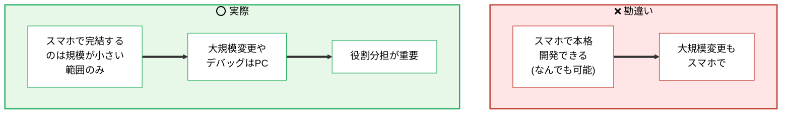

---

## 3. 必要な前提

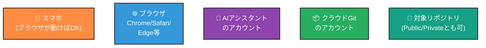

> 📝 専用アプリのインストールは**不要**。スマホ標準のブラウザだけで完結する。

---

## 4. AIアシスタント側の選択肢

リポジトリ連携機能を持つ Web 版 AI アシスタントは複数存在し、それぞれ名称や対応 Git ホストが異なる。

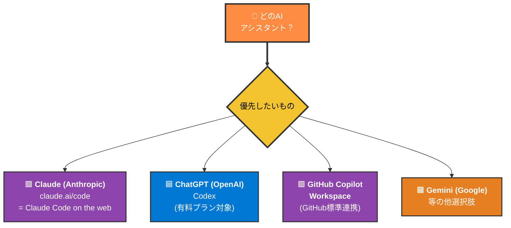

| サービス | URL / 入口 | 特徴 |
| --- | --- | --- |
| **Claude Code on the web** | `claude.ai/code` | Anthropic公式。GitHubリポを直接対象にブランチ作成・編集・push まで実行 |
| **ChatGPT Codex** | `chatgpt.com` の Codex 機能 | OpenAI公式。GitHub連携でリポジトリを sandbox にロード、編集・PR作成 |
| **GitHub Copilot Workspace** | GitHub 内蔵 | Issue/PR から起動する GitHub の AI 機能 |
| **その他 (Gemini Code Assist 等)** | 各社サービス | 機能仕様は各サービスのドキュメント参照 |

> 📝 サービスの**機能名や対応範囲は頻繁に更新**される。本資料では「**この種のサービスが選択肢として存在する**」という事実を示すに留め、具体的な機能比較は各サービスの公式ドキュメントを参照する。

---

## 5. 典型的なワークフロー

スマホブラウザから AI アシスタントを使い、ブランチ作成 → 編集 → push まで実行する流れ。

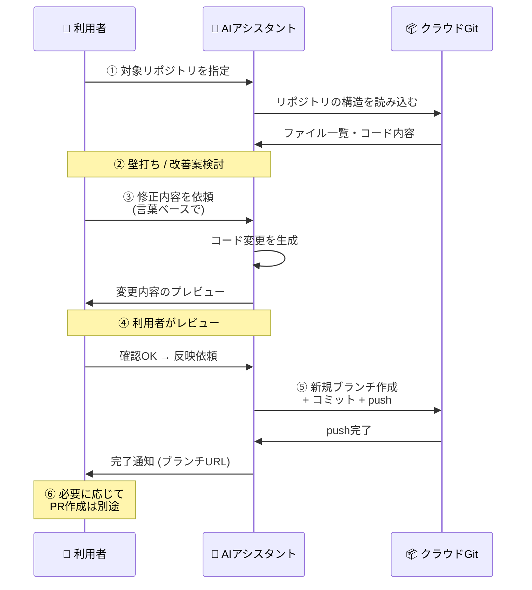

> 📝 **ブランチ運用**は [git.md §3〜§4](../02_git/git.md) と同じ考え方。スマホからは **featureブランチに push まで** をスコープにし、main へのマージは PR 経由で別途行うのが安全。

---

## 6. スマホで完結する範囲 / 完結しない範囲

```mermaid
flowchart TB
    SCOPE["📱 スマホで完結する範囲"]

    SCOPE --> Y1["✅ 壁打ち / 設計議論"]
    SCOPE --> Y2["✅ コード読み込み・理解"]
    SCOPE --> Y3["✅ 軽微な修正・typo・refactor"]
    SCOPE --> Y4["✅ コミット + push"]
    SCOPE --> Y5["✅ ドキュメント更新"]

    OUT["💻 PC で行うことが多い範囲"]

    OUT --> N1["⚠️ 多ファイル横断の大規模変更"]
    OUT --> N2["⚠️ ローカルでの動作確認・デバッグ"]
    OUT --> N3["⚠️ 大量のテスト実行"]
    OUT --> N4["⚠️ コードレビュー (差分が大きい場合)"]
    OUT --> N5["⚠️ マージ判断 / PRレビュー (大規模)"]

    style SCOPE fill:#27AE60,color:#FFFFFF,stroke:#333,stroke-width:3px
    style OUT fill:#3498DB,color:#FFFFFF,stroke:#333,stroke-width:3px
    style Y1 fill:#fff,color:#000,stroke:#27AE60
    style Y2 fill:#fff,color:#000,stroke:#27AE60
    style Y3 fill:#fff,color:#000,stroke:#27AE60
    style Y4 fill:#fff,color:#000,stroke:#27AE60
    style Y5 fill:#fff,color:#000,stroke:#27AE60
    style N1 fill:#fff,color:#000,stroke:#3498DB
    style N2 fill:#fff,color:#000,stroke:#3498DB
    style N3 fill:#fff,color:#000,stroke:#3498DB
    style N4 fill:#fff,color:#000,stroke:#3498DB
    style N5 fill:#fff,color:#000,stroke:#3498DB
```

> 📝 「**スマホで何でもできる**」と思い込まないことが重要。AIアシスタントは指示通りにコードを生成するが、**生成結果の正しさ・本番影響の判断は利用者の責任**。狭い画面で多ファイル差分を読むのは認知負荷が高く、見落としが発生しやすい。

---

## 7. PC との使い分け

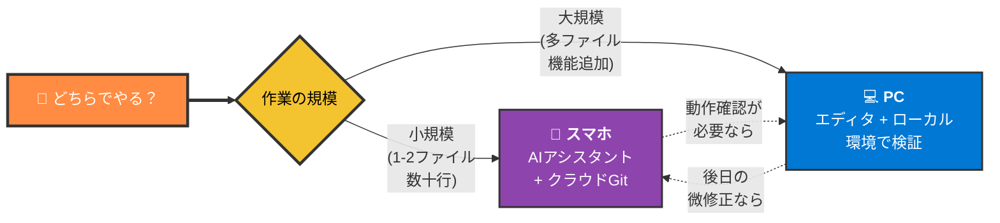

| 観点 | スマホで足りる | PC が必要 |
| --- | --- | --- |
| 修正範囲 | 1〜数ファイル、数十行 | 機能追加・多ファイル横断 |
| 検証 | コードレビューだけで判断可能 | ローカル起動・動作確認が必要 |
| 思考の種類 | 壁打ち・発想出し・小修正 | 集中して書く・デバッグ |
| 作業時間 | 隙間時間 (移動中・休憩) | まとまった時間 (デスクで) |

> 📝 **「スマホでアイデア出し → 軽微な修正は push まで → 大規模実装はPCで完成」**という流れが、両者の強みを活かす一つのパターン。

---

## 8. 注意点とコツ

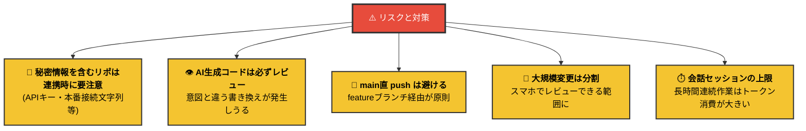

### 秘密情報の取り扱い

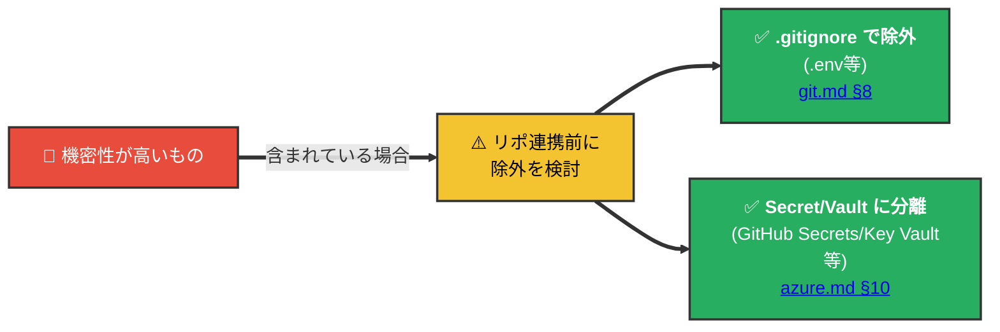

> 🚨 リポジトリ自体に `.env` 等のシークレットファイルがコミットされていれば、AIアシスタント側からも閲覧可能になる。スマホ運用かどうかに関わらず、**秘密情報は事前にリポから除外**するのが原則 ([git.md §8](../02_git/git.md))。

---

## 9. 全体像の位置づけ

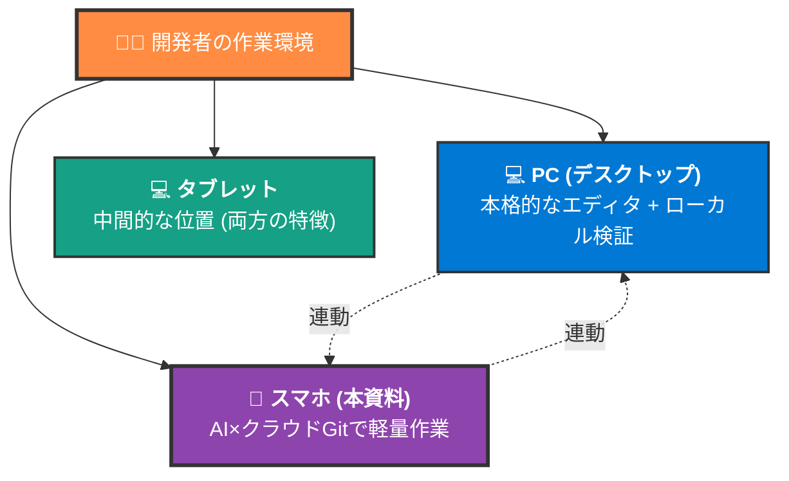

> 📝 スマホ単体での完結を目指すのではなく、**PCワークフローを補完する位置づけ**として捉えるのが現実的。「PCのときだけ開発」から「移動中も思考と軽作業を進める」への拡張、と考えるとイメージしやすい。

---

## 10. 関連資料

- [git.md](../02_git/git.md) — ブランチ・push・PR の基本概念 (§3〜§4)
- [git.md §8 .gitignore](../02_git/git.md) — 秘密情報をリポに残さないための除外設定
- [azure.md §10](../04b_azure/azure.md) — 環境変数とシークレット管理
- [app-release.md](../01_app-release/app-release.md) — 全体のリリースフローでの位置づけ
