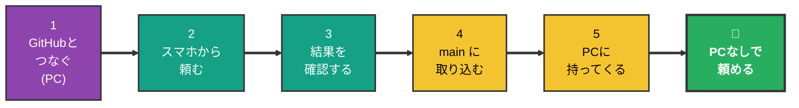
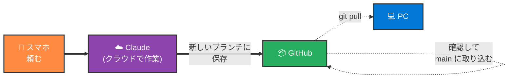
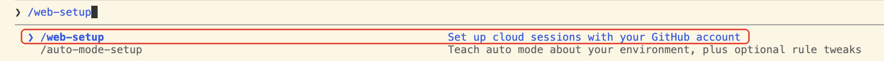
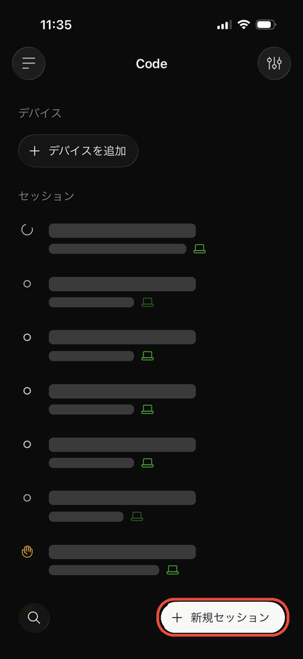
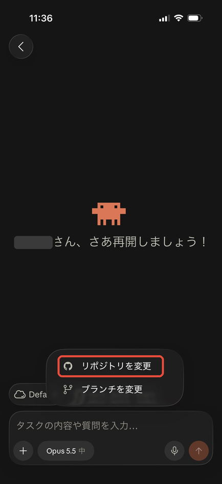
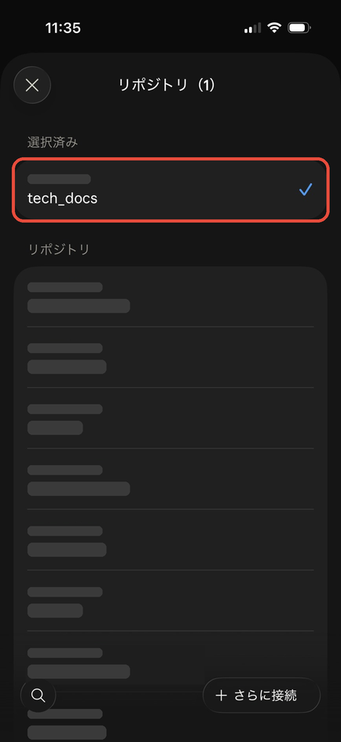
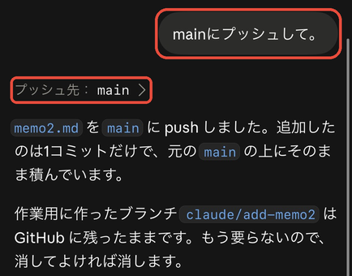
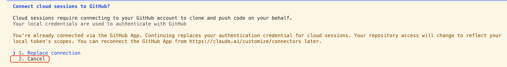

# スマホだけで Claude Code に頼む手順 — GitHub × Claude Code on the web

> 📝 [mobile-workflow.md](mobile-workflow.md) の考え方を、実際に手を動かす順番にしたもの。プロジェクトを GitHub に置いておき、Claude が**クラウド上で**作業する。**PC を閉じていても、電源を切っていても、スマホだけで作業を頼める。**
>
> まだ GitHub を使っていない人は、先に [setup.md](setup.md)（リモートコントロール）で十分。PC をつけたままにしておけば、GitHub なしでスマホから頼める。

🧠 想定する到達点:

- PC を閉じたまま、スマホから GitHub のリポジトリに作業を頼める
- Claude の作業結果は**別のブランチ**に入るので、`main` は勝手に書き換わらない
- 中身を確認し、よければ `main` に取り込める（スマホでも PC でも）

🧠 前提（ここが揃っていないと進めない）:

| 必要なもの | まだの場合 |
| --- | --- |
| Claude の**有料プラン（Pro 以上）** | [claude.ai](https://claude.ai) でプランを変更。**無料プランでは使えない** |
| GitHub アカウント | [Git 環境構築手順 2.1](../02_git/setup.md) |
| PC の `gh` で GitHub にログイン済み | [Git 環境構築手順 2.2](../02_git/setup.md) |
| プロジェクトが GitHub に push 済み | [Git 環境構築手順 2.3](../02_git/setup.md) |
| スマホの Claude アプリ | [setup.md 1.1](setup.md) |

---

## 0. 全体マップ



### ファイルの流れ（ここだけ押さえる）



> 💡 **PC のフォルダは、スマホで頼んだ時点では変わらない。** 変わるのは GitHub の上だけ。PC に反映させるのは、帰ってから（手順 5）。

### リモートコントロール（setup.md）との違い

| | この資料（Claude Code on the web） | [setup.md](setup.md)（リモートコントロール） |
| --- | --- | --- |
| 作業する場所 | Anthropic のクラウド | 自分の PC |
| 外出中の PC | **閉じても・電源を切ってもよい** | ふたを開けて、電源につないで、Claude を起動したまま |
| 使えるファイル | GitHub に置いたものだけ | PC にあるもの全部 |
| スマホから新しく始める | **できる**（リポジトリを選ぶだけ） | できない（PC で起動した Claude の続きだけ） |
| 結果が PC に入るまで | GitHub で取り込んで、`git pull` する | すぐ入る |

### どれを何回やる？

| 頻度 | やること | 節 |
| --- | --- | --- |
| **【一生に1回】** | Claude と GitHub をつなぐ | 1 |
| **【毎回】** | スマホから頼む → 結果を確認 | 2 / 3 |
| **【取り込むとき】** | main に取り込み、PC に持ってくる | 4 / 5 |

---

## 1. Claude と GitHub をつなぐ 【一生に1回・PC で】

Git 環境構築手順（2.2）で `gh`（GitHub をターミナルから使う道具。GitHub CLI とも呼ぶ）にログインしてあれば、**Claude に1行打つだけ**でつながる。

1. Cursor でターミナルを開く（開き方は [Git 環境構築手順「ターミナルを開く」](../02_git/setup.md#ターミナルを開く)）
2. ターミナルに `claude` と打って Enter（Claude が起動する）
3. Claude の入力欄に次の1行を打って Enter

```text
/web-setup
```

途中まで打つと候補が出る。`/web-setup` が出ていれば、そのまま Enter でよい。



4. 「**GitHub のログイン情報**（`gh` に保存されているもの）を、Claude のアカウントに送ってよいか」と聞かれるので、許可する
   - Git 環境構築手順で `gh` にログインしたときの情報を、クラウドの Claude にも使わせる、という意味。GitHub に改めてログインしなくて済む
5. **`Connected as （自分の GitHub のユーザー名）`** と出て、ブラウザで claude.ai/code が開けば完了

> ⚠️ これで、**自分の GitHub のリポジトリ全部**を、クラウドの Claude が扱えるようになる。ただし、Claude が触るのは**自分でセッションを始めて選んだリポジトリだけ**。

> ⚠️ リポジトリに `.env` などのパスワード・APIキーが入っていると、Claude からも読めてしまう。**秘密の情報は先に GitHub から外しておく**（[git.md §8](../02_git/git.md)）。

> 💡 `/web-setup` がうまくいかないときは、[付録 A](#付録-a--ブラウザでつなぐ)（ブラウザでつなぐ方法）を使う。

---

## 2. スマホから頼む 【毎回】

**セッション**は、Claude との1つの会話のこと。頼みごとをするたびに、新しいセッションを作る。

① スマホの Claude アプリで **「Code」** を開く

② 右下の **「＋ 新規セッション」** を押す



③ 入力欄の上の **GitHub のマーク（ネコのマーク）のボタン**に、作業するリポジトリが出ている（例: `tech_docs · main`）
   - 前回使ったリポジトリが選ばれている。そのままでよければ ⑤ へ
   - 隣の **雲のマーク「Default」** は「クラウドで作業する」という意味。そのままでよい


④ **別のリポジトリで頼みたいとき**は、ネコのマークのボタンを押す →「**リポジトリを変更**」→ 一覧から使いたいリポジトリを押す

 

   - 上の **「選択済み」** に、使いたいリポジトリだけが入っていれば OK。左上の **×** で閉じる
   - 一覧には、自分のリポジトリのほかに、**招待されて参加している人のリポジトリ**も出る。左下の 🔍 で名前を検索できる

> 💡 **リポジトリを変えるたびに、新しいセッションを作る**のが基本。「家計簿アプリのリポジトリで1つ」「ブログのリポジトリで1つ」のように、頼みごとごとにセッションが並ぶ。[setup.md](setup.md) のリモートコントロールと違って、PC で何も起動していなくても、スマホから好きなリポジトリで始められる。

⑤ 頼みたいことを話す（入力欄のマイクボタンを押して話せば文字になる）

**最初はこれを送ってみる**:

```text
memo.md を作って、「スマホから書きました」と1行書いて。終わったらコミットして push して
```

> ⚠️ **「コミットして push して」まで頼む。** クラウドの Claude は、頼まないとコミットも push もしないことがある。push しないまま放っておくと、**セッションが終わったときにファイルが消える**。

> 💡 **うまく頼むコツ**: 「どのファイルに」「何を」「どんな形で」を入れる。1回のお願いは**小さく**。スマホの画面で確認できる量にする。

> 💡 頼んだら**アプリを閉じてよい**。Claude はクラウドで作業を続けるので、PC もスマホも閉じていて大丈夫。終わったらアプリで確認できる。

> 💡 クラウドの Claude は、ファイルを変えるたびに許可を求めてこない。push するときは**新しいブランチ**（`claude/` で始まる名前）に入るので、`main` が勝手に書き換わることはない。

---

## 3. 結果を確認する 【毎回】

① Claude アプリの「Code」で、さっきのセッション（**雲のアイコン**がついたもの）を開く

② **何をどう変えたか**が出ている。**「プッシュ先: `claude/〜`」**と出ていれば、GitHub の新しいブランチに保存されている


> ⚠️ 「まだコミットも push もしていない」と言われたら、**「コミットして push して」** と返す（画像の上のほう）。「プッシュ先」が出れば OK。

③ 直してほしいところがあれば、**同じセッションで続けて頼む**（同じブランチに追加される）

> 💡 この時点では、`main` も PC のフォルダも**何も変わっていない**。気に入らなければ、そのまま放っておけばよい。

---

## 4. main に取り込む 【取り込むとき】

スマホでも PC でもできる。変更が多いときは、画面が広い **PC のブラウザ**（[claude.ai/code](https://claude.ai/code) で同じセッションを開く）の方が確認しやすい。

① セッションの下にある **「差分 +7」**（数字は増えた行の数）を押す → 変わった中身が表示される

② 中身を確認して、よければ **「PR を作成」** を押す → GitHub にプルリクエスト（PR）ができる

③ できた PR を GitHub で開き、**「Merge pull request」** → **「Confirm merge」** を押す

④ 「Delete branch」というボタンが出たら、押してよい（Claude が作ったブランチを片付けるだけ。main には影響しない）

> 💡 「PR を作成」の代わりに、同じセッションで **「main に取り込むプルリクエストを作って」** と頼んでもよい。

#### 自分だけのリポジトリなら、main に直接 push してもよい

自分しか使わないメモや資料のリポジトリなら、PR を作らずに、同じセッションで **「main に push して」** と頼めば、そのまま main に入る。



- 「プッシュ先: main」と出れば、main に入っている。このあとは手順 5 へ
- Claude が作ったブランチ（`claude/〜`）が残るので、「ブランチを消して」と頼めば片付く

> ⚠️ 人と一緒に作っているリポジトリや、本番で動いているアプリでは、**main に直接入れない**。ブランチ → PR → Merge の流れで、確認してから入れる。


> 💡 プルリクエスト（PR）は「このブランチの変更を main に入れてよいですか？」という確認の場。考え方は [git.md §3〜§4](../02_git/git.md)。

> ⚠️ 中身がよく分からないときは、**マージしない**。同じセッションで「この変更を分かりやすく説明して」と頼めばよい。

---

## 5. PC に持ってくる 【取り込んだあと・PC で】

Cursor でプロジェクトのフォルダを開き、ターミナルで:

```bash
git switch main
git pull
```

`memo.md` が Cursor のファイル一覧に出れば完了。

> 💡 [setup.md](setup.md) のリモートコントロールと違って、**PC には自動で入ってこない**。PC で作業を始める前に、毎回 `git pull` しておくのが習慣。

> 💡 テストで作った `memo.md` は、スマホから「memo.md を消して」と頼み、同じ流れ（3〜5）で取り込めば消せる。流れの練習にもなる。

---

### 🎉 ゴール

- PC を閉じたまま、スマホの Claude アプリ →「Code」→「＋ 新規セッション」→ リポジトリを選んで頼める
- 結果は別のブランチに入り、確認してから main に取り込める
- `git pull` で PC にも反映できる

---

## 困ったとき

| こうなった | こうする |
| --- | --- |
| `/web-setup` と打っても「No commands match」と出る | Claude に有料プランのアカウントでログインしていない。Claude の入力欄で `/login` と打ってログインし直す |
| `/web-setup` で「Connect cloud sessions to GitHub?」「You're already connected via the GitHub App」と出る | 前にブラウザで GitHub とつないだことがある。スマホでリポジトリを選べているなら、↓ キーで「2. Cancel」を選んで Enter（今のつなぎ方のまま使う）。画面は[下の画像](#すでにつないである場合の画面) |
| `/web-setup` で `gh` のエラーが出る | ターミナルで `gh auth status` と打ち、GitHub にログインしているか確認（[Git 環境構築手順 2.2](../02_git/setup.md)） |
| スマホでリポジトリが一覧に出ない | ターミナルで `gh repo view 自分のユーザー名/リポジトリ名` と打って見えるか確認。見えるなら、Claude で `/web-setup` をもう一度 |
| 「PR を作成」が見つからない | GitHub でリポジトリを開く →「Pull requests」タブ →「New pull request」→ Claude が作ったブランチ（`claude/` で始まる名前）を選ぶ |
| PC に変更が入ってこない | 4 のマージをしたか確認 → 5 の `git pull` |
| `git pull` でエラーが出る | PC で編集したまま保存していない変更がある。Claude（PC）に「git pull したらこのエラーが出た」とエラー文を貼って聞く |

### すでにつないである場合の画面



---

## 付録 A — ブラウザでつなぐ

`/web-setup` がうまくいかないときだけ使う。

① PC のブラウザで [claude.ai/code](https://claude.ai/code) を開き、Claude のアカウントでログインする

② GitHub とつなぐように案内が出るので、そのとおりに進み、GitHub の画面で **Authorize（許可）** を押す

③ **非公開（Private）のリポジトリを使うときは**、[Claude の GitHub App](https://github.com/apps/claude/installations/new) をインストールする

- **「Only select repositories」** を選ぶ
- 使うリポジトリ**だけ**を選んで **Install**

> ⚠️ 「All repositories」を選ぶと、すべてのリポジトリを Claude が扱えるようになる。使うものだけを選ぶ。あとから増やすのは簡単（GitHub の Settings → Applications）。

④ claude.ai/code の画面で、リポジトリの一覧に**自分のリポジトリが出れば完了**

---

## 関連資料

- [setup.md](setup.md) — GitHub なしでスマホから PC の Claude を動かす方法（リモートコントロール）
- [mobile-workflow.md](mobile-workflow.md) — スマホ開発の考え方（何ができて、何は PC でやるか）
- [Git 環境構築手順](../02_git/setup.md) / [git.md](../02_git/git.md) — GitHub・ブランチ・PR の基本
- 公式: [Claude Code on the web](https://code.claude.com/docs/en/claude-code-on-the-web) / [はじめかた](https://code.claude.com/docs/en/web-quickstart) / [モバイル](https://code.claude.com/docs/en/mobile)
