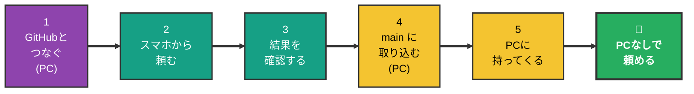
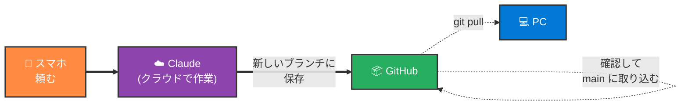
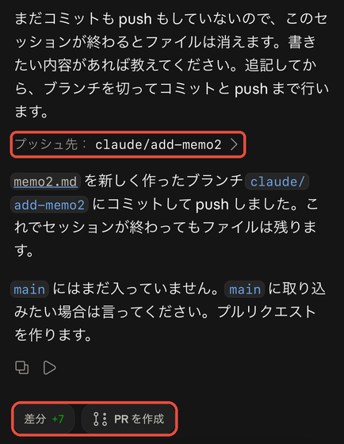

# スマホだけで Claude Code に頼む手順 — GitHub × Claude Code on the web

> 📝 [mobile-workflow.md](mobile-workflow.md) の考え方を、実際に手を動かす順番にしたもの。プロジェクトを GitHub に置いておき、Claude が**クラウド上で**作業する。**PC を閉じていても、スマホだけで作業を頼める。**
>
> まだ GitHub を使っていない人は、先に [setup.md](setup.md)（リモートコントロール）で十分。PC をつけたままにしておけば、GitHub なしでスマホから頼める。

🧠 想定する到達点:

- PC を閉じたまま、スマホから GitHub のリポジトリに作業を頼める
- Claude の作業結果は**別のブランチ**に入るので、`main` は勝手に書き換わらない
- 帰ってから PC で中身を確認し、よければ `main` に取り込める

🧠 前提（ここが揃っていないと進めない）:

| 必要なもの | まだの場合 |
| --- | --- |
| Claude の有料プラン（Pro 以上） | claude.ai でプランを変更 |
| GitHub アカウント | [Git 環境構築手順 2.1](../02_git/setup.md) |
| プロジェクトが GitHub に push 済み | [Git 環境構築手順 2.3](../02_git/setup.md) |
| スマホの Claude アプリ | [setup.md 1.1](setup.md) |

---

## 0. 全体マップ



### ファイルの流れ（ここだけ押さえる）



> 💡 **PC のフォルダは、スマホで頼んだ時点では変わらない。** 変わるのは GitHub の上だけ。PC に反映させるのは、帰ってから（手順 5）。

### どれを何回やる？

| 頻度 | やること | 節 |
| --- | --- | --- |
| **【一生に1回】** | claude.ai/code と GitHub をつなぐ | 1 |
| **【リポジトリごとに1回】** | 使うリポジトリを Claude に許可する | 1 の ③ |
| **【毎回】** | スマホから頼む → 結果を確認 | 2 / 3 |
| **【取り込むとき】** | PC で main に取り込み、PC に持ってくる | 4 / 5 |

---

## 1. GitHub とつなぐ 【一生に1回・PC で】

スマホでもできるが、画面が広い **PC のブラウザ**でやる方が迷わない。

① [claude.ai/code](https://claude.ai/code) を開き、Claude のアカウントでログインする

② **「Sign in with GitHub」** を押し、GitHub の画面で **Authorize（許可）** を押す

<!-- TODO(PCのスクショ): claude.ai/code の Sign in with GitHub ボタン -->


③ 使いたいリポジトリが一覧に出てこないときは、[Claude の GitHub App](https://github.com/apps/claude/installations/new) をインストールする
- **「Only select repositories」** を選ぶ
- 使うリポジトリ**だけ**を選んで **Install**

<!-- TODO(PCのスクショ): GitHub App インストール画面。Only select repositories に赤枠 -->


> 🚨 「All repositories」を選ぶと、**すべてのリポジトリを Claude が読めるようになる**。使うものだけを選ぶ。あとから増やすのは簡単（GitHub の Settings → Applications）。

> 🚨 リポジトリに `.env` などのパスワード・APIキーが入っていると、Claude からも読めてしまう。**秘密の情報は先に GitHub から外しておく**（[git.md §8](../02_git/git.md)）。

④ claude.ai/code の画面で、リポジトリの一覧に**自分のリポジトリが出れば完了**

<!-- TODO(PCのスクショ): claude.ai/code のリポジトリ選択に自分のリポジトリが出ている画面 -->


---

## 2. スマホから頼む 【毎回】

① スマホの Claude アプリで **「Code」** を開く

② **新しいセッション**を作り、**リポジトリを選ぶ**

<!-- TODO(スマホのスクショ): Codeで新しいセッションを作り、リポジトリを選ぶ画面 -->


③ 頼みたいことを話す（キーボードのマイクボタンで話せば文字になる）

**最初はこれを送ってみる**:

```text
memo.md を作って、「スマホから書きました」と1行書いて
```

> 💡 **うまく頼むコツ**: 「どのファイルに」「何を」「どんな形で」を入れる。1回のお願いは**小さく**。スマホの画面で確認できる量にする。

> 💡 頼んだら**アプリを閉じてよい**。Claude はクラウドで作業を続けるので、PC もスマホも閉じていて大丈夫。終わったらアプリで確認できる。

---

## 3. 結果を確認する 【毎回】

① Claude アプリの同じセッションを開くと、**何をどう変えたか**が出ている

② 作業結果は GitHub の**新しいブランチ**に保存されている（ブランチ名もセッションに出る）

<!-- TODO(スマホのスクショ): 作業完了後のセッション画面。変更内容とブランチ名に赤枠 -->


③ 直してほしいところがあれば、**同じセッションで続けて頼む**（同じブランチに追加される）

> 💡 この時点では、`main` も PC のフォルダも**何も変わっていない**。気に入らなければ、そのまま放っておけばよい。

---

## 4. main に取り込む 【取り込むとき・PC で】

差分をしっかり見るために、**PC で**やる。

① GitHub でリポジトリを開く → 上に出る **「Compare & pull request」** を押す

<!-- TODO(PCのスクショ): GitHub の Compare & pull request ボタン -->


② **「Files changed」** タブで、変わった中身を確認する

③ よければ **「Merge pull request」** → **「Confirm merge」**

<!-- TODO(PCのスクショ): Merge pull request ボタン -->


> 💡 プルリクエスト（PR）は「このブランチの変更を main に入れてよいですか？」という確認の場。考え方は [git.md §3〜§4](../02_git/git.md)。

> ⚠️ 中身がよく分からないときは、**マージしない**。Claude の Code のセッションで「この変更を分かりやすく説明して」と頼めばよい。

---

## 5. PC に持ってくる 【取り込んだあと・PC で】

Cursor でプロジェクトのフォルダを開き、ターミナルで:

```bash
git switch main
git pull
```

`memo.md` が Cursor のファイル一覧に出れば完了。

<!-- TODO(PCのスクショ): git pull 後、Cursor に memo.md が出ている画面 -->


> 💡 [setup.md](setup.md) のリモートコントロールと違って、**PC には自動で入ってこない**。PC で作業を始める前に、毎回 `git pull` しておくのが習慣。

---

### 🎉 ゴール

- PC を閉じたまま、スマホの Claude アプリ →「Code」→ リポジトリを選んで頼める
- 結果は別のブランチに入り、PC で確認してから main に取り込める
- `git pull` で PC にも反映できる

---

## 困ったとき

| こうなった | こうする |
| --- | --- |
| リポジトリが一覧に出ない | 1 の ③。GitHub App で、そのリポジトリを許可したか確認 |
| 「Compare & pull request」が出ない | GitHub の **Pull requests** タブ →「New pull request」→ Claude が作ったブランチを選ぶ |
| PC に変更が入ってこない | 4 のマージをしたか確認 → 5 の `git pull` |
| `git pull` でエラーが出る | PC で編集したまま保存していない変更がある。Claude（PC）に「git pull したらこのエラーが出た」とエラー文を貼って聞く |

---

## 関連資料

- [setup.md](setup.md) — GitHub なしでスマホから PC の Claude を動かす方法（リモートコントロール）
- [mobile-workflow.md](mobile-workflow.md) — スマホ開発の考え方（何ができて、何は PC でやるか）
- [Git 環境構築手順](../02_git/setup.md) / [git.md](../02_git/git.md) — GitHub・ブランチ・PR の基本
- 公式: [Claude Code on the web](https://code.claude.com/docs/en/claude-code-on-the-web) / [はじめかた](https://code.claude.com/docs/en/web-quickstart) / [モバイル](https://code.claude.com/docs/en/mobile)
