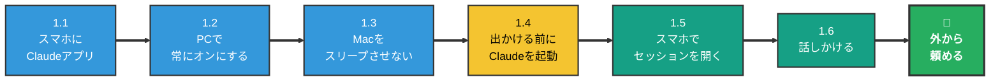
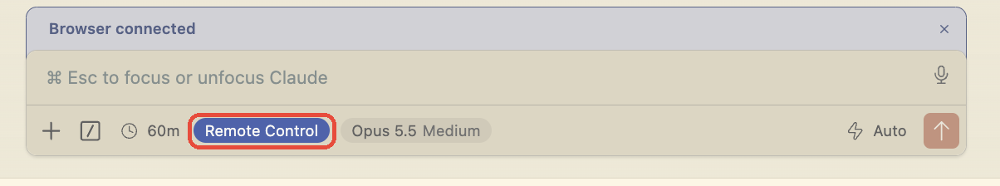

# スマホから PC の Claude Code を動かす手順 — リモートコントロール

> 📝 PC の Claude Code を**つけたまま**にしておき、外出先からスマホで話しかけて作業を頼む方法。**Git も GitHub も不要**で、PC にあるフォルダ・ファイルをそのまま使える。
>
> PC を閉じていても使いたくなったら → [setup-web.md](setup-web.md)（GitHub を使う方法）

🧠 想定する到達点:

- 電車での移動中や待ち時間に思いついたことを、**スマホから Claude Code に話しかけて**、PC のプロジェクトにメモや資料として残せる
- PC で途中まで進めた作業の続きを、スマホから指示できる

🧠 こんな使い方ができる:

| 場面 | スマホから送る言葉の例 |
| --- | --- |
| アイデアを思いついた | 「家計簿アプリのアイデアを話すので、`ideas/` にメモとして保存して」 |
| 資料を作っておいてほしい | 「週末の旅行先の候補を3つ、移動時間と費用で比べて `notes/` にまとめておいて」 |
| PCの作業の続き | 「さっきの企画書に、スケジュールの章を足しておいて」 |

> 💡 文字を打たなくてよい。Claude アプリの**入力欄にあるマイクボタン**を押して話せば、そのまま文字になる。

🧠 前提（ここが揃っていないと進めない）:

| 必要なもの | 確認のしかた |
| --- | --- |
| Claude の**有料プラン（Pro 以上）** | [claude.ai](https://claude.ai) の左下のアカウント名 → 設定 → プラン。**無料プランでは使えない** |
| PC の Cursor で Claude Code が使えている | ふだん Cursor で Claude に話しかけて作業できていれば OK |
| スマホ（iPhone / Android） | アプリを入れられれば OK |

---

## 0. 全体マップ

### 🟢 全体の流れ（20分）

PC の Claude Code を**つけたまま**にしておき、スマホから操作する方法。PC にあるフォルダ・ファイルをそのまま使える。**最初に1回設定すれば、あとはいつもどおり Cursor で Claude を起動しておくだけ。**



### PC をどの状態にしておけばいい？

スマホから頼めるのは、**PC の上で Claude が動き続けているときだけ**。PC が眠っていたり、Claude を閉じていたりすると、つながらない。

| PC の状態 | スマホから使える？ | 説明 |
| --- | --- | --- |
| ふたを開けたまま、電源につないで、Claude を起動している | ⭕ 使える | **この状態にしておく** |
| 画面だけ真っ暗になっている（1.3 の設定をしたあと） | ⭕ 使える | 画面が消えているだけで、中では動いている |
| ロック画面になっている（パスワード入力の画面） | ⭕ 使える | ロックされていても、中では動いている |
| スクリーンセーバーが動いている | ⭕ 使える | 中では動いている |
| 低電力モード | ⭕ 使える | 動きが少し遅くなるだけ |
| **スリープしている** | ❌ 使えない | 中も止まっている。起きれば自動でつながり直す |
| **ふたを閉じた** | ❌ 使えない | ふたを閉じると、Mac はスリープする |
| **電源を切った・再起動した** | ❌ 使えない | Claude も終了している。1.4 からやり直す |
| **Claude を閉じた・Cursor を終了した** | ❌ 使えない | 1.4 からやり直す |
| **Wi-Fi が切れている** | ❌ 使えない | Wi-Fi が戻れば自動でつながり直す |

> 💡 「スリープ」と「画面が消えている」は見た目が同じで、区別がつきにくい。Mac は、何もしないでいると**自動でスリープする**。1.3 の設定で、**画面が消えてもスリープしない**ようにしておく。

### このやり方と GitHub を使うやり方の違い

| | この資料（リモートコントロール） | [setup-web.md](setup-web.md)（Claude Code on the web） |
| --- | --- | --- |
| 作業する場所 | **自分の PC** | Anthropic のクラウド |
| PC | **つけたまま**にしておく | 閉じてよい |
| 使えるファイル | PC にあるもの全部 | GitHub に置いたものだけ |
| スマホから新しく始める | できない（PC で起動した Claude の続きだけ） | できる |
| 準備 | アプリを入れて、設定を1回オンにするだけ（**Git なしで OK**） | Git / GitHub を使えることが前提 |
| おすすめの人 | **まずはこちら** | Git / GitHub を学んだ人 |

### どれを何回やる？

| 頻度 | やること | 節 |
| --- | --- | --- |
| **【一生に1回】** | スマホに Claude アプリを入れてログイン | 1.1 |
| **【一生に1回】** | PC でリモートコントロールを常にオンにする | 1.2 |
| **【一生に1回】** | Mac が勝手にスリープしないようにする | 1.3 |
| **【最初に1回】** | **家で** PC の前に座ったまま、スマホから送って動くか試す | 1.6 |
| **【出かける前に毎回】** | Cursor でプロジェクトを開き、Claude を起動したままにする | 1.4 |
| **【毎回】** | スマホの「Code」から PC のセッションを開いて話しかける | 1.5 / 1.6 |

---

### 1.1 スマホに Claude アプリを入れる 【一生に1回】

1. スマホに **Claude** アプリを入れる
   - iPhone: [App Store](https://apps.apple.com/us/app/claude-by-anthropic/id6473753684)
   - Android: [Google Play](https://play.google.com/store/apps/details?id=com.anthropic.claude)
2. **PC の Claude Code と同じアカウント**（同じメールアドレス）でログインする
3. 左上の **≡（メニュー）** を押し、**「Code」** があることを確認する


> ⚠️ ふだんのチャット画面とは別に「Code」がある。リモートコントロールは**「Code」の中**で使う。

---

### 1.2 PC でリモートコントロールを常にオンにする 【一生に1回】

この設定は**ターミナル**で行う。ふだん拡張機能の Claude を使っている人も、ここだけはターミナルで行う（設定は拡張機能の Claude にも効く）。

1. Cursor でプロジェクトのフォルダを開く
2. ターミナルを開く: Cursor の上のメニュー **「ターミナル」→「新しいターミナル」**（画面の下にターミナルが出る）
3. ターミナルに `claude` と打って Enter（Claude が起動する）
4. Claude の入力欄に次の1行を打って Enter

```text
/config
```

5. 設定の画面が開いたら、そのまま `remote` と打つ（設定が1行に絞り込まれる）
6. **「Enable Remote Control for all sessions」** の行を ↓ キーで選び、Enter で **`true`** にする
7. 行の右側が `true` になっていれば完了


#### あると便利: 許可を求められたらスマホに通知が来るようにする

Claude は作業の途中で「このファイルを変更してよいか」と許可を求めてくることがある。**答えるまで作業は止まったまま**なので、スマホに通知が来るようにしておくと気づける。

8. 同じ設定の画面で、`remote` を消して `push` と打つ
9. **「Push when actions required」** の行を選び、Enter で **`true`** にする
10. **Esc** で設定の画面を閉じる

#### 設定が終わったら

11. ターミナルの Claude は閉じてよい（ターミナルの右上のゴミ箱のマークを押す）
12. **拡張機能の Claude をすでに開いていた場合は、一度閉じて開き直す**（設定は、これから起動する Claude から効く）

> 💡 これで、**これから起動する Claude は全部、自動でスマホからつながる状態**になる。毎回コマンドを打つ必要はない。

---

### 1.3 Mac が勝手にスリープしないようにする 【一生に1回】

Mac は、しばらく何もしないでいると自動でスリープする。スリープするとスマホからつながらないので、**電源につないでいるときはスリープしない**ようにしておく。

#### ノート型の Mac（MacBook）の場合

1. 画面左上の **🍎（アップルメニュー）→「システム設定」**
2. 左の一覧から **「バッテリー」** を選ぶ
3. 右下の **「オプション…」** を押す
4. **「電源アダプタ接続時に、ディスプレイがオフのときに自動でスリープさせない」** をオンにする
5. **「完了」** を押す

#### デスクトップ型の Mac（iMac・Mac mini など）の場合

1. **🍎（アップルメニュー）→「システム設定」→「省エネルギー」**
2. **「ディスプレイがオフのときに自動でスリープさせない」** をオンにする

<!-- TODO(PCのスクショ): バッテリー → オプション の画面。「電源アダプタ接続時に、ディスプレイがオフのときに自動でスリープさせない」に赤枠 -->

> 💡 macOS のバージョンによって、項目の名前が少し違うことがある。見つからないときは、システム設定の左上の検索欄に **「スリープ」** と打つ。

> ⚠️ この設定が効くのは**電源につないでいるときだけ**。電源につないでいないと、Mac はいずれスリープする。出かけるときは**必ず電源につないでおく**。

---

### 1.4 出かける前に Claude を起動しておく 【出かける前に毎回】

> 💡 **初めての人は、出かける前に 1.6 の「🏠 最初の1回は、家で試す」を先にやる。**

1. Mac を**電源につなぐ**
2. Cursor で、**作業したいプロジェクトのフォルダ**を開く
3. Claude を起動する（ふだんどおりでよい。ターミナルの `claude` でも、Cursor の拡張機能の Claude でもどちらでも OK）
4. Claude の入力欄の下に、青い **「Remote Control」** の表示が出ていることを確認する（出ていれば、スマホからつながる状態）



※ 画像は Cursor の拡張機能の Claude の場合。

> ⚠️ 「Remote Control」の表示が出ていないときは、1.2 の設定が `true` になっているか確認し、Claude を一度閉じて開き直す。

5. **ふたは開けたまま**、そのまま出かける（画面は消えてもよい）

> 💡 **このフォルダが Claude の作業場所になる。** 外から頼んだメモや資料は、このフォルダの中に保存される。

> ⚠️ **スマホからは「PC で起動しておいた Claude の続き」を話すだけ。** スマホから新しいフォルダを選んで始めることはできない。
> - 別のフォルダでも作業したいなら、出かける前に**そのフォルダでも** Claude を起動しておく（スマホの一覧にセッションが2つ並ぶ）
> - 出かける前に起動していなかったフォルダは、外からは触れない

---

### 1.5 スマホでセッションを開く 【毎回】

**セッション**は、Claude との1つの会話のこと。PC で Claude を1つ起動すると、セッションが1つできる。

1. スマホの Claude アプリで **「Code」** を開く
2. 「セッション」の一覧から、**緑のノートPCのアイコン**がついたものを探してタップする
   - アイコンの左の小さい文字が、1.4 で開いた**フォルダの名前**（例: `tech_docs`）
   - ※ Git を使っているフォルダだと、後ろに `· main` のような**ブランチ名**も付く。Git を使っていなければ付かないが、気にしなくてよい


> 💡 **ノートPCのアイコン = 自分の PC で動いているセッション**。雲のアイコンは [setup-web.md](setup-web.md) のクラウドのセッションなので、ここでは使わない。

> 💡 一覧に出てこない・開いても返事がないときは、PC がスリープしているか、Claude が止まっている（「[PC をどの状態にしておけばいい？](#pc-をどの状態にしておけばいい)」の表を確認）。

---

### 1.6 スマホから話しかける 【毎回】

1. 入力欄をタップ
2. 入力欄の右にある **マイクボタン** を押して話す（文字で打ってもよい）
3. 送信 → PC の上で Claude が作業し、結果がスマホに出る


> 💡 **うまく頼むコツ**: 「どこに」「何を」「どんな形で」を入れる。
> - ❌「さっきのアイデアまとめて」
> - ⭕「`ideas/` フォルダに、家計簿アプリのアイデアメモを作って。困っていること・使う人・ほしい機能の3つの見出しで」

> ⚠️ Claude が「このファイルを変更してよいか」と聞いてくることがある。内容を読んで、よければ許可する。**分からないときは許可せず、帰ってから PC で確認**すればよい。

#### 🏠 最初の1回は、家で試す（おすすめ）

外で初めて使って、もしつながらなかったら、その場では直せない。**最初の1回は、家で PC の前に座ったまま**スマホから送ってみる。

1. PC で 1.4 のとおり Claude を起動し、スマホで 1.5 のとおりセッションを開く
2. スマホから、これを送る:

```text
このフォルダに memo.md を作って、「スマホから書きました」と1行書いて
```

3. 送ったら、**すぐ PC の Claude の画面を見る**。スマホから送った言葉がそのまま出て、Claude が作業を始めていれば、つながっている


> 💡 上の赤枠がスマホから送った言葉、右下の赤枠「Remote Control」がスマホとつながっている印。

4. Cursor の左のファイル一覧に `memo.md` ができていれば成功。これで外でも使える


> 💡 ファイル名の右の **`U`** は「新しくできて、まだ Git に記録していないファイル」という印。※ Git を使っていないフォルダでは `U` は付かない。ファイル一覧に `memo.md` が出ていれば成功。

5. 確認できたら、`memo.md` は消してよい（ファイル一覧で `memo.md` を右クリック →「削除」）

---

### 🎉 ゴール

- 最初に1回、`/config` でリモートコントロールを常にオンにし、Mac がスリープしないようにしておけば
- 出かける前に、Mac を電源につないで Cursor で Claude を起動しておくだけで
- 移動中にスマホの Claude アプリ →「Code」→ ノートPCのアイコンのセッションから話しかけるだけで
- PC のプロジェクトにメモや資料が残る

---

## 困ったとき

| こうなった | こうする |
| --- | --- |
| スマホの「Code」にセッションが出ない | PC の Cursor で Claude が起動したままか確認。**PC とスマホで同じアカウント**か確認。1.2 の設定が `true` か確認 |
| 外で急につながらなくなった | PC がスリープしたか、電源が抜けた可能性が高い。帰ってから 1.3 の設定と電源を確認 |
| 一覧にどうしても出ない | PC の Claude の入力欄で `/remote-control` と打つ。出てくる QR コードをスマホのカメラで写すと、そのセッションが開く |
| 「Remote Control は使えない」と出る | Claude の**有料プラン（Pro 以上）**で、`/login` からログインしているか確認 |
| 頼んだのに作業が進まない | Claude が許可を求めて止まっている可能性がある。スマホでセッションを開き、許可を求める表示が出ていないか確認 |
| 頼んだファイルが見つからない | 1.4 で開いたフォルダの中を探す。見つからなければスマホで「どこに保存した？」と聞く |

---

## 関連資料

- [mobile-workflow.md](mobile-workflow.md) — スマホ開発の考え方（何ができて、何は PC でやるか）
- [setup-web.md](setup-web.md) — PC を閉じていても使う方法（GitHub を使う）
- 公式: [Remote Control](https://code.claude.com/docs/en/remote-control) / [モバイル](https://code.claude.com/docs/en/mobile)
