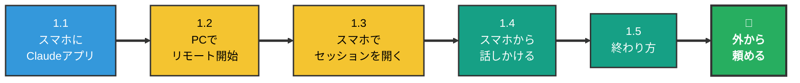
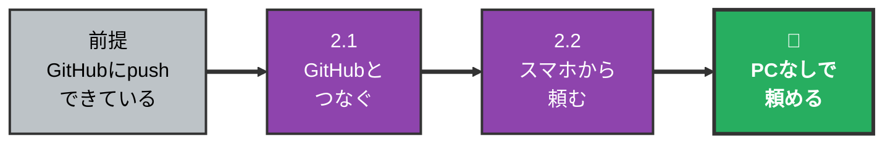
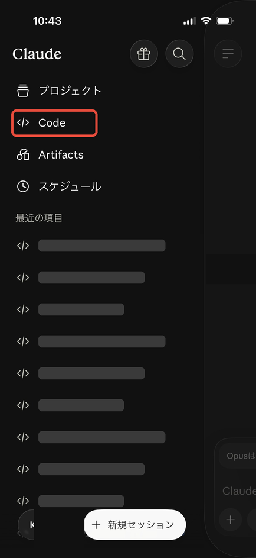
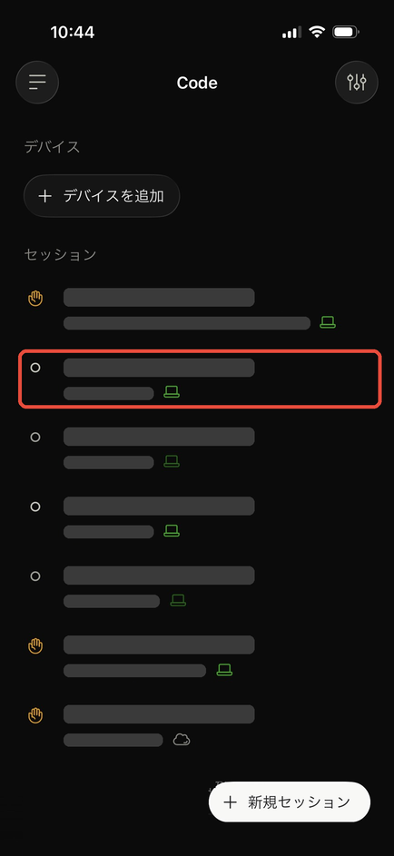
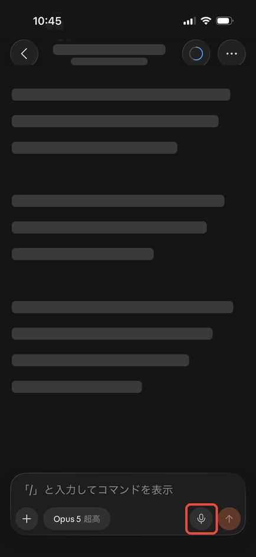
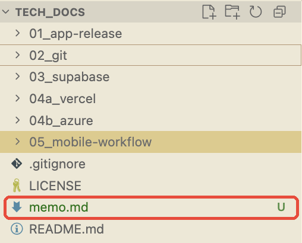
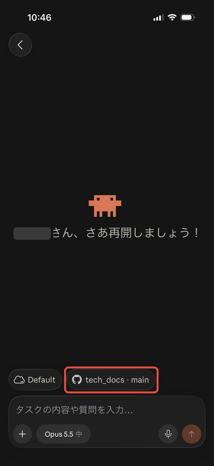

# スマホから Claude Code を使う手順 — 移動中にアイデアを投げる

> 📝 [mobile-workflow.md](mobile-workflow.md) が**考え方の地図**なら、このドキュメントは**実際に手を動かす順番**。**Part 1 だけで「外出先からスマホで Claude に作業を頼める」状態になる。** Part 2 は Git / GitHub を学んだあとでよい。

🧠 想定する到達点:

- 自転車や電車の移動中に思いついたことを、**スマホから Claude Code に話しかけて**、PC のプロジェクトにメモや資料として残せる
- PC で途中まで進めた作業の続きを、スマホから指示できる
- （Part 2）PC を閉じていても、スマホだけで作業を頼める

🧠 こんな使い方ができる:

| 場面 | スマホから送る言葉の例 |
| --- | --- |
| アイデアを思いついた | 「ミニバスの練習試合マッチングのアイデアを話すので、`ideas/` に企画メモとして保存して」 |
| 資料を作っておいてほしい | 「○○議員の過去の発言を議事録から集めて、出典つきで `reports/` にまとめておいて」 |
| PCの作業の続き | 「さっきの企画書、マネタイズの章を足しておいて」 |

> 💡 文字を打たなくてよい。**スマホのキーボードのマイクボタン**を押して話せば、そのまま文字になる。

---

## 0. 全体マップ

### 🟢 Part 1 — リモートコントロール（20分）

PC の Claude Code を**つけたまま**にしておき、スマホから操作する方法。PC にあるフォルダ・ファイルをそのまま使える。



> ⬇️ **ここで一度止まってよい。** 「PC をつけっぱなしにできない日がある」と感じたら、下の Part 2 へ。

### 🟡 Part 2 — Claude Code on the web（GitHub を使えるようになってから）

プロジェクトを GitHub に置いておき、Claude がクラウド上で作業する方法。**PC を閉じていても動く。**



### どちらを使う？

| | Part 1 リモートコントロール | Part 2 Claude Code on the web |
| --- | --- | --- |
| 作業する場所 | **自分の PC** | Anthropic のクラウド |
| PC | **つけたまま**にしておく | 閉じてよい |
| 使えるファイル | PC にあるもの全部 | GitHub に置いたものだけ |
| 準備 | Claude アプリを入れるだけ | GitHub を使えることが前提 |
| おすすめの人 | **まずはこちら** | Git / GitHub を学んだ人 |

### どれを何回やる？

| 頻度 | やること | 節 |
| --- | --- | --- |
| **【一生に1回】** | スマホに Claude アプリを入れてログイン | 1.1 |
| **【出かける前に毎回】** | PC でリモートコントロールを始める | 1.2 |
| **【毎回】** | スマホの「Code」から PC のセッションを開く | 1.3 |
| **【毎回】** | スマホから話しかける | 1.4 |
| **【帰ったら】** | 終わらせる | 1.5 |

---

## Part 1 — リモートコントロール

### 1.1 スマホに Claude アプリを入れる 【一生に1回】

1. スマホに **Claude** アプリを入れる
   - iPhone: [App Store](https://apps.apple.com/us/app/claude-by-anthropic/id6473753684)
   - Android: [Google Play](https://play.google.com/store/apps/details?id=com.anthropic.claude)
2. **PC の Claude Code と同じアカウント**でログインする
3. 画面下（または左上のメニュー）に **「Code」** があることを確認する

<!-- TODO(スマホのスクショ): ログイン後のホーム画面。「Code」の場所に赤枠 -->


> ⚠️ ふだんのチャット画面とは別に「Code」がある。リモートコントロールは**「Code」の中**で使う。

---

### 1.2 PC でリモートコントロールを始める 【出かける前に毎回】

1. Cursor で、**作業したいプロジェクトのフォルダ**を開く
2. Cursor のターミナルを開く（メニューの「ターミナル」→「新しいターミナル」）
3. 次の1行を貼り付けて Enter

```bash
claude remote-control
```

4. 「Remote Control を有効にするか」と聞かれたら `y` を押して Enter

<!-- TODO(PCのスクショ): Cursorのターミナルで claude remote-control を実行した直後の画面 -->


> 💡 **このフォルダが Claude の作業場所になる。** 外から頼んだメモや資料は、このフォルダの中に保存される。ふだん使っているプロジェクトのフォルダで始めるのがおすすめ。

> ⚠️ **PC は閉じない・電源につないでおく。** ターミナルを閉じたり Cursor を終了したりすると、スマホからつながらなくなる。

---

### 1.3 スマホでセッションを開く 【毎回】

1. スマホの Claude アプリで **「Code」** を開く
2. PC の名前と**緑の点**がついたセッションが一覧に出ているので、タップする

<!-- TODO(スマホのスクショ): Codeタブの一覧。緑の点のついたPCのセッションに赤枠 -->


> 💡 緑の点は「PC 側がつながっている」という印。点がない・灰色のときは、PC でリモートコントロールが止まっている（1.2 からやり直す）。

> 💡 一覧に出てこないときは、PC のターミナルで**スペースキー**を押すと QR コードが出る。スマホのカメラで写すと、そのセッションが Claude アプリで開く。

---

### 1.4 スマホから話しかける 【毎回】

1. 入力欄をタップ
2. キーボードの **マイクボタン** を押して話す（文字で打ってもよい）
3. 送信 → PC の上で Claude が作業し、結果がスマホに出る

<!-- TODO(スマホのスクショ): 入力欄とキーボードのマイクボタンに赤枠 -->


**最初はこれを送ってみる**（ちゃんとつながっているかの確認）:

```text
このフォルダに memo.md を作って、「スマホから書きました」と1行書いて
```

帰ってから PC の Cursor を見て、`memo.md` ができていれば成功。

<!-- TODO(PCのスクショ): Cursorのファイル一覧に memo.md ができている画面 -->


> 💡 **うまく頼むコツ**: 「どこに」「何を」「どんな形で」を入れる。
> - ❌「さっきのアイデアまとめて」
> - ⭕「`ideas/` フォルダに、ミニバスのマッチングアプリの企画メモを作って。課題・使う人・お金の取り方の3つの見出しで」

> ⚠️ Claude が「このファイルを変更してよいか」と聞いてくることがある。内容を読んで、よければ許可する。**分からないときは許可せず、帰ってから PC で確認**すればよい。

---

### 1.5 終わり方 【帰ったら】

PC の Cursor のターミナルで **`Ctrl` + `C`** を押す。

> 💡 うっかり止めてしまっても大丈夫。4時間以内なら、次の1行で同じ続きから再開できる。
>
> ```bash
> claude remote-control --continue
> ```

> 💡 PC が一時的にスリープしたり、ネットが切れたりしても、**戻れば自動でつながり直す**。長く（30分ほど）切れていた場合は、1.2 からやり直す。

---

### 🎉 Part 1 のゴール

- 出かける前に PC で `claude remote-control` を始めておけば
- 移動中にスマホの Claude アプリ →「Code」→ 緑の点のセッションから話しかけるだけで
- PC のプロジェクトにメモや資料が残る

---

## Part 2 — Claude Code on the web（PC を閉じていても使う）

> ⚠️ **ここから先は、プロジェクトを GitHub に置けていることが前提。** まだの人は [Git 環境構築手順 Part 2](../02_git/setup.md) を先に終わらせる。

### 2.1 GitHub とつなぐ 【一生に1回】

1. PC のブラウザで [claude.ai/code](https://claude.ai/code) を開く
2. **「Sign in with GitHub」** を押し、GitHub の画面で許可する
3. 使いたいリポジトリが一覧に出なければ、[Claude の GitHub App](https://github.com/apps/claude/installations/new) をインストールし、**「Only select repositories」でそのリポジトリだけ**を選ぶ

<!-- TODO(PCのスクショ): claude.ai/code の Sign in with GitHub ボタン -->


> 🚨 GitHub App のインストールで「All repositories」を選ぶと、すべてのリポジトリを Claude が読めるようになる。**使うリポジトリだけ**を選ぶ。

### 2.2 スマホから頼む 【毎回】

1. スマホの Claude アプリ →「Code」→ 新しいセッションを作る
2. **リポジトリを選ぶ**
3. 頼みたいことを話す（1.4 と同じ）

<!-- TODO(スマホのスクショ): Codeタブで新規セッション作成→リポジトリ選択の画面 -->


> 💡 Claude の作業結果は、**GitHub の新しいブランチ**に保存される。`main` が直接書き換わることはない。取り込むかどうかは、帰ってから PC で確認して決める（[git.md §3〜§4](../02_git/git.md)）。

---

### 🎉 Part 2 のゴール

- PC を閉じていても、スマホから GitHub のリポジトリに対して作業を頼める
- 結果は別のブランチに残るので、あとで PC で確認してから取り込める

---

## 困ったとき

| こうなった | こうする |
| --- | --- |
| スマホの「Code」にセッションが出ない | PC で `claude remote-control` が動いているか確認。**PC とスマホで同じアカウント**か確認 |
| 「Remote Control は使えない」と出る | Claude の**有料プラン（Pro 以上）**で、`/login` からログインしているか確認 |
| 頼んだファイルが見つからない | 1.2 で開いたフォルダの中を探す。見つからなければスマホで「どこに保存した？」と聞く |

---

## 関連資料

- [mobile-workflow.md](mobile-workflow.md) — スマホ開発の考え方（何ができて、何は PC でやるか）
- [Git 環境構築手順](../02_git/setup.md) — Part 2 に進む前に
- 公式: [Remote Control](https://code.claude.com/docs/en/remote-control) / [Claude Code on the web](https://code.claude.com/docs/en/claude-code-on-the-web) / [モバイル](https://code.claude.com/docs/en/mobile)
