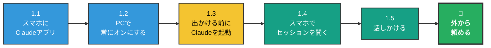
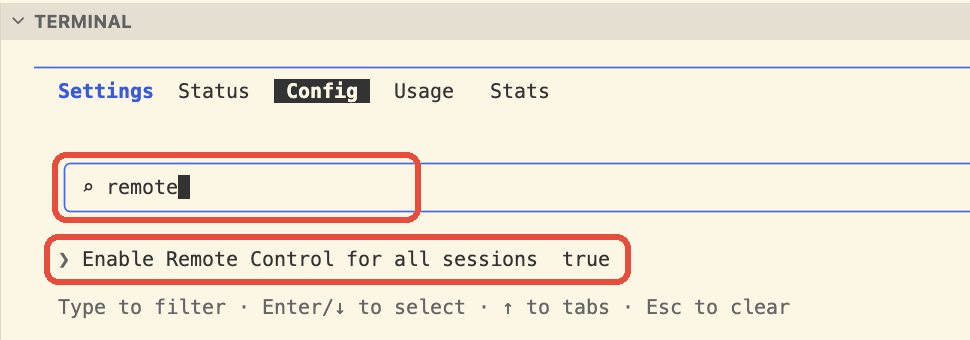
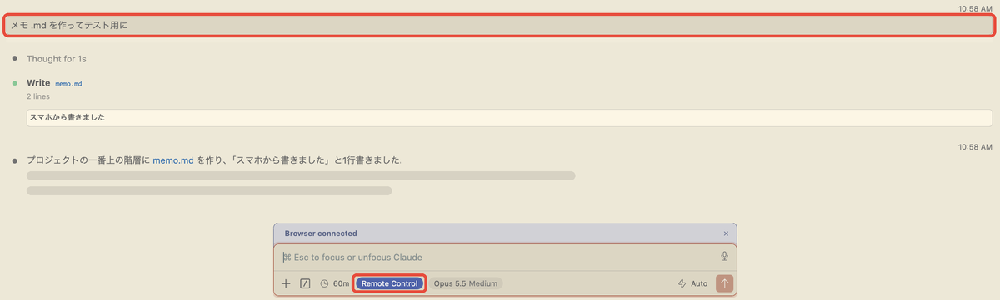

# スマホから PC の Claude Code を動かす手順 — リモートコントロール

> 📝 PC の Claude Code を**つけたまま**にしておき、外出先からスマホで話しかけて作業を頼む方法。**Git も GitHub も不要**で、PC にあるフォルダ・ファイルをそのまま使える。
>
> PC を閉じていても使いたくなったら → [setup-web.md](setup-web.md)（GitHub を使う方法）

🧠 想定する到達点:

- 電車での移動中や待ち時間に思いついたことを、**スマホから Claude Code に話しかけて**、PC のプロジェクトにメモや資料として残せる
- PC で途中まで進めた作業の続きを、スマホから指示できる

🧠 こんな使い方ができる:

| 場面 | スマホから送る言葉の例 |
| --- | --- |
| アイデアを思いついた | 「家計簿アプリのアイデアを話すので、`ideas/` にメモとして保存して」 |
| 資料を作っておいてほしい | 「週末の旅行先の候補を3つ、移動時間と費用で比べて `notes/` にまとめておいて」 |
| PCの作業の続き | 「さっきの企画書に、スケジュールの章を足しておいて」 |

> 💡 文字を打たなくてよい。Claude アプリの**入力欄にあるマイクボタン**を押して話せば、そのまま文字になる。

---

## 0. 全体マップ

### 🟢 全体の流れ（15分）

PC の Claude Code を**つけたまま**にしておき、スマホから操作する方法。PC にあるフォルダ・ファイルをそのまま使える。**最初に1回設定すれば、あとはいつもどおり Cursor で Claude を起動しておくだけ。**



### このやり方と GitHub を使うやり方の違い

| | この資料（リモートコントロール） | [setup-web.md](setup-web.md)（Claude Code on the web） |
| --- | --- | --- |
| 作業する場所 | **自分の PC** | Anthropic のクラウド |
| PC | **つけたまま**にしておく | 閉じてよい |
| 使えるファイル | PC にあるもの全部 | GitHub に置いたものだけ |
| 準備 | アプリを入れて、設定を1回オンにするだけ（**Git なしで OK**） | Git / GitHub を使えることが前提 |
| おすすめの人 | **まずはこちら** | Git / GitHub を学んだ人 |

### どれを何回やる？

| 頻度 | やること | 節 |
| --- | --- | --- |
| **【一生に1回】** | スマホに Claude アプリを入れてログイン | 1.1 |
| **【一生に1回】** | PC でリモートコントロールを常にオンにする | 1.2 |
| **【出かける前に毎回】** | Cursor でプロジェクトを開き、Claude を起動したままにする | 1.3 |
| **【毎回】** | スマホの「Code」から PC のセッションを開いて話しかける | 1.4 / 1.5 |

---

### 1.1 スマホに Claude アプリを入れる 【一生に1回】

1. スマホに **Claude** アプリを入れる
   - iPhone: [App Store](https://apps.apple.com/us/app/claude-by-anthropic/id6473753684)
   - Android: [Google Play](https://play.google.com/store/apps/details?id=com.anthropic.claude)
2. **PC の Claude Code と同じアカウント**でログインする
3. 左上の **≡（メニュー）** を押し、**「Code」** があることを確認する


> ⚠️ ふだんのチャット画面とは別に「Code」がある。リモートコントロールは**「Code」の中**で使う。

---

### 1.2 PC でリモートコントロールを常にオンにする 【一生に1回】

1. Cursor でプロジェクトのフォルダを開き、**ターミナル**で `claude` を起動する
   - ※ ふだん拡張機能の Claude を使っている人も、この設定だけはターミナルで行う（設定は拡張機能の Claude にも効く）
2. Claude の入力欄に次の1行を打って Enter

```text
/config
```

3. 設定の画面が開いたら、そのまま `remote` と打つ（設定が1行に絞り込まれる）
4. **「Enable Remote Control for all sessions」** の行を ↓ キーで選び、Enter で **`true`** にする
5. 行の右側が `true` になっていれば完了。**Esc** で設定の画面を閉じる



> 💡 これで、**これから起動する Claude は全部、自動でスマホからつながる状態**になる。毎回コマンドを打つ必要はない。

---

### 1.3 出かける前に Claude を起動しておく 【出かける前に毎回】

1. Cursor で、**作業したいプロジェクトのフォルダ**を開く
2. Claude を起動する（ふだんどおりでよい。ターミナルの `claude` でも、Cursor の拡張機能の Claude でもどちらでも OK）
3. Claude の入力欄の下に、青い **「Remote Control」** の表示が出ていることを確認する（1.5 の画像の右下の赤枠）
4. **そのまま出かける**

> 💡 **このフォルダが Claude の作業場所になる。** 外から頼んだメモや資料は、このフォルダの中に保存される。

> ⚠️ **スマホからは「PC で起動しておいた Claude の続き」を話すだけ。** スマホから新しいフォルダを選んで始めることはできない。
> - 別のフォルダでも作業したいなら、出かける前に**そのフォルダでも** Claude を起動しておく（スマホの一覧にセッションが2つ並ぶ）
> - 出かける前に起動していなかったフォルダは、外からは触れない

> ⚠️ **PC は閉じない・電源につないでおく。** Claude を閉じたり Cursor を終了したりすると、スマホからつながらなくなる。一時的なスリープやネットの切断なら、戻れば自動でつながり直す。

---

### 1.4 スマホでセッションを開く 【毎回】

1. スマホの Claude アプリで **「Code」** を開く
2. 「セッション」の一覧から、**緑のノートPCのアイコン**がついたものを探してタップする
   - アイコンの左の小さい文字が、1.3 で開いた**フォルダの名前**（例: `tech_docs`）
   - ※ Git を使っているフォルダだと、後ろに `· main` のような**ブランチ名**も付く。Git を使っていなければ付かないが、気にしなくてよい


> 💡 **ノートPCのアイコン = 自分の PC で動いているセッション**。雲のアイコンは [setup-web.md](setup-web.md) のクラウドのセッションなので、ここでは使わない。

> 💡 一覧に出てこない・開いても返事がないときは、PC の Claude が止まっている（帰ってから 1.3 をやり直す）。

---

### 1.5 スマホから話しかける 【毎回】

1. 入力欄をタップ
2. 入力欄の右にある **マイクボタン** を押して話す（文字で打ってもよい）
3. 送信 → PC の上で Claude が作業し、結果がスマホに出る


**最初はこれを送ってみる**（ちゃんとつながっているかの確認）:

```text
このフォルダに memo.md を作って、「スマホから書きました」と1行書いて
```

PC の Claude の画面にも、**スマホから送った言葉がそのまま出て**、Claude が作業したことが残っている。



> 💡 上の赤枠がスマホから送った言葉、右下の赤枠「Remote Control」がスマホとつながっている印。

帰ってから PC の Cursor を見て、`memo.md` ができていれば成功。


> 💡 ファイル名の右の **`U`** は「新しくできて、まだ Git に記録していないファイル」という印。※ Git を使っていないフォルダでは `U` は付かない。ファイル一覧に `memo.md` が出ていれば成功。

> 💡 **うまく頼むコツ**: 「どこに」「何を」「どんな形で」を入れる。
> - ❌「さっきのアイデアまとめて」
> - ⭕「`ideas/` フォルダに、家計簿アプリのアイデアメモを作って。困っていること・使う人・ほしい機能の3つの見出しで」

> ⚠️ Claude が「このファイルを変更してよいか」と聞いてくることがある。内容を読んで、よければ許可する。**分からないときは許可せず、帰ってから PC で確認**すればよい。

---

### 🎉 ゴール

- 最初に1回 `/config` でリモートコントロールを常にオンにしておけば
- 出かける前に Cursor で Claude を起動しておくだけで
- 移動中にスマホの Claude アプリ →「Code」→ ノートPCのアイコンのセッションから話しかけるだけで
- PC のプロジェクトにメモや資料が残る

---

## 困ったとき

| こうなった | こうする |
| --- | --- |
| スマホの「Code」にセッションが出ない | PC の Cursor で Claude が起動したままか確認。**PC とスマホで同じアカウント**か確認。1.2 の設定が `true` か確認 |
| 一覧にどうしても出ない | PC の Claude の入力欄で `/remote-control` と打つ。出てくる QR コードをスマホのカメラで写すと、そのセッションが開く |
| 「Remote Control は使えない」と出る | Claude の**有料プラン（Pro 以上）**で、`/login` からログインしているか確認 |
| 頼んだファイルが見つからない | 1.3 で開いたフォルダの中を探す。見つからなければスマホで「どこに保存した？」と聞く |

---

## 関連資料

- [mobile-workflow.md](mobile-workflow.md) — スマホ開発の考え方（何ができて、何は PC でやるか）
- [setup-web.md](setup-web.md) — PC を閉じていても使う方法（GitHub を使う）
- 公式: [Remote Control](https://code.claude.com/docs/en/remote-control) / [モバイル](https://code.claude.com/docs/en/mobile)
