# Azure 全体像

> 📝 Azure は Microsoft の**総合クラウド**。「Webアプリの置き場」「DB」「認証」「AI」「ネットワーク」「仮想マシン」など、ITで使うものが**全部入り**で並んでいる巨大な道具箱。Vercel や Supabase が「特定の用途に特化した PaaS」なら、Azure は **「何でも揃うデパート」**。

🧠 先に押さえておきたい4つの言葉:

- **クラウド**: 自分のPCやサーバーではなく、**よその会社のデータセンター**を借りて動かす仕組み。Azure / AWS / Google Cloud の3社が代表。
- **PaaS / IaaS / SaaS**: クラウドの使い方の段階。**IaaS**=サーバーだけ借りる（OSは自分で） / **PaaS**=実行環境ごと借りる（コード置くだけ） / **SaaS**=完成品を使う。
- **リージョン**: データセンターの場所。「東日本リージョン」「米国東部」など世界中にある。近いほど速い。
- **テナント / サブスクリプション**: Azure特有の階層（後述§3）。最初に必ずつまずく場所。

---

## 1. Azureが提供するもの

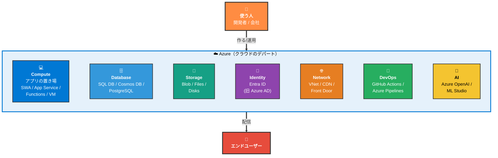

サービス数は **200種類以上**。最初は全部覚える必要はない。**「Webアプリを公開したい」というだけなら、出てくるのは Compute（特に Static Web Apps）+ Database + Identity の3つくらい**。

> 📝 本資料では「**個人開発から本格運用までの Web アプリ + CI/CD + DB**」という軸で、必要な部品だけを順に説明する。VMやAI周りなど他のジャンルは入口だけ触れる。

---

## 2. よくある勘違い

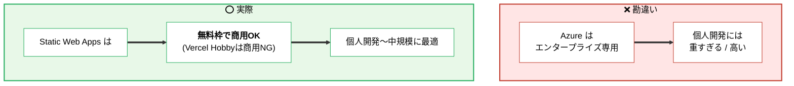

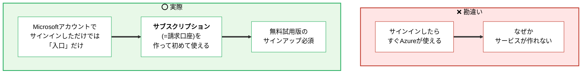

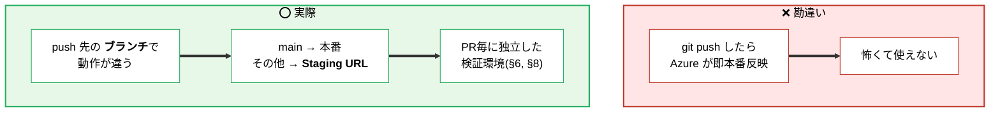

---

## 3. Azure特有の階層 — テナント / サブスクリプション / リソースグループ / リソース

Azureを使う上で**最初に必ずつまずく**のがこの4階層。Vercel や Supabase にはない独特の概念で、ここを理解すると一気にスッキリする。

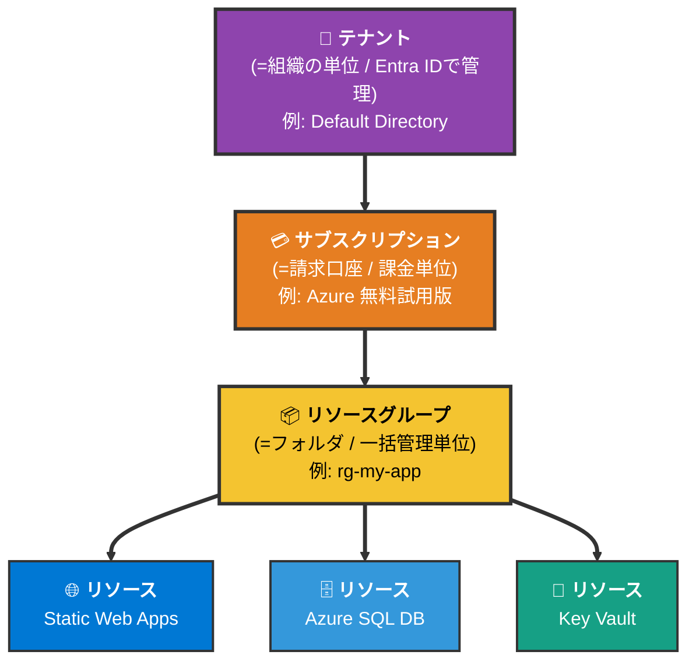

| 階層 | 役割 | 例えるなら |
| ---- | ---- | --------- |
| 🏢 **テナント** | ユーザー / グループの所属組織。AAD（Entra ID）が管理 | 会社そのもの |
| 💳 **サブスクリプション** | 請求のまとまり。「誰が払うか」を分ける | 経費の請求口座 |
| 📦 **リソースグループ** | 関連リソースのフォルダー。**一括で消せる**のが便利 | プロジェクト用の段ボール箱 |
| 🌐 **リソース** | 実体（Static Web Apps、DB、VMなど） | 段ボールの中身 |

> 📝 「**リソースグループごと削除**」で中身全部消せるので、お試し用に作って終わったら箱ごと捨てる、というのが定番。Free tier で課金されていなくても、**何を作ったか忘れがち**なので習慣化しておくと安全。

### 🚨 テナント切替の罠（最初の地雷）

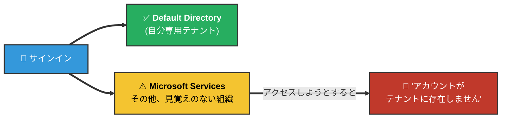

ブラウザに古い Microsoft セッションが残っていると、勝手に**別組織のテナント**を見に行ってエラーになる。`portal.azure.com` 右上のディレクトリ表示が「Default Directory」になっていることを必ず確認する。直らない時は **別ブラウザ or シークレットウィンドウ**で `azure.microsoft.com/free` から入り直すのが確実。

---

## 4. はじめの一歩

Vercel や Supabase より一手間多い。**サインアップ → 無料試用版（=サブスクリプション作成）→ リソースグループ → 個別リソース**、の順で進む。

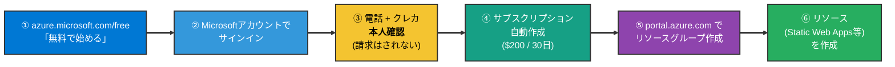

> 📝 **クレジットカードは「本人確認」目的だけ**で、無料枠を超えなければ請求されない。デビットカード不可、JCB がたまに弾かれるので Visa/Master が無難。

### 🚨 「Pay-As-You-Go にアップグレード」を押さない

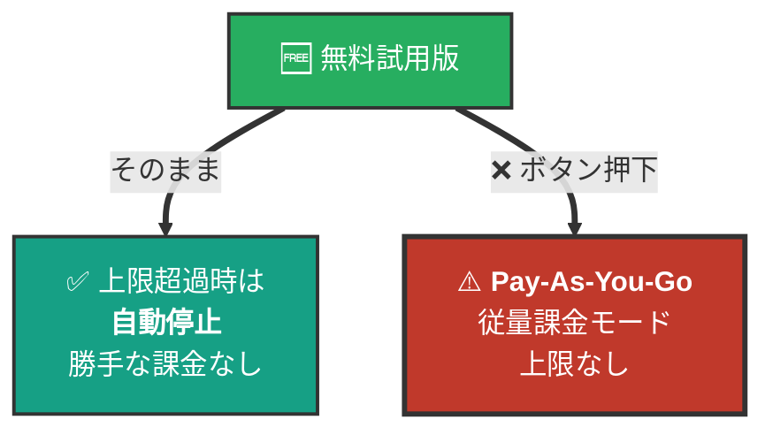

無料試用版のままなら**枠を超えるとリソースが停止**するだけだが、Pay-As-You-Go に切り替えると**青天井で課金**される。Portal の各所に勧誘ボタンが出るが、個人開発・お試し段階では押さない。

---

## 5. アプリの置き場所 — 用途別の Compute 選び

Azureには「アプリを動かす場所」が複数ある。**個人開発→本格運用への成長段階**でこの選択が変わる。

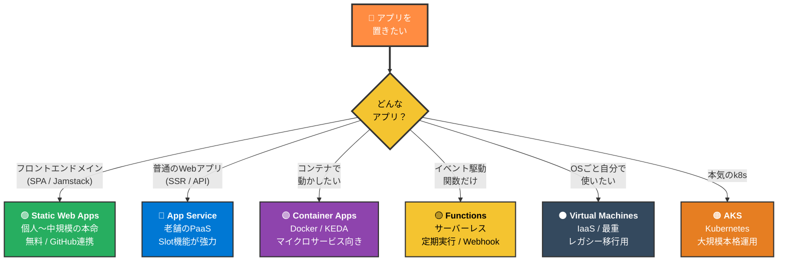

| サービス | 何向け | 料金感 | 個人開発 | 本格運用 |
| ---- | ---- | ---- | :---: | :---: |
| **Static Web Apps** | 静的サイト + API（Functions同梱） | 無料枠あり | ⭐⭐⭐ | ⭐⭐ |
| **App Service** | 一般的なWebアプリ（Node/.NET/Python） | $13/月〜 | ⭐⭐ | ⭐⭐⭐ |
| **Container Apps** | コンテナ型・マイクロサービス | 従量 | ⭐ | ⭐⭐⭐ |
| **Functions** | 単発処理・Webhook・定期実行 | 100万回/月無料 | ⭐⭐⭐ | ⭐⭐ |
| **VM** | 自由度最大・レガシー移行 | $7/月〜 | △ | ⭐⭐ |
| **AKS** | 本格的なKubernetes | 高い | × | ⭐⭐⭐ |

> 📝 まず **Static Web Apps から始め**、SSR や複雑なAPIが必要になったら **App Service** へ。本格的にコンテナ運用になったら **Container Apps** に進む、というのが定番の階段。

---

## 6. Azure Static Web Apps — Vercel に最も近い存在

本資料の中心。**「Vercelとほぼ同じ体験」を Azure で得られる**のがこのサービス。

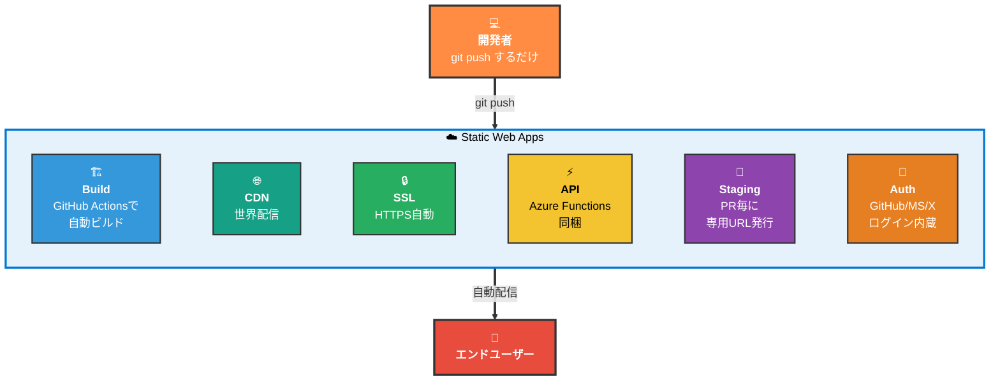

### Static Web Apps の作成フロー

```mermaid
flowchart LR
    S1["① portal.azure.com<br/>「Static Web Apps」検索"] ==> S2["② + 作成<br/>リソースグループ作成"]
    S2 ==> S3["③ プランは <b>Free</b><br/>リージョン: East Asia"]
    S3 ==> S4["④ GitHub認可<br/>(Only select repos推奨)"]
    S4 ==> S5["⑤ ビルドプリセット<br/>(Next.js/React/Vite)"]
    S5 ==> S6["⑥ 作成 → 2-3分<br/>URL発行"]

    style S1 fill:#0078D4,color:#FFFFFF,stroke:#333,stroke-width:2px
    style S2 fill:#3498DB,color:#FFFFFF,stroke:#333,stroke-width:2px
    style S3 fill:#16A085,color:#FFFFFF,stroke:#333,stroke-width:2px
    style S4 fill:#8E44AD,color:#FFFFFF,stroke:#333,stroke-width:2px
    style S5 fill:#F4C430,color:#000,stroke:#333,stroke-width:2px
    style S6 fill:#27AE60,color:#FFFFFF,stroke:#333,stroke-width:2px
```

> 📝 作成時にAzureが**GitHub Actions のワークフローファイル**（`.github/workflows/azure-static-web-apps-xxxx.yml`）を**勝手にリポジトリへ commit** する。これが「git push したら自動デプロイ」の正体。Vercel が裏で持っている Webhook の代わりに、Azureは GitHub Actions に乗っかる方式。

### 💸 Static Web Apps 無料枠の主な制限

| 項目 | 上限 | 詰まったら |
| ---- | ---- | --------- |
| 帯域幅 | 100GB/月 | Standard($9/月)へ |
| ストレージ | 0.5GB | 同上 |
| カスタムドメイン | 2つまで | Standardで5つ |
| SSL証明書 | 自動・無料 | — |
| Staging環境 | PR毎に自動発行 | — |
| API実行(Functions同梱) | 無料枠内 | — |
| **商用利用** | ✅ **OK** | （Vercel Hobby より緩い） |

> 🚨 個人開発・社内ツール・小規模商用ならFree tierで十分。**Vercel Hobby と違い商用OK**なので、副業や小規模スタートアップにとっては実はAzureの方が条件が良い。

---

## 7. DB系の選び方

Static Web Apps はあくまでフロント+軽量APIなので、データ保存は別サービスが必要。Azure内で完結させるか、外部（Supabase等）と組み合わせるかが分かれ道。

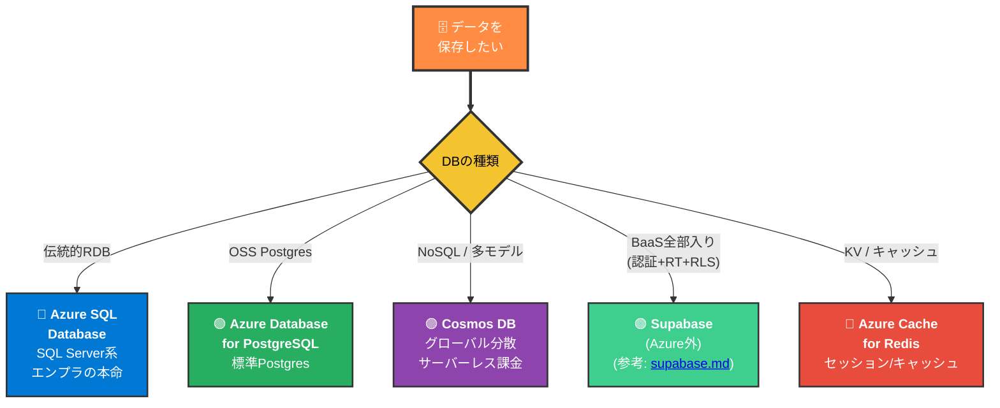

| サービス | 強み | 個人開発 | 本格運用 |
| ---- | ---- | :---: | :---: |
| **Azure SQL Database** | エンプラ標準・MS整合性・最も無難 | △（高め） | ⭐⭐⭐ |
| **PostgreSQL (Flexible Server)** | OSS互換・移行性高 | ⭐⭐ | ⭐⭐⭐ |
| **Cosmos DB** | グローバル分散・無料枠1000RU/s | ⭐⭐ | ⭐⭐⭐ |
| **Supabase併用** | 認証+RLS+Realtime込み・手早い | ⭐⭐⭐ | ⭐⭐ |
| **Cache for Redis** | セッション/キャッシュ用の脇役 | △ | ⭐⭐ |

> 📝 個人開発の初手なら **Supabase + Azure Static Web Apps** の組み合わせが軽くて速い（実際の構成例: フロントを SWA、DB+認証は Supabase）。社内縛りで「Azure内で完結」が必要なら **Azure SQL or PostgreSQL** に切り替える。詳しいDBの概念は [supabase.md](../supabase/supabase.md) §4-5 を参照。

---

## 8. Git push = 即本番？ — 安全弁の4層

Vercelでも触れた話だが、Azure でも同じ仕組みが必要。「pushしたら即本番反映」は表面の話で、実際には**4層のゲート**が挟まる。

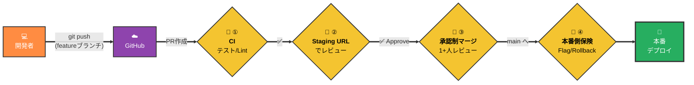

| 層 | 仕組み | Azure 側の実現 |
| --- | --- | --- |
| ① CI（自動チェック） | テスト・型・Lintを走らせて落ちたら止める | GitHub Actions or Azure Pipelines |
| ② Staging環境 | PR毎に自動で別URLが立つ | SWA の **Staging environments** / App Service の **Deployment Slots** |
| ③ 承認制マージ | 1+人レビュー必須 | GitHub Branch protection / Azure DevOps Branch policies |
| ④ 本番側保険 | フラグ・ロールバック・カナリア | **App Configuration**（Feature Flag）/ Slot swap / Traffic routing |

> 📝 正確には「**main ブランチへのマージ＝本番**」であって、main に直接 push することは普通禁止する（Branch protection）。ブランチ運用の詳細は [git.md](../git/git.md) §4 を参照。

### 本番後でも戻せる: Rollback / Canary / Feature Flag

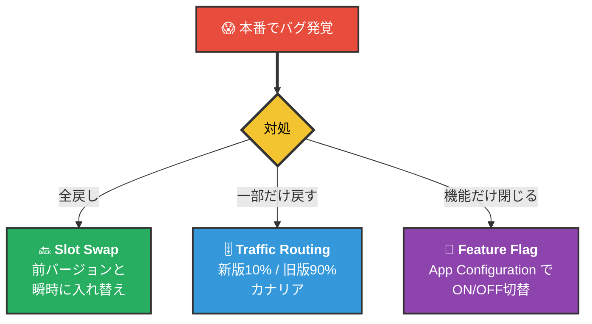

> 📝 **Slot Swap** は実は Vercel より前から Azure（App Service）に存在する**老舗の仕組み**。「新バージョンを Staging スロットに置いて疎通試験 → swap ボタンで本番と入れ替え」を**ゼロダウンタイム**で実現する。エンプラ受けが良い理由のひとつ。

---

## 9. Vercel との対応表

両者の機能・概念を1対1で並べると、移行や比較の地図になる。

| Vercel | Azure 側の相当物 | 補足 |
| --- | --- | --- |
| **Preview Deployments** | **Static Web Apps Staging environments** / **App Service Deployment Slots** | PR毎に自動で別URL |
| **アトミックデプロイ** | **Slot Swap** | 新バージョンに瞬時切替 |
| **インスタントロールバック** | Slot swap で前スロットへ戻す / Pipelinesの過去ビルド再デプロイ | — |
| **CI Gate** | **GitHub Actions** or **Azure Pipelines** | SWAは前者がデフォルト |
| **環境別シークレット** | **Key Vault** + slot単位の **App Settings** | §10で詳述 |
| **Canary Deployment** | **App Service Traffic Routing**（slot間で%分配） | Vercel Pro相当 |
| **Feature Flag** | **App Configuration の Feature Manager** | — |
| **CDN** | **Front Door** or **Azure CDN**（SWAは内蔵） | — |
| **Edge Functions** | **Functions** + Front Door / **Container Apps** | — |
| **Custom Domain + 自動SSL** | SWA / App Service 標準機能 | Let's Encrypt 相当 |

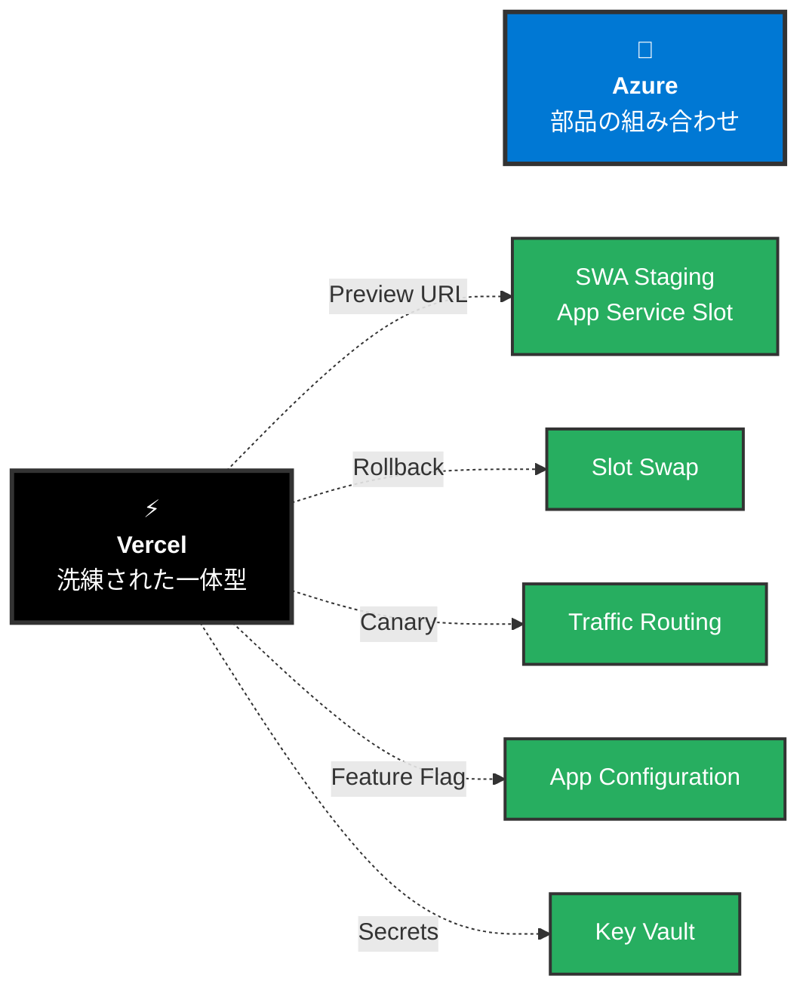

> 📝 Vercel は **「全部1サービスに統合」**、Azure は **「部品を組み合わせて作る」**。柔軟だが、最初は「**どの部品を選べばいいの？**」で迷う。SWAから入って、必要に応じて Key Vault や App Configuration を足していくのが順当。

---

## 10. 環境変数とシークレット — 置き場所が3つある

ここがVercelより**ややこしい**ポイント。Azureでは「**いつ使うか**」で置き場所が変わる。

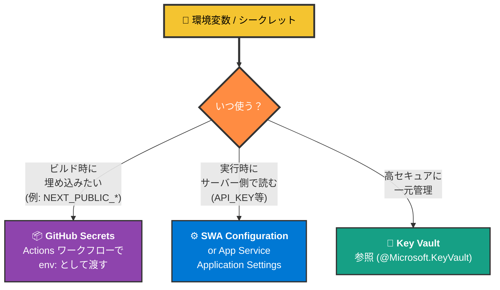

| 置き場 | いつ参照される | 用途例 |
| --- | --- | --- |
| **GitHub Secrets** | ビルド時 | `NEXT_PUBLIC_*`、デプロイトークン、テスト用APIキー |
| **SWA Configuration** | 実行時（サーバー側） | バックエンドAPIキー、DB接続文字列 |
| **Key Vault** | 実行時（高セキュア） | 本番DBパスワード、証明書、テナント横断のシークレット |

> 🚨 **`NEXT_PUBLIC_*` の罠**: Next.js の `NEXT_PUBLIC_*` 系は**ビルド時にコードへ埋め込まれる**。**SWA Configuration に入れても意味がない**（実行時にしか参照されないため）。必ず **GitHub Secrets** に登録し、ワークフローの `env:` で渡す。

> 📝 環境変数の基本概念は [git.md](../git/git.md) §8 / [vercel.md](../vercel/vercel.md) §7 を参照。Vercel が「Production / Preview / Development」の3環境で**自動的に分けて持てる**のに対し、Azureでは **GitHub Environments**（Actionsの環境別シークレット）や **deployment slot 別の Configuration** を**自分で組む**必要がある。ここはVercelの方が一歩楽。

### Key Vault を挟むメリット

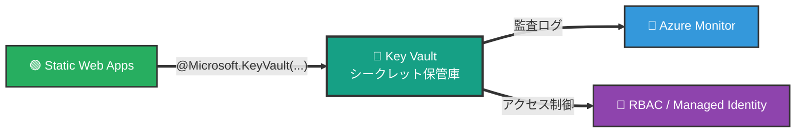

エンプラ要件で「誰がいつシークレットを参照したか監査したい」「**人間にはキーを見せない**（Managed Identity 経由で取得）」が必要になったら Key Vault。個人開発段階では SWA Configuration で十分。

---

## 11. GitHub以外からのCI/CD — 社内縛り対策

Azure SWA は GitHub 連携が基本だが、**GitHub が使えない環境**（社内ネットワーク・コンプライアンス制約など）でも以下の選択肢がある。

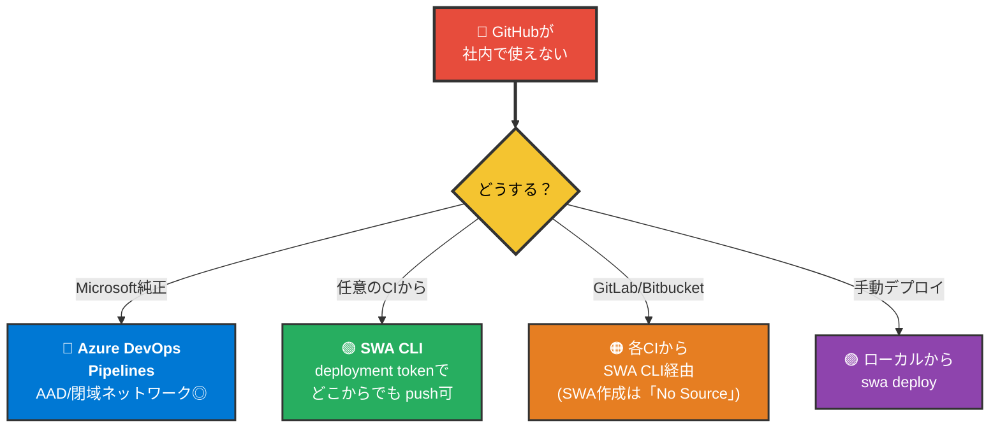

| 選択肢 | 特徴 | 社内環境で響く点 |
| --- | --- | --- |
| **Azure DevOps Pipelines** | MS純正・SWAタスク標準提供 | AAD連携◎ / セルフホストAgent / Azure Monitor統合 |
| **SWA CLI + deployment token** | 任意のCIから `swa deploy` | GitLab/Jenkins/CircleCI等 |
| **GitLab/Bitbucket** | SWA作成時は「No Source」で作り、上記CLI経由 | — |
| **手動デプロイ** | ローカルから同じCLI | お試し/緊急用 |

### 11.1 Azure DevOps の中身 — Pipelines は5部品の1つ

「Azure DevOps」は単一サービスではなく、**5つのサービスをまとめたスイート**（`dev.azure.com` 配下）。CI/CD 文脈で主役なのは Pipelines だが、社内縛り環境では **Repos も合わせて選ぶ**ことが多い（=「GitHub と GitHub Actions を Azure 内で両方代替」）。

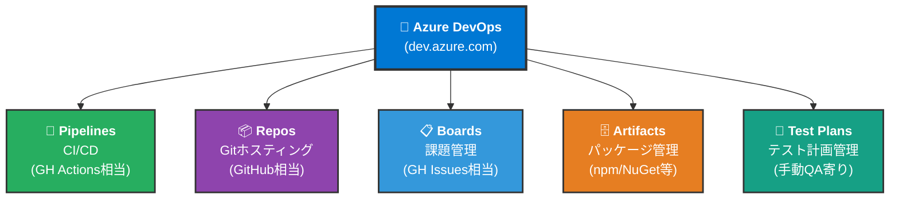

| サービス | GitHub対応物 | 個人開発 | エンプラ |
| --- | --- | :---: | :---: |
| **Pipelines** | GitHub Actions | ⭐⭐ | ⭐⭐⭐ |
| **Repos** | GitHub本体 | △ | ⭐⭐⭐ |
| **Boards** | GitHub Issues / Projects | △ | ⭐⭐⭐ |
| **Artifacts** | GitHub Packages | △ | ⭐⭐ |
| **Test Plans** | （独自・GitHubにない） | × | ⭐⭐ |

> 📝 「GitHubを丸ごとAzure側で代替」したいなら **Repos + Pipelines** をセットで使う。両方とも **Entra ID (AAD)** で社員アカウント連携でき、Microsoft 365 と権限管理を一元化できる。

### 11.2 GitHub Actions ⇄ Azure Pipelines マッピング

YAML の作りはそっくりで、概念単位で**素直に翻訳できる**。既存の GH Actions ワークフローを書き換える際のチートシート。

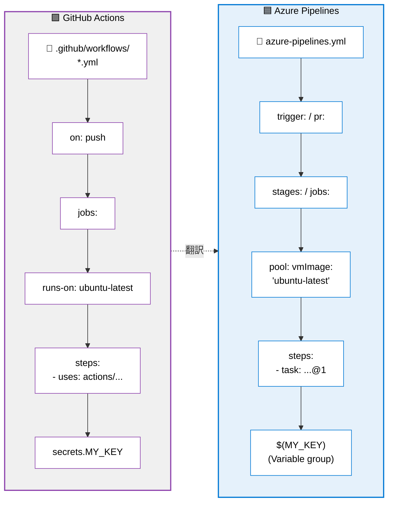

| GitHub Actions | Azure Pipelines | 役割 |
| --- | --- | --- |
| `.github/workflows/*.yml` | `azure-pipelines.yml` | パイプライン定義ファイル |
| `on:` | `trigger:` / `pr:` | トリガー（push/PR） |
| `jobs:` | `jobs:` / `stages:` | 並列実行単位 |
| `runs-on:` | `pool:` | 実行マシン指定 |
| `steps:` + `uses:` | `steps:` + `task:` | 再利用部品 |
| `secrets.*` | `$(name)` + Variable Group | シークレット参照 |
| `env:` | `variables:` | 環境変数 |
| `environment:` | `environment:` + Approval | 環境ゲート・承認 |

> 📝 SWA 専用タスク **`AzureStaticWebApp@0`** が Microsoft 公式に用意されているので、GH Actions の `Azure/static-web-apps-deploy@v1` と1対1で置き換えられる。NEXT_PUBLIC_* 系のビルド時埋め込み（§10）も `env:` で渡せばよく、考え方は同じ。

### 11.3 エンプラで響く3つの理由 — 閉域 / AAD / 監査

社内でGitHubが使いにくい状況の本質は「**外部にコード/資格情報を出したくない**」「**社員アカウントで一元管理したい**」「**監査ログがほしい**」の3点。Azure DevOps Pipelines はここに**標準対応**する。

```mermaid
flowchart TB
    R["🏢 エンプラ要件"] --> R1{"必要なもの"}

    R1 --> N1["🛡️ <b>閉域ネットワーク</b><br/>ビルドマシンを<br/>社内に置きたい"]
    R1 --> N2["🛂 <b>SSO / ID統合</b><br/>社員アカウントで<br/>そのまま使う"]
    R1 --> N3["📜 <b>監査</b><br/>誰がいつ何をしたか<br/>記録/出力"]

    N1 --> S1["✅ <b>Self-hosted Agent</b><br/>社内サーバー/VMに<br/>エージェント常駐"]
    N2 --> S2["✅ <b>Entra ID (AAD)</b><br/>連携<br/>Service Principal<br/>でAzure操作"]
    N3 --> S3["✅ <b>Azure Monitor</b><br/>連携<br/>監査ログ集約"]

    style R fill:#E74C3C,color:#FFFFFF,stroke:#333,stroke-width:3px
    style R1 fill:#F4C430,color:#000,stroke:#333,stroke-width:3px
    style N1 fill:#3498DB,color:#FFFFFF,stroke:#333,stroke-width:2px
    style N2 fill:#8E44AD,color:#FFFFFF,stroke:#333,stroke-width:2px
    style N3 fill:#E67E22,color:#FFFFFF,stroke:#333,stroke-width:2px
    style S1 fill:#27AE60,color:#FFFFFF,stroke:#333,stroke-width:2px
    style S2 fill:#27AE60,color:#FFFFFF,stroke:#333,stroke-width:2px
    style S3 fill:#27AE60,color:#FFFFFF,stroke:#333,stroke-width:2px
```

#### Self-hosted Agent — 閉域ネットワークの肝

```mermaid
flowchart LR
    subgraph CLOUD["☁️ Microsoft-hosted (デフォルト)"]
        MH["🟦 Microsoft<br/>データセンター<br/>のVM"]
    end

    subgraph INTRA["🏢 社内ネットワーク (閉域)"]
        SH["🟩 <b>Self-hosted</b><br/><b>Agent</b><br/>社内サーバー"]
        SC["🗄️ 社内Git/<br/>社内DB/<br/>社内API"]
        SH ---|"閉域内で完結"| SC
    end

    P["🟦 Azure Pipelines<br/>(クラウド側のオーケストレータ)"] -.->|"ジョブ指示"| MH
    P -.->|"ジョブ指示 (アウトバウンドのみ)"| SH

    style CLOUD fill:#E5F1FB,stroke:#0078D4,stroke-width:2px,color:#000
    style INTRA fill:#E8F8E8,stroke:#27AE60,stroke-width:2px,color:#000
    style P fill:#0078D4,color:#FFFFFF,stroke:#333,stroke-width:3px
    style MH fill:#fff,color:#000,stroke:#0078D4
    style SH fill:#27AE60,color:#FFFFFF,stroke:#333,stroke-width:2px
    style SC fill:#fff,color:#000,stroke:#27AE60
```

| 項目 | Microsoft-hosted | Self-hosted |
| --- | --- | --- |
| 動く場所 | Microsoft のクラウド | 社内サーバー / VM |
| インターネット必須 | ✅ 必要 | ❌ アウトバウンドのみで可 |
| 無料枠 | 1,800分/月（Private） | 自前マシン |
| 社内DB/社内APIアクセス | ❌ 不可（外から見えない） | ✅ 可 |
| 構築の手間 | ゼロ | エージェントインストール必要 |

> 📝 Agent は**アウトバウンドの長時間ポーリング**で Pipelines クラウドから「次のジョブ」を取りに行く方式。**社内ファイアウォール越しでも疎通可能**で、社内側でポートを開ける必要がない。これが「閉域でも回せる」最大の理由。

#### AAD連携 + Service Principal — 人ではなくロボットIDで認証

```mermaid
flowchart LR
    DEV["👤 社員<br/>(Entra ID)"] ==>|"SSO"| ADO["🟦 Azure DevOps"]
    ADO ==>|"Service Connection"| SP["🤖 <b>Service Principal</b><br/>(ロボット ID)"]
    SP ==>|"RBAC で必要権限のみ"| AR["🔷 Azureリソース<br/>(SWA / Key Vault等)"]

    style DEV fill:#FF8C42,color:#FFFFFF,stroke:#333,stroke-width:2px
    style ADO fill:#0078D4,color:#FFFFFF,stroke:#333,stroke-width:2px
    style SP fill:#F4C430,color:#000,stroke:#333,stroke-width:3px
    style AR fill:#27AE60,color:#FFFFFF,stroke:#333,stroke-width:2px
```

> 📝 **Service Principal** = Pipelines が Azure リソースを操作するための**専用ロボットアカウント**。「人間のパスワードをパイプラインに埋め込む」のではなく、ロボットIDに最小権限だけ与える。退職者対応・権限剥奪が AAD で一元化できるのがエンプラで効く。

### 11.4 エンプラ移行の現実的なレシピ

```mermaid
flowchart LR
    Step1["① GitHub Actions で<br/>動く構成を作る<br/>(個人開発)"] ==> Step2["② Azure Repos に<br/>コードを移送"]
    Step2 ==> Step3["③ workflow.yml を<br/>azure-pipelines.yml に翻訳<br/>(§11.2 マッピング)"]
    Step3 ==> Step4["④ Self-hosted Agent<br/>を社内に立てる"]
    Step4 ==> Step5["⑤ Service Connection<br/>(Service Principal)<br/>でAzure接続"]
    Step5 ==> Step6["✅ 閉域 + AAD +<br/>監査 全部満たす"]

    style Step1 fill:#8E44AD,color:#FFFFFF,stroke:#333,stroke-width:2px
    style Step2 fill:#3498DB,color:#FFFFFF,stroke:#333,stroke-width:2px
    style Step3 fill:#F4C430,color:#000,stroke:#333,stroke-width:2px
    style Step4 fill:#16A085,color:#FFFFFF,stroke:#333,stroke-width:2px
    style Step5 fill:#0078D4,color:#FFFFFF,stroke:#333,stroke-width:2px
    style Step6 fill:#27AE60,color:#FFFFFF,stroke:#333,stroke-width:3px
```

> 📝 個人開発段階で GitHub Actions に慣れておけば、エンプラ段階でも **「同じYAMLを翻訳するだけ」** に持ち込める。最初から Pipelines で組む必要はなく、**①〜⑤を順番に置き換える**のが現実的。

---

## 12. 無料枠と課金体系

Azure はサービスごとに無料枠の有無・形式がバラバラ。「**Always Free（常時無料）**」と「**12ヶ月無料**」と「**$200クレジット**」が混在している。

```mermaid
flowchart TB
    F["🆓 Azure Free"] ==> F1["🟢 <b>Always Free</b><br/>ずっと無料<br/>(枠内なら永続)"]
    F ==> F2["🟡 <b>12ヶ月無料</b><br/>サービス毎に<br/>無料期間あり"]
    F ==> F3["🟣 <b>$200クレジット</b><br/>30日有効<br/>有料サービス試用用"]

    F1 ==> A1["Static Web Apps"]
    F1 ==> A2["Functions (100万実行/月)"]
    F1 ==> A3["Cosmos DB (1000RU/s)"]
    F2 ==> B1["App Service (B1)"]
    F2 ==> B2["VM (B1S 750h/月)"]
    F3 ==> C1["VM / SQL DB等<br/>のお試し"]

    style F fill:#0078D4,color:#FFFFFF,stroke:#333,stroke-width:3px
    style F1 fill:#27AE60,color:#FFFFFF,stroke:#333,stroke-width:2px
    style F2 fill:#F4C430,color:#000,stroke:#333,stroke-width:2px
    style F3 fill:#8E44AD,color:#FFFFFF,stroke:#333,stroke-width:2px
    style A1 fill:#fff,color:#000,stroke:#27AE60
    style A2 fill:#fff,color:#000,stroke:#27AE60
    style A3 fill:#fff,color:#000,stroke:#27AE60
    style B1 fill:#fff,color:#000,stroke:#F4C430
    style B2 fill:#fff,color:#000,stroke:#F4C430
    style C1 fill:#fff,color:#000,stroke:#8E44AD
```

| 区分 | サービス例 | 注意点 |
| --- | --- | --- |
| **Always Free** | Static Web Apps、Functions、Cosmos DB、Entra ID無料層 | 個人開発の基盤になる |
| **12ヶ月無料** | App Service B1、VM B1S、SQL DB 250GB等 | 期限後は課金開始 |
| **$200クレジット** | 全サービスに使える試用枠 | 30日で消滅 |

### 💰 GitHub Actions の無料枠（Privateリポ）

| 内容 | 無料枠 |
| --- | --- |
| Public リポ | **無制限** |
| Private リポ | **2,000分/月** |
| SWA の1ビルド | 30秒〜2分 |

> 📝 個人開発で月1,000ビルドはまず使い切らない。チームで毎日大量に PR を回す段階で初めて意識する。

### 🚨 課金の見張り方

```mermaid
flowchart LR
    P["💰 課金が怖い"] ==> B["📊 <b>コスト管理 + 課金</b><br/>(Cost Management)"]
    B ==> B1["📈 予測コスト確認"]
    B ==> B2["🔔 <b>予算アラート</b>設定<br/>(例: $5超で通知)"]
    B ==> B3["🔍 リソース別内訳"]

    style P fill:#E74C3C,color:#FFFFFF,stroke:#333,stroke-width:2px
    style B fill:#F4C430,color:#000,stroke:#333,stroke-width:3px
    style B1 fill:#27AE60,color:#FFFFFF,stroke:#333,stroke-width:2px
    style B2 fill:#27AE60,color:#FFFFFF,stroke:#333,stroke-width:2px
    style B3 fill:#27AE60,color:#FFFFFF,stroke:#333,stroke-width:2px
```

最初に「**予算アラート**」を $1 や $5 で仕掛けておくと、知らないうちに課金が走るのを防げる。

---

## 13. 認証 — 2つの「private」を整理する

「private にしたい」と言ったとき、**意味が2つ**ある。混同しがちなので最初に切り分ける。

```mermaid
flowchart LR
    Q["🤔 「private にしたい」"] ==> A{"どっちの<br/>private？"}
    A -->|"ソースコードを隠す"| P1["📦 <b>リポジトリを Private</b><br/>GitHub側の設定<br/>✅ Free tierでOK"]
    A -->|"サイト自体に<br/>ログインを要求"| P2["🔐 <b>サイトに認証</b><br/>Azure側の機能<br/>(SWA組込 or Entra ID)"]

    style Q fill:#E74C3C,color:#FFFFFF,stroke:#333,stroke-width:3px
    style A fill:#F4C430,color:#000,stroke:#333,stroke-width:3px
    style P1 fill:#27AE60,color:#FFFFFF,stroke:#333,stroke-width:2px
    style P2 fill:#8E44AD,color:#FFFFFF,stroke:#333,stroke-width:2px
```

### 13.1 リポジトリを Private にする

```mermaid
flowchart LR
    G["GitHub<br/>リポジトリ作成"] ==>|"Private 選択"| R["📦 Private リポ"]
    R ==>|"Azure 連携時"| AC["⚙️ Azure 認可で<br/>「Only select repositories」<br/>を選ぶ"]
    AC ==> S["✅ そのリポだけ<br/>Azureに見える"]

    style G fill:#8E44AD,color:#FFFFFF,stroke:#333,stroke-width:2px
    style R fill:#27AE60,color:#FFFFFF,stroke:#333,stroke-width:2px
    style AC fill:#F4C430,color:#000,stroke:#333,stroke-width:2px
    style S fill:#27AE60,color:#FFFFFF,stroke:#333,stroke-width:2px
```

Privateリポでも Free tier の機能はすべて変わらず使える。**Azureに渡す権限の範囲を最小化**するのがコツ。

### 13.2 サイト自体にログインをかける

```mermaid
flowchart TB
    Q["🔐 サイトを<br/>ログイン必須にしたい"] ==> A{"どの認証？"}
    A -->|"無料 / 簡単"| B1["✅ <b>SWA組込み認証</b><br/>GitHub / MS / X<br/>(staticwebapp.config.json)"]
    A -->|"会社のAD連携"| B2["🏢 <b>Entra ID</b><br/>(旧 Azure AD)<br/>シングルサインオン"]
    A -->|"独自B2C"| B3["💰 <b>Entra External ID</b><br/>(旧 Azure AD B2C)<br/>カスタムドメイン認証"]

    style Q fill:#8E44AD,color:#FFFFFF,stroke:#333,stroke-width:3px
    style A fill:#F4C430,color:#000,stroke:#333,stroke-width:3px
    style B1 fill:#27AE60,color:#FFFFFF,stroke:#333,stroke-width:2px
    style B2 fill:#0078D4,color:#FFFFFF,stroke:#333,stroke-width:2px
    style B3 fill:#E67E22,color:#FFFFFF,stroke:#333,stroke-width:2px
```

> 📝 Free tier でも **`staticwebapp.config.json`** を置けば「全ページ Microsoftアカウントログイン必須」のような認証は無料でかかる。「会社アカウントで社内向けポータル」レベルなら **Entra ID** との連携、「外部ユーザー向けの SaaS 認証」が必要になったら **Entra External ID** に進む。

---

## 14. 個人開発 → 本格運用への階段

「最初は Free tier、でもいずれ本番に育てたい」という流れで、**増やしていくサービス**と**置き換えていく構成**を一望する。

```mermaid
flowchart LR
    L1["🌱 <b>Lv.1 個人開発</b><br/>(無料)"] ==> L2["🌿 <b>Lv.2 小規模本番</b><br/>($10-30/月)"]
    L2 ==> L3["🌳 <b>Lv.3 本格運用</b><br/>($100+/月)"]
    L3 ==> L4["🌲 <b>Lv.4 エンプラ</b><br/>(従量)"]

    style L1 fill:#27AE60,color:#FFFFFF,stroke:#333,stroke-width:3px
    style L2 fill:#16A085,color:#FFFFFF,stroke:#333,stroke-width:3px
    style L3 fill:#0078D4,color:#FFFFFF,stroke:#333,stroke-width:3px
    style L4 fill:#8E44AD,color:#FFFFFF,stroke:#333,stroke-width:3px
```

| Lv | フロント | API | DB | 認証 | シークレット | CI/CD | 監視 |
| -- | -- | -- | -- | -- | -- | -- | -- |
| **Lv.1 個人** | SWA Free | SWA同梱Functions | Supabase Free or Cosmos DB Free | SWA組込 | SWA Configuration | GitHub Actions | Portalで目視 |
| **Lv.2 小規模本番** | SWA Standard | 同上 or 単独Functions | Azure SQL Basic / PostgreSQL Burstable | Entra ID Free | Key Vault | + Branch protection | Application Insights |
| **Lv.3 本格運用** | SWA Standard / App Service | App Service or Container Apps | Azure SQL / Cosmos / PostgreSQL（HA構成） | Entra ID P1 | Key Vault + Managed Identity | + Staging slot + 承認ゲート | App Insights + Azure Monitor |
| **Lv.4 エンプラ** | Front Door + App Service / AKS | AKS or Container Apps | 上記 + Read Replica + Geo-Redundant | Entra ID P2 + Conditional Access | Key Vault + Private Endpoint | Azure Pipelines + Bicep/Terraform | Monitor + Sentinel |

```mermaid
flowchart TB
    subgraph SCALE["📈 育てる方向の典型パス"]
        direction TB
        S1["① <b>SWA Free + Supabase</b><br/>最速で公開"]
        S2["② <b>SWA Standard + Azure SQL</b><br/>独自ドメイン・SLA重視"]
        S3["③ <b>App Service + Slot Swap</b><br/>SSR/重いAPI対応"]
        S4["④ <b>Container Apps / AKS</b><br/>マイクロサービス化"]
        S1 ==> S2 ==> S3 ==> S4
    end

    style SCALE fill:#F0F0F0,stroke:#0078D4,stroke-width:2px,color:#000
    style S1 fill:#27AE60,color:#FFFFFF,stroke:#333,stroke-width:2px
    style S2 fill:#16A085,color:#FFFFFF,stroke:#333,stroke-width:2px
    style S3 fill:#0078D4,color:#FFFFFF,stroke:#333,stroke-width:2px
    style S4 fill:#8E44AD,color:#FFFFFF,stroke:#333,stroke-width:2px
```

> 📝 **Lv.1 → Lv.2 の段差が一番大きい**（Supabaseから Azure SQL への移行、シークレット管理を Key Vault に集約、独自ドメイン取得 等）。Lv.2 を超えると Lv.3/4 は「同じ仕組みを規模拡大していくだけ」になるため、Lv.2 を1度経験しておくのが目安。

### 各レベルで足す/置き換える代表的なもの

```mermaid
flowchart LR
    L1A["🌱 Lv.1"] -->|"独自ドメイン + SLA"| L2A["🌿 Lv.2"]
    L2A -->|"SSR / 重い処理"| L3A["🌳 Lv.3"]
    L3A -->|"複数サービス連携"| L4A["🌲 Lv.4"]

    L1A -.->|"足すもの"| F1["💳 課金プラン化<br/>🌐 独自ドメイン<br/>🔑 Key Vault"]
    L2A -.->|"足すもの"| F2["🟦 App Service<br/>🎚️ Deployment Slots<br/>📊 App Insights"]
    L3A -.->|"足すもの"| F3["🐳 Container Apps<br/>🚪 Front Door<br/>🚩 App Configuration"]
    L4A -.->|"足すもの"| F4["☸ AKS<br/>🛡 Private Endpoint<br/>🔍 Sentinel"]

    style L1A fill:#27AE60,color:#FFFFFF,stroke:#333,stroke-width:2px
    style L2A fill:#16A085,color:#FFFFFF,stroke:#333,stroke-width:2px
    style L3A fill:#0078D4,color:#FFFFFF,stroke:#333,stroke-width:2px
    style L4A fill:#8E44AD,color:#FFFFFF,stroke:#333,stroke-width:2px
    style F1 fill:#fff,color:#000,stroke:#27AE60
    style F2 fill:#fff,color:#000,stroke:#16A085
    style F3 fill:#fff,color:#000,stroke:#0078D4
    style F4 fill:#fff,color:#000,stroke:#8E44AD
```

---

## 15. 迷ったらどこを見る？

```mermaid
flowchart LR
    Q["❓ 困った"] ==> P["<b>Portal → リソース概要</b><br/>🏠 状態とURL"]
    Q ==> A["<b>GitHub Actions タブ</b><br/>🏗️ ビルド/デプロイ失敗"]
    Q ==> L["<b>Portal → ログストリーム / Insights</b><br/>📜 実行時エラー"]
    Q ==> C["<b>Portal → 構成 (Configuration)</b><br/>🔐 環境変数の確認"]
    Q ==> B["<b>Portal → コスト管理</b><br/>💰 課金状況"]
    Q ==> M["<b>Portal → アクティビティログ</b><br/>📋 誰が何を変更したか"]

    style Q fill:#E74C3C,color:#FFFFFF,stroke:#333,stroke-width:3px
    style P fill:#27AE60,color:#FFFFFF,stroke:#333,stroke-width:2px
    style A fill:#27AE60,color:#FFFFFF,stroke:#333,stroke-width:2px
    style L fill:#27AE60,color:#FFFFFF,stroke:#333,stroke-width:2px
    style C fill:#27AE60,color:#FFFFFF,stroke:#333,stroke-width:2px
    style B fill:#27AE60,color:#FFFFFF,stroke:#333,stroke-width:2px
    style M fill:#27AE60,color:#FFFFFF,stroke:#333,stroke-width:2px
```

| 症状 | 見る場所 |
| --- | --- |
| ビルドが失敗 | **GitHub → Actions タブ**のログ |
| URLが404 | **Portal → SWA → 構成 / ルーティング設定** |
| Preview URLが出ない | PRの **Checks** タブ（コメントではなく） |
| 環境変数が反映されない | `NEXT_PUBLIC_*` ならGitHub Secrets、それ以外なら Configuration |
| 「テナントエラー」 | 右上ディレクトリを **Default Directory** へ切替 |
| 何か変 | **Portal → 概要** の状態欄 |

「デプロイは成功してるのに動かない」のほとんどは **環境変数の置き場違い** か **NEXT_PUBLIC_系のビルド時埋め込み忘れ**。

---

## 16. 補足: Vercel / Supabase との立ち位置の違い

```mermaid
flowchart TB
    subgraph VC["⚡ Vercel"]
        direction TB
        V1["フロント特化"]
        V2["1つで完結"]
        V3["DX最高 / Next最適化"]
    end

    subgraph SP["🟢 Supabase"]
        direction TB
        SP1["バックエンド特化"]
        SP2["Postgresに全部生やす"]
        SP3["OSS / 移行性高"]
    end

    subgraph AZ["🔷 Azure"]
        direction TB
        A1["総合クラウド"]
        A2["部品の組み合わせ"]
        A3["エンプラ受け◎"]
    end

    style VC fill:#F0F0F0,stroke:#000,stroke-width:2px,color:#000
    style SP fill:#E8F8E8,stroke:#3ECF8E,stroke-width:2px,color:#000
    style AZ fill:#E5F1FB,stroke:#0078D4,stroke-width:2px,color:#000
    style V1 fill:#fff,color:#000,stroke:#000
    style V2 fill:#fff,color:#000,stroke:#000
    style V3 fill:#fff,color:#000,stroke:#000
    style SP1 fill:#fff,color:#000,stroke:#3ECF8E
    style SP2 fill:#fff,color:#000,stroke:#3ECF8E
    style SP3 fill:#fff,color:#000,stroke:#3ECF8E
    style A1 fill:#fff,color:#000,stroke:#0078D4
    style A2 fill:#fff,color:#000,stroke:#0078D4
    style A3 fill:#fff,color:#000,stroke:#0078D4
```

**結論: 3者は競合ではなく層が違う。**

- **Vercel**: フロントエンドのDXが最強。Next.js を作っている会社が運営。「すぐ公開・運用も楽」が最大の価値
- **Supabase**: バックエンド（DB+認証+ファイル）を1個にまとめた BaaS。Postgresが軸（[supabase.md](../supabase/supabase.md) §14参照）
- **Azure**: クラウドの**総合デパート**。何でも揃うが組み合わせ力が要る。**エンプラ・社内・規模拡大**に強い

実務的な使い分け:

```mermaid
flowchart TB
    Q["🎯 何を作る？"] ==> Q1{"規模 / 制約"}
    Q1 -->|"個人 / 趣味"| C1["⚡ Vercel + Supabase"]
    Q1 -->|"社内ツール<br/>小規模商用"| C2["🔷 SWA + Supabase or Azure SQL"]
    Q1 -->|"エンプラ縛り<br/>(社内 / 監査)"| C3["🔷 SWA/App Service +<br/>Azure SQL + Key Vault +<br/>Entra ID + Pipelines"]

    style Q fill:#FF8C42,color:#FFFFFF,stroke:#333,stroke-width:3px
    style Q1 fill:#F4C430,color:#000,stroke:#333,stroke-width:3px
    style C1 fill:#000,color:#FFFFFF,stroke:#333,stroke-width:2px
    style C2 fill:#0078D4,color:#FFFFFF,stroke:#333,stroke-width:2px
    style C3 fill:#8E44AD,color:#FFFFFF,stroke:#333,stroke-width:2px
```

> 📝 「**クラウドのデパート1個に、Compute / DB / Auth / DevOps を全部並べたもの**」というのが Azure のしっくりくる説明。Supabase が「Postgres全部入り」、Vercel が「CDN全部入り」だったのに対し、Azure は「全部入りの全部入り」。だからこそ**入り口の Static Web Apps から始めて、必要になったら隣の棚を覗く**、という育て方が向いている（[vercel.md](../vercel/vercel.md) §13 / [supabase.md](../supabase/supabase.md) §14 と対になる構造）。
