# Azure 環境構築手順 — アカウント開設からアプリ公開まで

> 📝 [azure.md](azure.md) が**概念の地図**なら、このドキュメントは**実際に手を動かす順番**。**Azure アカウント開設 → リソース準備 → CI/CD → DB → デプロイ確認**までを通しで案内する。CI/CD と DB は途中で分岐するので、自分の状況に合わせて選ぶ。

🧠 想定する到達点:

- ブラウザから `https://xxxxx.azurestaticapps.net` にアクセスしてアプリが見える
- GitHub（or Azure Repos）のmainブランチに push → 数分後に本番反映される
- featureブランチで PR を作る → Preview URL が立つ
- DB（Supabase or Azure内DB）から読み書きできる

---

## 0. 全体マップ

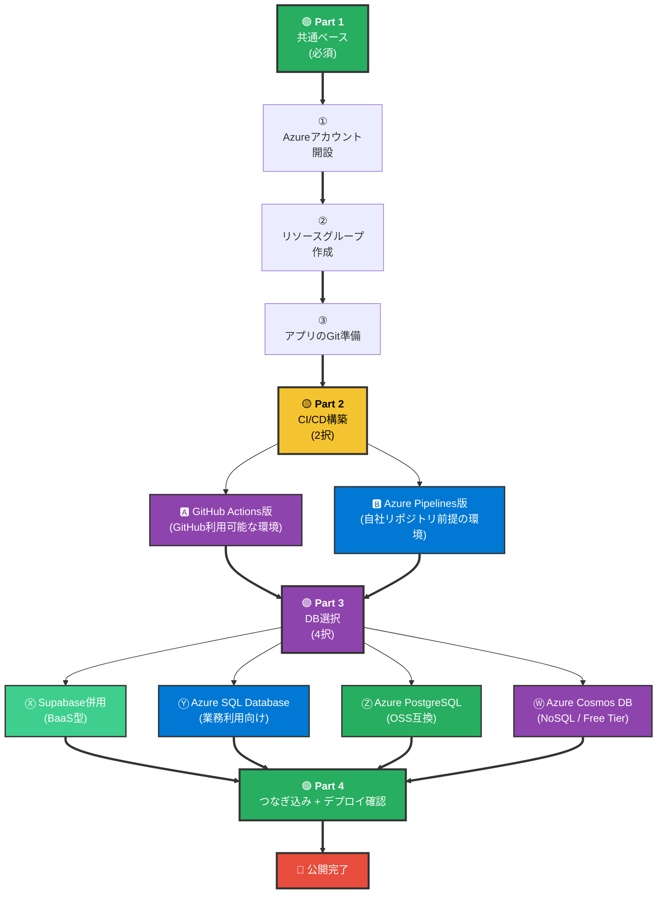

| Part | 内容 | 所要時間 |
| --- | --- | --- |
| 1 | 共通ベース (アカウント・リソースグループ・リポジトリ) | 30〜45分 |
| 2 | CI/CD構築 (GH Actions版 or Pipelines版) | 15〜30分 |
| 3 | DB準備 (Supabase / Azure SQL / PostgreSQL) | 15〜30分 |
| 4 | つなぎ込み + デプロイ確認 | 15分 |

> 📝 **構成例の一つ**: 「Part 1 → 2-A (GH Actions) → 3-X (Supabase) → Part 4」が短時間で公開まで進められる経路。業務利用での要件（閉域 / 監査 など）が必要になれば 2-B / 3-Y に置き換える。

---

# Part 1: 共通ベース

CI/CDやDBの選択肢に関わらず、必ず通る土台。

## 1.1 Azureアカウント開設


**操作の要点:**

| ステップ | やること | 注意 |
| --- | --- | --- |
| ① | シークレット/プライベートウィンドウを開く | 既存Microsoftセッションの干渉を防ぐ |
| ② | `azure.microsoft.com/free` で「無料で始める」 | `portal.azure.com` から行くと詰まりやすい |
| ③ | Microsoftアカウントでサインイン | 個人用アカウントを選ぶ（職場用ではない）|
| ④ | 電話 (SMS or 音声) + クレカで本人確認 | クレカは確認用、課金されない |
| ⑤ | サブスクリプションが自動で作られる | `$200 / 30日` のクレジット付与 |
| ⑥ | Portalで右上ディレクトリ表示を確認 | **Default Directory** になっていればOK |

> 🚨 **テナント切替の罠**: ⑥で「Microsoft Services」などになっていたら、別Microsoftアカウントのセッションが残っている。新しいシークレットウィンドウで②からやり直す。詳しくは [azure.md §3](azure.md) の「テナント切替の罠」参照。

> 🚨 **「Pay-As-You-Goにアップグレード」を押さない**: Portalの随所に出るが、押すと従量課金モードに切替わる。無料試用版のまま使うこと（上限超過時は自動停止）。

## 1.2 リソースグループ作成

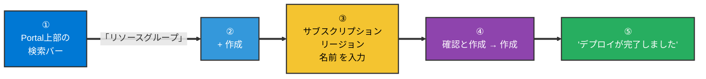

**入力内容:**

| 項目 | 入れる値 |
| --- | --- |
| サブスクリプション | Azure サブスクリプション 1 (自動表示) |
| リソースグループ名 | `rg-my-app` など（自由・英数字とハイフン） |
| リージョン | East Asia (東アジア) または Japan East |

> 📝 リソースグループは**フォルダ**の役割。SWA / DB / Key Vault など、これから作るリソースはすべてこのグループに入れる。**お試しが終わったら「リソースグループ削除」で中身ごと一掃**できる（[azure.md §3](azure.md) 参照）。

## 1.3 アプリの Git 準備

CI/CD の入力になるアプリのコードを Git に置く。

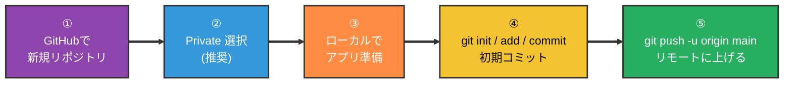

**アプリの選択肢（小さく始める）:**

| 種類 | 中身 | おすすめ |
| --- | --- | --- |
| 静的HTML | `index.html` 1枚 | いちばん躓きにくい |
| Vite + React | `npm create vite@latest` | 5分で雛形が立つ |
| Next.js | `npx create-next-app@latest` | 本格運用に近い |

> 🚨 **`.gitignore` を忘れない**: `.env*` `node_modules/` `.next/` `dist/` などを除外。[git.md §8](../git/git.md) 参照。Supabaseキーなどの秘密情報がリポジトリに乗らないようにする。

> 📝 リポジトリは**Private**で問題なし。Azure SWA は Private リポにも対応していて Free tier の制限も変わらない。詳しくは [azure.md §13](azure.md) 参照。

---

# Part 2: CI/CD構築

GitHub Actions版 (2-A) と Azure Pipelines版 (2-B) のどちらかを選ぶ。

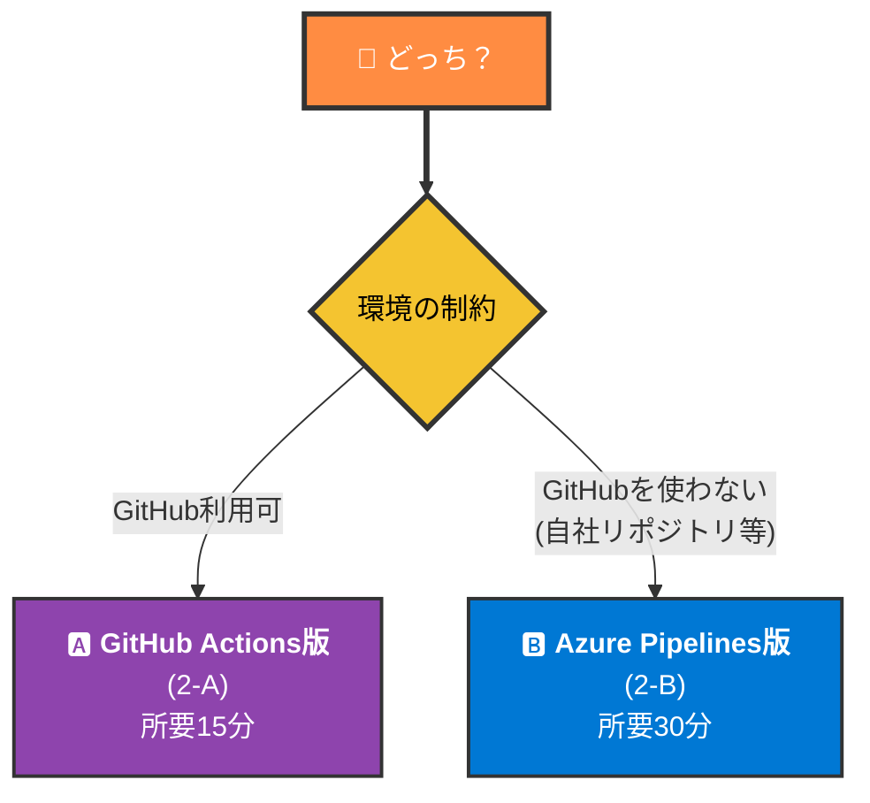

---

## 2-A. GitHub Actions版 (GitHubが利用可能な環境)

Azure SWA を作る際に GitHub 連携を指定すれば、Azure が**ワークフローファイルを自動で commit** する。「Portal で数項目埋めるだけ」で初期構成が完了する形。

```mermaid
flowchart LR
    S1["①<br/>Portalで<br/>'Static Web Apps'検索"] ==> S2["②<br/>+ 作成"]
    S2 ==> S3["③<br/>基本タブ<br/>名前/プラン/リージョン"]
    S3 ==> S4["④<br/>GitHubでサインイン<br/>+ リポジトリ認可"]
    S4 ==> S5["⑤<br/>ビルドプリセット選択<br/>(Next.js / Vite / 静的)"]
    S5 ==> S6["⑥<br/>確認と作成 → 作成<br/>(2〜3分待つ)"]
    S6 ==> S7["⑦<br/>GitHub Actions が<br/>自動起動・初回デプロイ"]
    S7 ==> S8["✅<br/>URL発行<br/>xxxxx.azurestaticapps.net"]

    style S1 fill:#0078D4,color:#FFFFFF,stroke:#333,stroke-width:2px
    style S2 fill:#3498DB,color:#FFFFFF,stroke:#333,stroke-width:2px
    style S3 fill:#F4C430,color:#000,stroke:#333,stroke-width:2px
    style S4 fill:#8E44AD,color:#FFFFFF,stroke:#333,stroke-width:2px
    style S5 fill:#F4C430,color:#000,stroke:#333,stroke-width:2px
    style S6 fill:#16A085,color:#FFFFFF,stroke:#333,stroke-width:2px
    style S7 fill:#E67E22,color:#FFFFFF,stroke:#333,stroke-width:2px
    style S8 fill:#27AE60,color:#FFFFFF,stroke:#333,stroke-width:3px
```

**基本タブの入力内容:**

| 項目 | 入れる値 |
| --- | --- |
| サブスクリプション | Azure サブスクリプション 1 (自動) |
| リソースグループ | `rg-my-app` (Part 1で作ったもの) |
| 名前 | `my-app-swa` など |
| プランの種類 | **Free** ⚠️ Standardを選ばない |
| Azure Functions のリージョン | East Asia |

**GitHub 認可の選び方:**

- 「Authorize Azure-App-Service-Static-Web-Apps」をクリック
- 権限スコープは **「Only select repositories」** を選び、対象リポジトリだけチェック
- 戻ってきたら、組織 / リポジトリ / ブランチ を選ぶ（ブランチは `main`）

**ビルドの詳細:**

| 項目 | 入れる値 |
| --- | --- |
| ビルドのプリセット | `Next.js` / `React` / `Vite` / `Custom` から選ぶ |
| アプリの場所 | `/` (ルート) |
| API の場所 | 空欄 |
| 出力先 | プリセットが自動判定（HTML1枚なら空欄でOK） |

> 🚨 **プリセット誤検出に注意**: Next.js を使っているのに「React」と誤検出されることがある。必ず**ドロップダウンを開いて正しいフレームワークを選ぶ**。React のままだと `build` フォルダを探しに行ってデプロイ失敗する。

**作成後に起きること:**

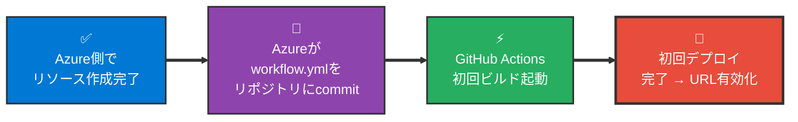

完了後にローカルで `git pull` すると、`.github/workflows/azure-static-web-apps-xxxx.yml` が降ってくる。これが今後の自動ビルド設定。

> 📝 環境変数を渡す必要がある場合（NEXT_PUBLIC_* 等）は、Part 4 でこの YAML を編集する。

---

## 2-B. Azure Pipelines版 (Azure内で完結させる場合)

GitHub を使わない / Azure 内でリポジトリと CI/CD を完結させる場合の手順。**Azure DevOps 組織の作成 → Azure Repos にコード移送 → Pipelines 構築**の3段階。

```mermaid
flowchart LR
    S1["①<br/>dev.azure.com<br/>Organization作成"] ==> S2["②<br/>Project作成<br/>(Reposも自動付帯)"]
    S2 ==> S3["③<br/>ローカルリポを<br/>Azure Reposへpush"]
    S3 ==> S4["④<br/>Portalで<br/>SWA作成<br/>'デプロイのソース: その他'"]
    S4 ==> S5["⑤<br/>deployment token<br/>取得"]
    S5 ==> S6["⑥<br/>azure-pipelines.yml<br/>作成"]
    S6 ==> S7["⑦<br/>Service Connection<br/>+ Variable Group登録"]
    S7 ==> S8["✅<br/>Pipelines実行<br/>→ デプロイ完了"]

    style S1 fill:#0078D4,color:#FFFFFF,stroke:#333,stroke-width:2px
    style S2 fill:#3498DB,color:#FFFFFF,stroke:#333,stroke-width:2px
    style S3 fill:#F4C430,color:#000,stroke:#333,stroke-width:2px
    style S4 fill:#8E44AD,color:#FFFFFF,stroke:#333,stroke-width:2px
    style S5 fill:#E67E22,color:#FFFFFF,stroke:#333,stroke-width:2px
    style S6 fill:#16A085,color:#FFFFFF,stroke:#333,stroke-width:2px
    style S7 fill:#3498DB,color:#FFFFFF,stroke:#333,stroke-width:2px
    style S8 fill:#27AE60,color:#FFFFFF,stroke:#333,stroke-width:3px
```

### Step ① Organization と Project 作成

- `dev.azure.com` にアクセス（Portalと同じMicrosoftアカウントでサインイン）
- 初回は「Create new organization」→ 組織名（例: `my-company`）と地域を選ぶ
- 続けて「New Project」→ プロジェクト名（例: `my-app`）→ Visibility: Private → Create

### Step ② Azure Repos にコード移送

| 状況 | 操作 |
| --- | --- |
| まだ何もリポジトリがない | プロジェクト → Repos → ローカルから `git remote add origin ...` で push |
| GitHub からコピーしたい | プロジェクト → Repos → Import → GitHub URL を貼る |

> 📝 Azure Repos の URL は `https://dev.azure.com/{org}/{project}/_git/{repo}` の形。Personal Access Token (PAT) を発行して認証する。

### Step ③ SWA を「ソースなし」で作る

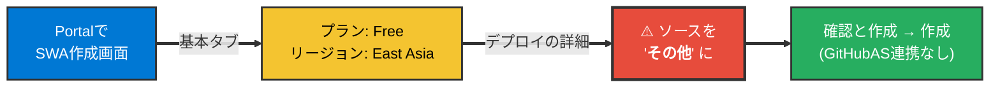

ここで GitHub と紐づけず、**自前の Pipelines からデプロイ**する状態にする。

### Step ④ Deployment Token を取得

- Portal → 作った SWA → 概要 → 右上「**デプロイトークンの管理**」
- 表示されたトークンをコピー（一度しか出ない）

### Step ⑤ azure-pipelines.yml を作る

リポジトリのルートに `azure-pipelines.yml` を作成。最低限の構造:

| 要素 | 役割 |
| --- | --- |
| `trigger:` | どのブランチへの push でビルドするか |
| `pool: vmImage:` | Microsoft-hosted Agent 指定（例: `ubuntu-latest`）|
| `steps:` | npm install → build → デプロイの順 |
| `task: AzureStaticWebApp@0` | Microsoft 公式の SWA デプロイタスク |

> 📝 Microsoft Learn の「Azure Pipelines を使用してデプロイする」ページに公式テンプレートあり。GitHub Actions の `azure-static-web-apps-xxxx.yml` と構造は1対1対応（[azure.md §11.2](azure.md) 参照）。

### Step ⑥ Variable Group に Deployment Token を登録

- Azure DevOps → Pipelines → Library → + Variable group
- 名前: `swa-secrets` など
- 変数追加: `AZURE_STATIC_WEB_APPS_API_TOKEN` = 先ほどのトークン
- 🔒 マークをONにして秘匿化

### Step ⑦ Pipeline 作成と初回実行

- Pipelines → Create Pipeline → Azure Repos Git → 対象リポジトリ
- 既存 YAML を使う → ブランチ `main`、パス `/azure-pipelines.yml`
- Variable group を紐付け
- Run pipeline → ビルド成功 → SWA に反映

> 📝 **閉域ネットワーク要件**で Microsoft-hosted Agent が使えない場合は、Step ⑦ の `pool:` を `pool: name: <自前エージェントプール名>` に変えて、別途 Self-hosted Agent を組織内VMにインストールする。Agent はアウトバウンドのみで Pipelines と通信するためファイアウォールを開ける必要はない（[azure.md §11.3](azure.md) 参照）。

---

# Part 3: DB選択

> 🚨 **DB選択の変更はコードの修正を伴う**: SDK / クエリ言語 / 認証連携が DB ごとに異なるため、後から DB を切り替える場合は**アプリ側のコード書き換え**（SDK 差し替え、クエリ書き直しなど）が必要になる。最初の選択時点で運用シナリオを検討しておくと、後の手戻りを抑えられる。

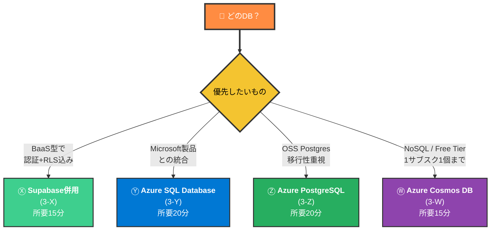

---

## 3-X. Supabase 併用 (BaaS型)

DB + 認証 + Realtime + RLS が一式揃った BaaS。Azure 側に DB を作らずに済むため、**初期セットアップが少ない構成**。

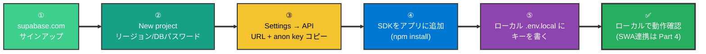

**取得する2つの値:**

| キー | 役割 | 置き場所 |
| --- | --- | --- |
| `NEXT_PUBLIC_SUPABASE_URL` | プロジェクトのURL | フロントOK |
| `NEXT_PUBLIC_SUPABASE_PUBLISHABLE_KEY` (旧 `anon_key`) | 公開可能なAPIキー | フロントOK |

> 🚨 `service_role` キーは**フロントに絶対置かない**。サーバー側専用。[supabase.md §12](../supabase/supabase.md) 参照。

> 📝 テーブル作成・RLS設定など Supabase 側の設計は [supabase.md §4-7](../supabase/supabase.md) 参照。本資料の射程外。

---

## 3-Y. Azure SQL Database (業務利用向け)

Microsoft 製の RDB。SQL Server 系で、他の Microsoft 製品との統合性が高い。

```mermaid
flowchart LR
    S1["①<br/>Portalで<br/>'SQL databases'検索"] ==> S2["②<br/>+ 作成"]
    S2 ==> S3["③<br/>サーバー新規作成<br/>(なければ)"]
    S3 ==> S4["④<br/>認証方法選択<br/>(SQL or Entra)"]
    S4 ==> S5["⑤<br/>サイズ: Basic<br/>(小規模利用)"]
    S5 ==> S6["⑥<br/>ファイアウォール<br/>'Azureサービスを許可'"]
    S6 ==> S7["✅<br/>接続文字列<br/>コピー"]

    style S1 fill:#0078D4,color:#FFFFFF,stroke:#333,stroke-width:2px
    style S2 fill:#3498DB,color:#FFFFFF,stroke:#333,stroke-width:2px
    style S3 fill:#F4C430,color:#000,stroke:#333,stroke-width:2px
    style S4 fill:#8E44AD,color:#FFFFFF,stroke:#333,stroke-width:2px
    style S5 fill:#16A085,color:#FFFFFF,stroke:#333,stroke-width:2px
    style S6 fill:#E67E22,color:#FFFFFF,stroke:#333,stroke-width:2px
    style S7 fill:#27AE60,color:#FFFFFF,stroke:#333,stroke-width:3px
```

**作成時の入力:**

| 項目 | 入れる値 |
| --- | --- |
| リソースグループ | `rg-my-app` |
| データベース名 | `db-my-app` |
| サーバー | 新規作成 → 名前 / 場所 / 管理者ログイン+パスワード |
| 認証方法 | SQL認証 (簡易) / Entra ID 統合 (組織アカウント連携) |
| 価格レベル | **Basic** ($5/月程度) または **無料サービス** (12ヶ月) |
| バックアップ冗長性 | ローカル冗長 (検証/小規模) |

**接続文字列の取得:**

- 作成完了後、DB リソースを開く
- 左メニュー「接続文字列」→ ADO.NET / JDBC / ODBC など言語別タブ
- パスワード部分は `{your_password}` プレースホルダなので、自分の値に置換してメモ

> 🚨 **ファイアウォール設定が必須**: 作成直後はインターネットから繋がらない。サーバーリソース → ネットワーク → 「Azure サービスとリソースにこのサーバーへのアクセスを許可する」 を **オン** にする。これで同じAzure内のSWA / Functionsから接続できる。

> 🚨 **接続文字列に管理者パスワードを直書きしない**: Part 4 で **Key Vault** に保管する形が望ましい。

---

## 3-Z. Azure Database for PostgreSQL (OSS互換)

OSS Postgres そのもの。Supabase など他の Postgres ベースの DB から移行しやすい（SQL方言が同じ）。

```mermaid
flowchart LR
    S1["①<br/>Portalで<br/>'PostgreSQL'検索"] ==> S2["②<br/>+ 作成<br/>'Flexible Server'選択"]
    S2 ==> S3["③<br/>基本情報<br/>(サーバー名/管理者)"]
    S3 ==> S4["④<br/>サイズ: Burstable<br/>(B1ms = 一番小さい)"]
    S4 ==> S5["⑤<br/>ネットワーク<br/>'Azureサービスを許可'"]
    S5 ==> S6["⑥<br/>作成 (5-10分)"]
    S6 ==> S7["✅<br/>接続文字列<br/>コピー"]

    style S1 fill:#0078D4,color:#FFFFFF,stroke:#333,stroke-width:2px
    style S2 fill:#27AE60,color:#FFFFFF,stroke:#333,stroke-width:2px
    style S3 fill:#F4C430,color:#000,stroke:#333,stroke-width:2px
    style S4 fill:#16A085,color:#FFFFFF,stroke:#333,stroke-width:2px
    style S5 fill:#E67E22,color:#FFFFFF,stroke:#333,stroke-width:2px
    style S6 fill:#8E44AD,color:#FFFFFF,stroke:#333,stroke-width:2px
    style S7 fill:#27AE60,color:#FFFFFF,stroke:#333,stroke-width:3px
```

**作成時の入力:**

| 項目 | 入れる値 |
| --- | --- |
| リソースグループ | `rg-my-app` |
| サーバー名 | `pg-my-app` |
| デプロイの種類 | **Flexible server** (推奨) |
| バージョン | 16 (新しい安定版) |
| サイズ | Burstable B1ms (最小プラン・検証/小規模向け) |
| 認証方法 | PostgreSQL 認証のみ / Entra ID 併用 |
| 管理者ユーザー / パスワード | 自分で決める |

> 📝 **「Single Server」は選ばない**: 旧世代で廃止予定。必ず **Flexible Server** を選ぶ。

> 📝 **Supabase からの移行**: Supabase の Dashboard → Database → Backups から dump を取り、Azure PostgreSQL に `pg_restore` で投入できる。スキーマはそのまま利用可能（RLSポリシーは標準Postgresの機能なので移植可能）。

---

## 3-W. Azure Cosmos DB (NoSQL / Free Tier)

Microsoft 製のグローバル分散 NoSQL DB。**1サブスクリプションにつき1個の Free Tier 枠**（1000 RU/s + 25 GB）が永続的に使える。

```mermaid
flowchart LR
    S1["①<br/>Portalで<br/>'Cosmos DB'検索"] ==> S2["②<br/>+ 作成 →<br/>'Cosmos DB for NoSQL'"]
    S2 ==> S3["③<br/>基本情報<br/>(アカウント名/リージョン)"]
    S3 ==> S4["④<br/>ワークロードの種類<br/>(必須・新項目)"]
    S4 ==> S5["⑤<br/>Free レベル割引を<br/>'適用'"]
    S5 ==> S6["⑥<br/>作成 (3-5分)"]
    S6 ==> S7["⑦<br/>データベース<br/>+ コンテナ作成"]
    S7 ==> S8["✅<br/>接続文字列<br/>コピー"]

    style S1 fill:#0078D4,color:#FFFFFF,stroke:#333,stroke-width:2px
    style S2 fill:#8E44AD,color:#FFFFFF,stroke:#333,stroke-width:2px
    style S3 fill:#F4C430,color:#000,stroke:#333,stroke-width:2px
    style S4 fill:#E67E22,color:#FFFFFF,stroke:#333,stroke-width:2px
    style S5 fill:#16A085,color:#FFFFFF,stroke:#333,stroke-width:3px
    style S6 fill:#3498DB,color:#FFFFFF,stroke:#333,stroke-width:2px
    style S7 fill:#F4C430,color:#000,stroke:#333,stroke-width:2px
    style S8 fill:#27AE60,color:#FFFFFF,stroke:#333,stroke-width:3px
```

**作成時の入力:**

| 項目 | 入れる値 |
| --- | --- |
| リソースグループ | `rg-my-app` |
| アカウント名 | `cosmos-my-app` (Azure全体でユニーク・44文字以内・英数小文字) |
| API の種類 | **Azure Cosmos DB for NoSQL** (Free Tier 対象) |
| 場所（リージョン） | Japan East (近場) |
| 容量モード | プロビジョニングされたスループット |
| **Free レベルの割引を適用** | ✅ **適用** （重要） |
| **ワークロードの種類** | 学習 / 開発・テスト / 運用 から選択（**必須項目**） |
| 全体的なバックアップポリシー | Periodic（定期的） |

> 🚨 **Free Tier は 1 サブスクリプションにつき 1 個まで**: 既に別の Cosmos アカウントで Free 枠を使っていると、「適用」がグレーアウトする。Free 枠を使う場合は、不要な Cosmos アカウントを削除してから新規作成する。

> 🚨 **「ワークロードの種類」は必須項目**: Azure が追加した必須項目。空欄のままだと「Basics」タブにエラーが出て先に進めない。学習目的なら「学習」、検証や本番なら「開発・テスト」または「運用」を選ぶ。

> 🚨 **リージョン選択肢が出ない場合**: 新規 Free Trial サブスクリプション直後は、リージョン解放が限定され「EUAP」系（プレビュー用リージョン）しか出ないことがある。EUAP は Cosmos DB では使えないため、**Portal で詰まる**。この場合は本資料末尾の「困ったときの初動」で案内する Azure CLI 経由での作成に切り替える。

### データベースとコンテナの作成

Cosmos DB アカウントができたら、**データベース（論理的なまとまり）**と**コンテナ（テーブル相当）**を順に作成する。

| 階層 | 役割 | 例 |
| --- | --- | --- |
| アカウント | 認証・接続単位 | `cosmos-my-app` |
| データベース | 名前空間 | `myappdb` |
| コンテナ | データの入れ物（テーブル相当） | `items` |
| パーティションキー | 分散のためのキー | `/userId` など |

> 📝 **パーティションキーの設計**は Cosmos DB の性能に直結する。クエリで頻繁に絞る項目（例: `userId`, `tenantId`）を選ぶ。後から変更できないため、初回の選択は慎重に。

### 接続文字列の取得

- 作成完了後、アカウントリソースを開く
- 左メニュー「キー」→ 「PRIMARY CONNECTION STRING」をコピー
- `AccountEndpoint=...;AccountKey=...;` 形式の文字列

> 🚨 接続文字列は実質的に管理者キーと同等。Part 4 で **SWA Configuration** または **Key Vault** に登録し、コードに直接書き込まない。

---

# Part 4: つなぎ込み + デプロイ確認

ここまでで SWA・CI/CD・DB が揃った。**環境変数で繋ぎ込み**、**実際に変更がデプロイされる**ことを確認する。

## 4.1 環境変数の置き場所マトリクス

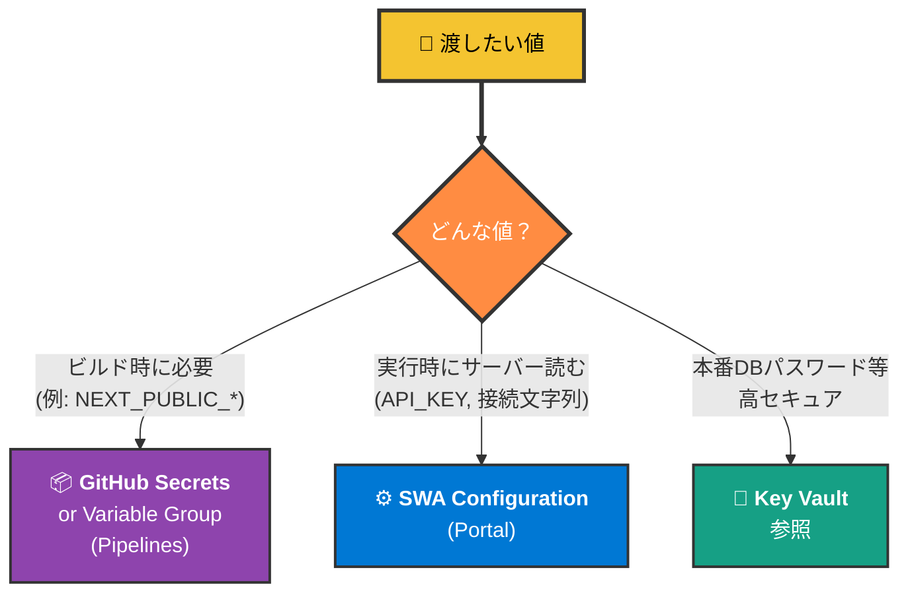

| 値 | 置き場 | 反映タイミング |
| --- | --- | --- |
| `NEXT_PUBLIC_SUPABASE_URL` | GitHub Secrets (or Variable Group) | ビルド時 |
| `NEXT_PUBLIC_SUPABASE_PUBLISHABLE_KEY` | GitHub Secrets (or Variable Group) | ビルド時 |
| `DATABASE_URL` (Azure SQL/PG接続文字列) | SWA Configuration | 実行時 |
| 本番DBパスワード | Key Vault + SWA Configuration から参照 | 実行時 |

詳しい仕組みは [azure.md §10](azure.md) 参照。

## 4.2 GitHub Actions 版でビルド時 env を渡す

Azureが自動生成した `.github/workflows/azure-static-web-apps-xxxx.yml` を編集する。

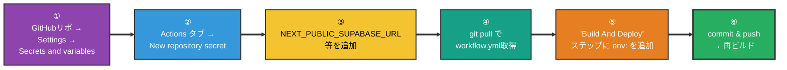

> 🚨 **NEXT_PUBLIC_* の罠（再掲）**: Next.js の `NEXT_PUBLIC_*` 系は**ビルド時にコードへ埋め込まれる**ため、Azure Portal の Configuration（実行時）に入れても効かない。必ず **GitHub Secrets** に登録し、`env:` でビルドステップに渡すこと。

## 4.3 Azure Pipelines 版でビルド時 env を渡す

Pipelines は **Variable Group** を `azure-pipelines.yml` に紐づけて参照する。

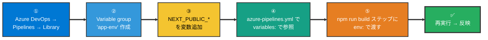

## 4.4 PR で Preview URL を体感する

ここが Vercel ライクな体験を初めて味わうハイライト。

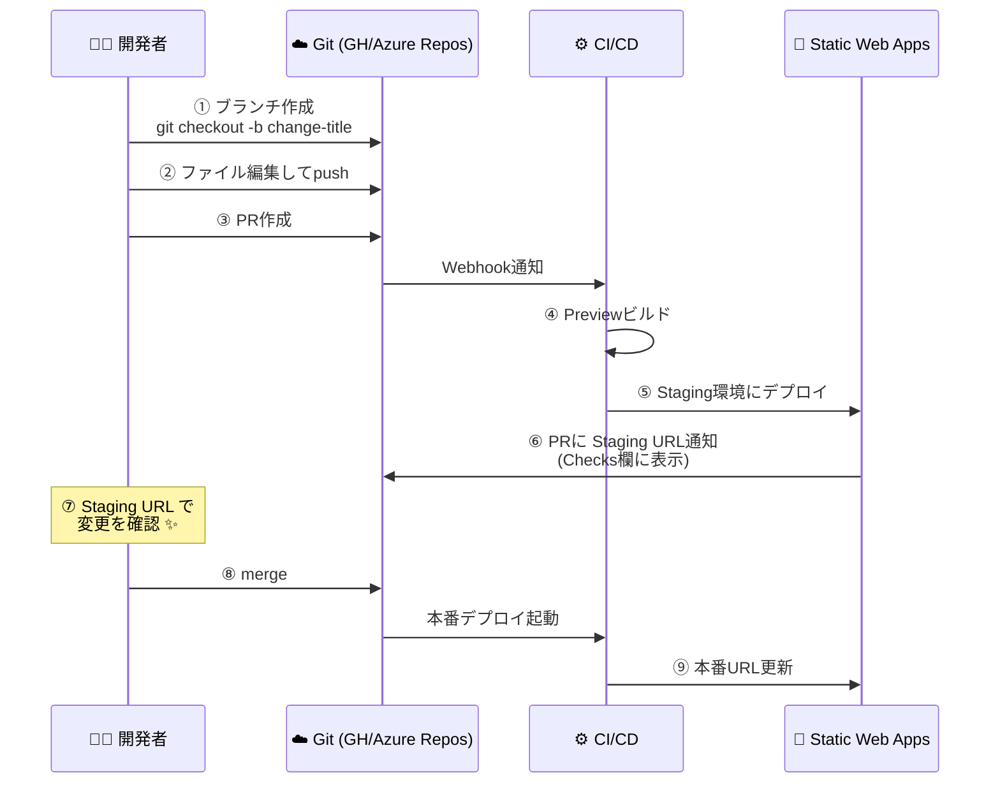

**確認するポイント:**

| 確認 | どこで |
| --- | --- |
| ビルド成功/失敗 | GitHub Actions タブ / Azure DevOps Pipelines |
| Preview/Staging URL | PR の Checks タブ（コメントではなく） |
| デプロイ完了 | Portal → SWA → 環境 (Environments) タブ |
| 本番反映 | 本番URLで F5（キャッシュに注意） |

---

# Part 5: 後片付け / 撤収

検証が終わったら、リソースグループごと削除すると一発で全部消える。

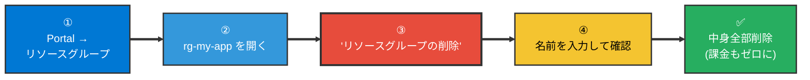

> 📝 **Free tier なら放置しても課金されない**が、何を作ったか忘れがちなので、検証が一段落したら片付ける習慣を。Supabase プロジェクトも同様に Dashboard から削除可。

> 🚨 **GitHub 側のリポジトリ・ワークフローは残る**ので、本番運用しない場合は workflow.yml を消すか、リポジトリ自体をアーカイブする。

---

# 困ったときの初動

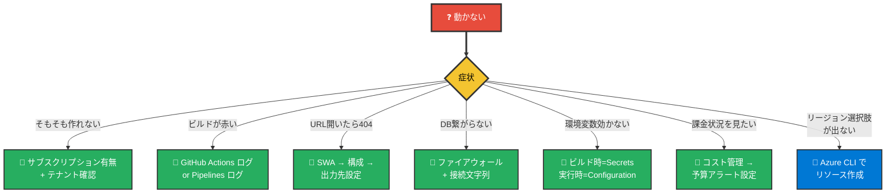

詳しい切り分け表は [azure.md §15](azure.md) 参照。

## 付録: Azure Portal で詰まったら — Azure CLI という選択肢

Azure Portal は GUI で操作できる利点がある一方で、**新規 Free Trial サブスクリプション直後のリージョン制限**や**Portal 側のバリデーションエラー**で詰まることがある。そのような場合、**Azure CLI (`az` コマンド)** を使うと Portal の制約を回避してリソースを作成できることが多い。

```mermaid
flowchart LR
    P["⚠️ Portal で<br/>詰まった"] ==> Q{"症状"}

    Q -->|"リージョン選択肢<br/>に Japan East 等が<br/>出ない"| C1["✅ Azure CLI で<br/>明示指定して作成"]
    Q -->|"特定のフォーム<br/>項目でエラー"| C2["✅ Azure CLI で<br/>該当オプションを指定"]
    Q -->|"複数リソースを<br/>一括作成したい"| C3["✅ Azure CLI を<br/>スクリプト化"]

    style P fill:#E74C3C,color:#FFFFFF,stroke:#333,stroke-width:3px
    style Q fill:#F4C430,color:#000,stroke:#333,stroke-width:3px
    style C1 fill:#0078D4,color:#FFFFFF,stroke:#333,stroke-width:2px
    style C2 fill:#0078D4,color:#FFFFFF,stroke:#333,stroke-width:2px
    style C3 fill:#0078D4,color:#FFFFFF,stroke:#333,stroke-width:2px
```

### Azure CLI の導入と使い方の流れ

```mermaid
flowchart LR
    S1["①<br/>Azure CLI を<br/>インストール<br/>(brew/winget等)"] ==> S2["②<br/>az login<br/>(ブラウザで認証)"]
    S2 ==> S3["③<br/>az ○○ create<br/>(対象リソース作成)"]
    S3 ==> S4["④<br/>az ○○ keys list<br/>等で接続情報取得"]
    S4 ==> S5["✅<br/>Portal にも<br/>作成済みリソースが<br/>表示される"]

    style S1 fill:#0078D4,color:#FFFFFF,stroke:#333,stroke-width:2px
    style S2 fill:#3498DB,color:#FFFFFF,stroke:#333,stroke-width:2px
    style S3 fill:#F4C430,color:#000,stroke:#333,stroke-width:2px
    style S4 fill:#16A085,color:#FFFFFF,stroke:#333,stroke-width:2px
    style S5 fill:#27AE60,color:#FFFFFF,stroke:#333,stroke-width:3px
```

### よくある回避シナリオ

| 症状 | Portal | Azure CLI |
| --- | --- | --- |
| Cosmos DB のリージョン選択肢に Japan East が出ない | × 詰まる | ✅ `--locations regionName=japaneast` で指定可能 |
| Free Trial 直後のリージョン制限 (EUAP系のみ) | × 詰まる | ✅ サポート済みリージョンを直接指定 |
| 必須項目の追加でフォームが弾かれる | × エラー | ✅ コマンドラインオプションで全項目を指定 |
| 同じ構成を別環境に複製したい | △ 手動繰り返し | ✅ スクリプト化で一括作成 |

> 📝 Azure CLI と Portal は**同じバックエンドAPI**を呼んでいるため、CLI で作ったリソースも Portal で確認・編集できる。「CLI で作るとPortalで管理できない」ということはない。インストール手順とコマンドリファレンスは Microsoft Learn の「Azure CLI のインストール」「Azure CLI コマンドリファレンス」を参照。本資料では具体的なコマンドは扱わず、**選択肢の存在**のみ案内する。

---

# 関連資料

- [azure.md](azure.md) — Azure 全体像 (本資料の概念編)
- [vercel.md](../vercel/vercel.md) — 比較対象の PaaS（CI/CD思想が同じ）
- [supabase.md](../supabase/supabase.md) — DB側に Supabase を選ぶ場合の概念
- [git.md](../git/git.md) — ブランチ運用・`.gitignore`・PR フロー
