# Git 全体像

> 📝 本資料の`main`ブランチは、古い呼称では`master`と同じものです。以降`main（master）`と表記します。

---

## 1. 全体の流れ

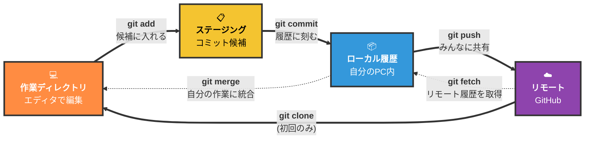

左から右が基本の流れ。commitまでは自分のPCだけ。pushしてはじめて共有される。

> 📝 **`git pull` = `git fetch` + `git merge` のショートカット**
> 普段使うのは `git pull` ひとつでOK。「リモートから最新を取ってきて自分の作業に統合する」動作を一発でやってくれる。

---

## 2. よくある勘違い

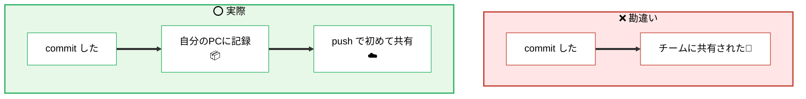

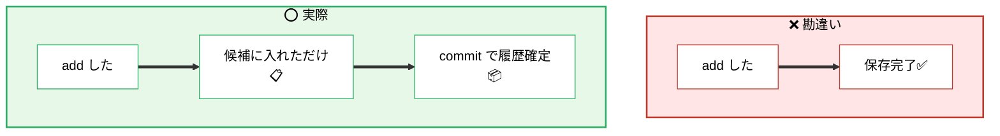

---

## 3. ブランチとマージ

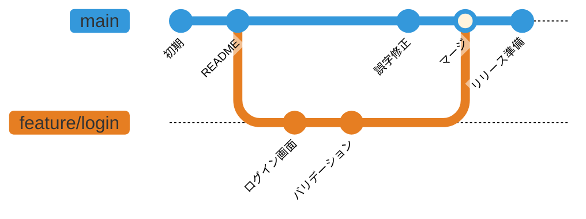

main（master）に影響を与えずに作業するため、機能ごとに枝分かれ（ブランチ）を作る。完成したらmain（master）に合流させる（merge）。

### 実際のコマンド順序

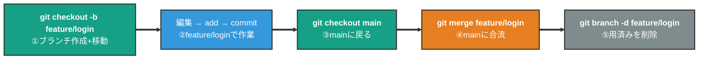

> 📝 §1で見せた「全体の流れ」は4つの**場所**をまたぐコマンド。こちらは`Local Repository`の**内部**でのブランチ操作。

---

## 4. Pull Request フロー

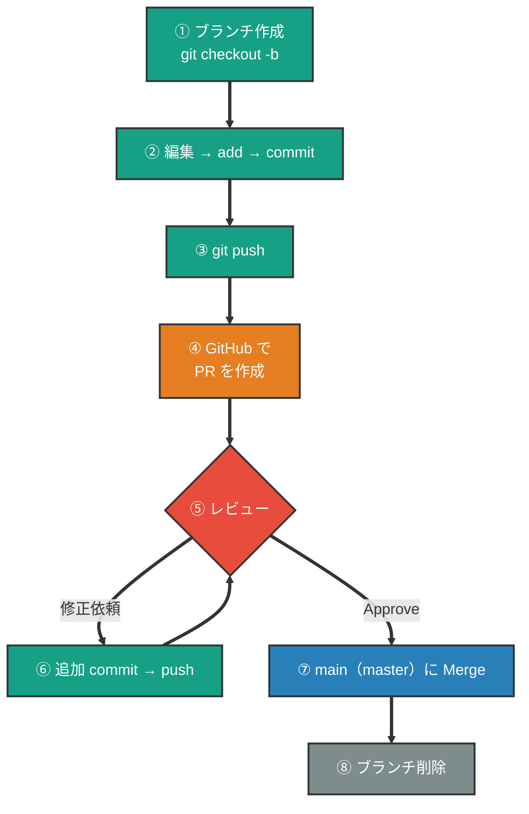

main（master）に直接commitしない。必ずブランチ→PR→レビュー→mergeの流れ。

---

## 5. 迷ったら叩くコマンド

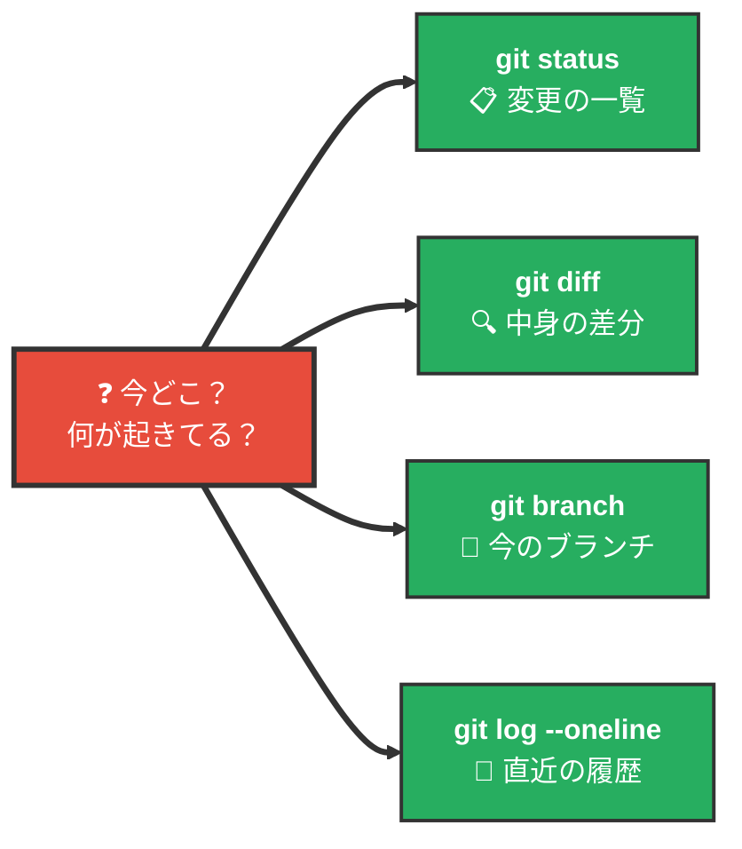

---

## 6. コンフリクト（衝突）の解決

2人が**同じファイルの同じ行**を別々に変えると、Gitは「どっちを残すか決めて」と聞いてくる。これがコンフリクト。

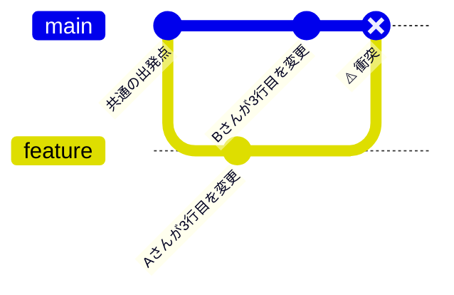

mergeしようとすると、ファイルの中に**マーカー**が差し込まれる:

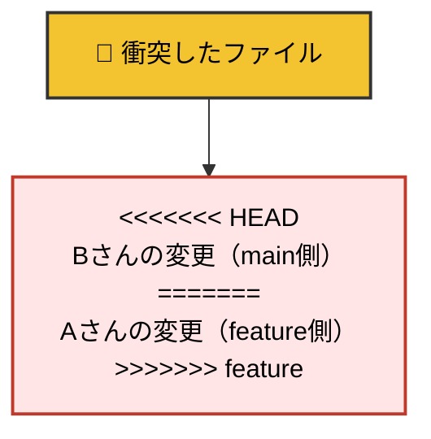

**解決の3ステップ:**

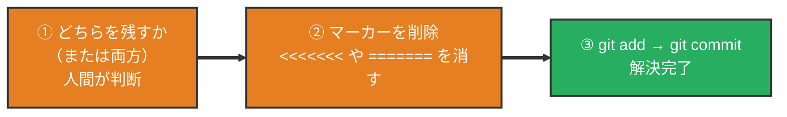

コンフリクトはエラーではなく、**人間に判断を求めているだけ**。怖くない。

---

## 7. やらかした時の戻し方

「どこまで進んだか」で使うコマンドが変わる。

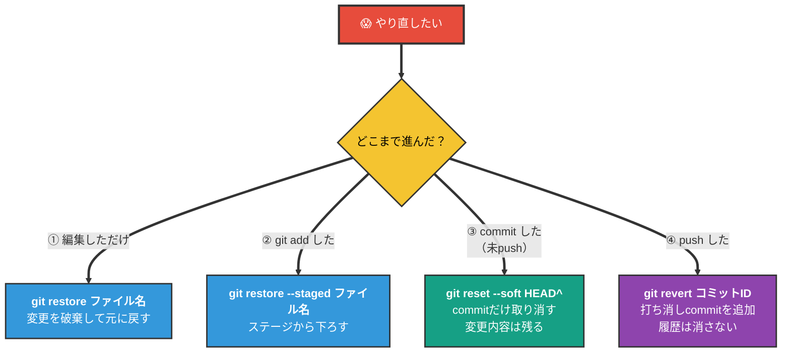

**鉄則:** pushした後は`reset`ではなく`revert`。履歴を書き換えるとチーム全員が死ぬ。

> 📝 補足: `HEAD^`は「今のcommitの1つ前」を指す書き方。`HEAD~2`なら「2つ前」。

---

## 8. .gitignore — 追跡しないファイル

`.gitignore`に書いたファイルは、Gitから見えなくなる（commit対象外）。

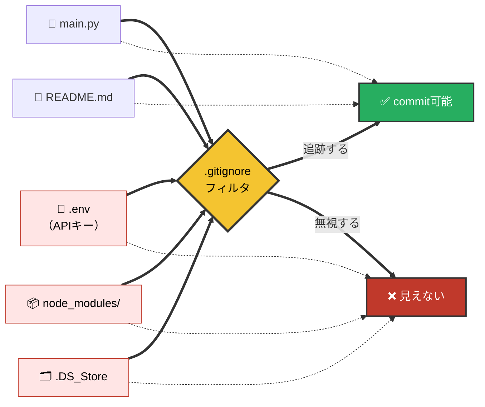

**絶対にcommitしてはいけないもの:**

- 🔐 `.env` / APIキー / パスワード → 漏洩事故の常連
- 📦 `node_modules/` / `venv/` → 巨大で再生成可能
- 🗂 `.DS_Store` / エディター設定 → OS/個人依存のゴミ

このリポジトリの[.gitignore](../../.gitignore)が実例なので見てみよう。

### ⚠️ よくある罠: 「すでに追跡中のファイルは無視できない」

`.gitignore`は**新しく追加されるファイル**にしか効かない。一度commitしてしまったファイルは、後から`.gitignore`に書いても無視されない。

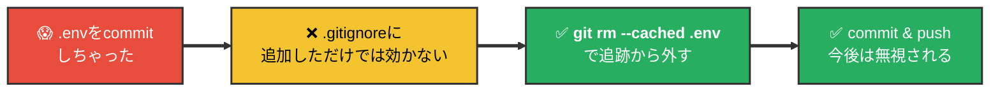

> 🚨 APIキーなどを一度pushしてしまった場合、`git rm --cached`だけでは**過去のコミット履歴には残る**。外部に漏れた可能性があるなら、**そのキーは無効化して再発行**するのが鉄則。

---

## 9. git stash（作業中の変更を一時退避）

**stash**は、作業ディレクトリにある**まだコミットしていない変更**を、いったん**別の場所に退避**する仕組みです。別ブランチに切り替えたいが変更を捨てたくない、急ぎの修正に移りたい、などのときに使います（コミットではないので、履歴には残りません）。

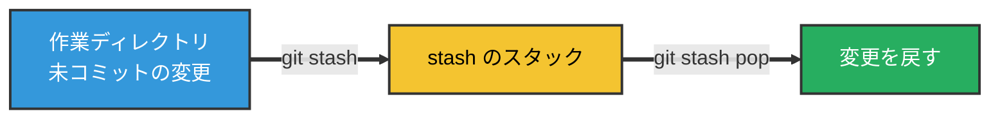

> 📝 イメージは「**机の上の作業を、一旦引き出しにしまう**」感覚。あとで引き出しから取り出して続きを再開できる。

### こんなときに使う（具体例）

#### 例1: 作業中に緊急バグの修正依頼が来た

`feature/login`で開発中、まだコミットできるキリのいい状態じゃない。でも本番でバグが見つかり、急いで`main`で修正したい、という王道シナリオ。

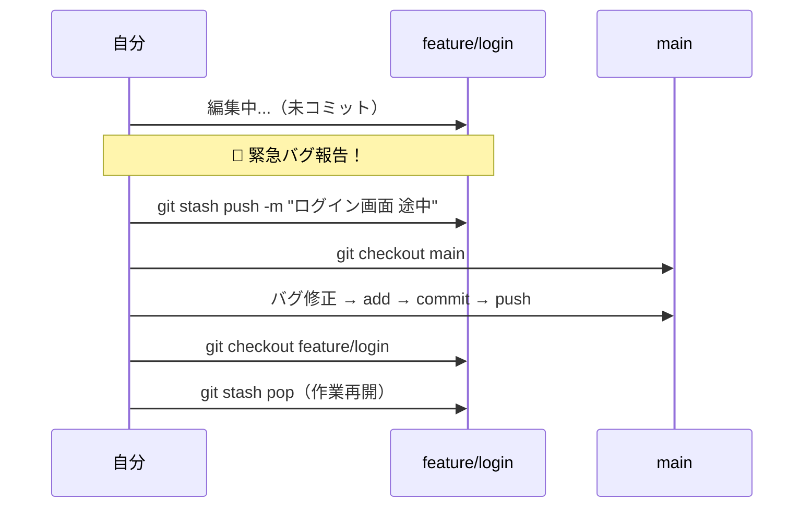

> 💡 commitしてからブランチを移ることもできるが、**「中途半端な状態を履歴に残したくない」**ときにstashが便利。

#### 例2: ブランチを間違えて作業していた

`main`で作業を始めてしまい、コミット直前に「これ`feature`ブランチでやるやつだ…」と気づいたとき。

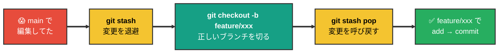

#### 例3: `git pull` したら「変更を確定してくれ」と怒られた

リモートに新しいcommitが入っていて取り込みたいが、ローカルに未コミットの変更があるとpullが拒否されることがある。

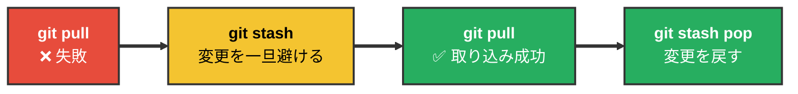

#### 例4: 「この変更を一時的に外した状態」で挙動を確認したい

書きかけのコードを残したまま、**変更前の状態でちゃんと動くか確認したい**ときも便利。

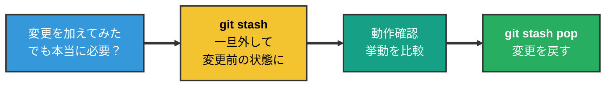

### よく使うコマンド

| コマンド | 説明 |
|---------|------|
| `git stash` | 追跡中ファイルの変更を退避（メッセージは自動） |
| `git stash push -m "メモ"` | メモ付きで退避 |
| `git stash push -u` | **未追跡ファイルも含めて**退避（新規ファイルも一緒に避けたいとき） |
| `git stash list` | 退避一覧を表示 |
| `git stash pop` | いちばん新しい stash を**適用してから削除** |
| `git stash apply` | 適用するが**stash は残す**（同じ内容を複数ブランチに当てたいとき） |
| `git stash drop stash@{n}` | 指定した stash だけ削除 |
| `git stash clear` | stash を**すべて削除**（取り消しにくいので注意） |

### 注意点

- `pop` したブランチによっては**コンフリクト**が出ることがある（退避時と違うコードが入っている場合）。
- stash はローカル向けの退避であり、**`git push` ではリモートに送られない**（チーム共有の仕組みではない）。

---

## 10. 補足: `main` と `master` の違い

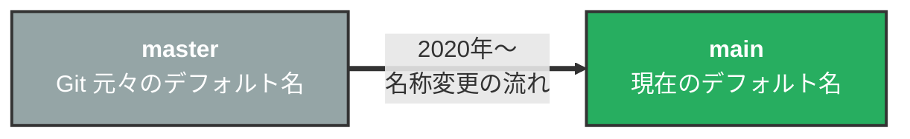

**結論: 技術的には完全に同じもの。名前が違うだけ。**

- Gitのデフォルトブランチ名は元々`master`
- 2020年頃、用語への配慮から業界的に`main`への変更が広がった
- GitHubは2020年10月以降、新規リポジトリのデフォルトが`main`
- 古いチュートリアルでは`master`、最近のものは`main`で書かれている

### 設定方法

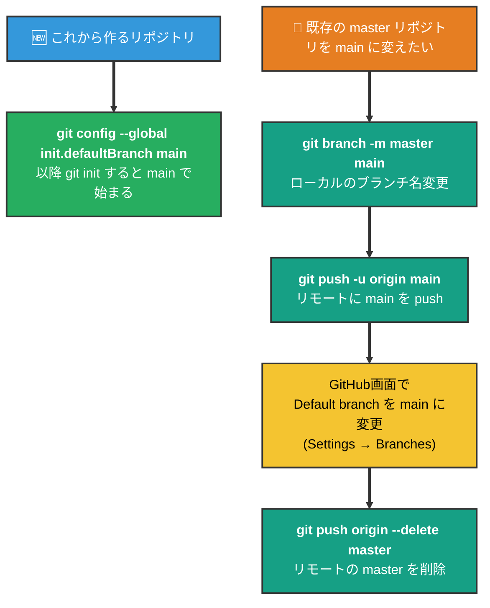

> 📝 現在自分の環境で何がデフォルトか確認: `git config --global init.defaultBranch`
