# Supabase 全体像

> 📝 Supabase は「**バックエンドを丸ごと肩代わりしてくれるサービス**」。データベース・認証・ファイル保管・リアルタイム通信などを、サーバーを建てずに使えるようにする仕組み（BaaS = Backend as a Service）。中身は **PostgreSQL** という伝統的なDB。

---

## 1. Supabaseが提供するもの

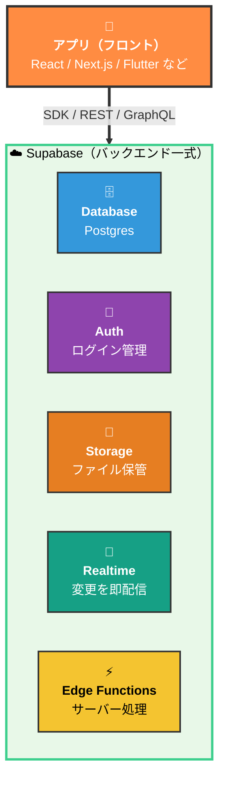

アプリはSupabaseが用意したSDKを呼ぶだけで、サーバーコードを書かなくても「DB読み書き／ログイン／ファイル保存」が動く。

> 📝 中心にあるのは **Postgres**。Auth も Storage も Realtime も、内部的には Postgres のテーブルに紐づいている。「全部Postgresの上に乗っている」と理解すると一気に見通しがよくなる。

---

## 2. よくある勘違い

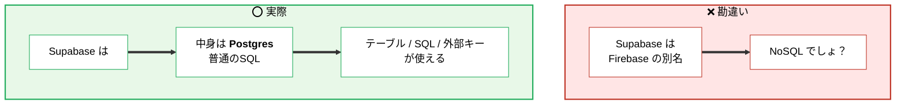

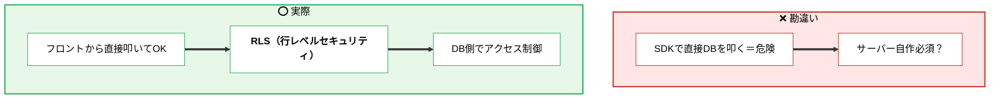

---

## 3. はじめの一歩（Hello World）

概念の話の前に、**5分で手を動かせる流れ**を見ておく。

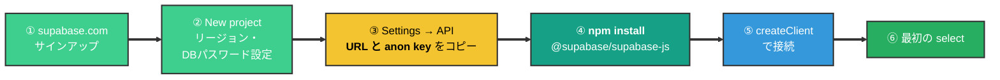

### 接続コード（これがすべての出発点）

```ts
import { createClient } from '@supabase/supabase-js'

const supabase = createClient(
  'https://xxxxxxxx.supabase.co', // ← Project URL
  'eyJhbGciOi...'                  // ← anon key
)

// 最初の読み出し
const { data, error } = await supabase
  .from('posts')
  .select('*')
```

> 📝 `xxxxxxxx` の部分はプロジェクトごとに違う。**URLとanon keyは公開してOK**（後述§12参照）。逆に`service_role` key を貼り付けると終わるので絶対やらない。

### 💸 無料枠（Free tier）の主な制限

| 項目 | 上限 | 詰まったら |
| ---- | ---- | --------- |
| DB容量 | 500MB | 不要データ削除 or Pro($25/月) |
| ストレージ | 1GB | 同上 |
| 認証ユーザー数 | 5万 MAU | 余裕、まず当たらない |
| Edge Functions実行 | 50万回/月 | 大量呼び出しに注意 |
| 非アクティブ | 1週間使わないと一時停止 | ログインで復活 |

> 🚨 個人開発なら無料枠で十分。本番サービスに乗せるなら Pro 以上推奨（バックアップ7日 → 7日以上に伸びる、自動停止なし）。

---

## 4. Database — Postgres と自動API

Supabaseで「テーブルを作る」と、**REST API と GraphQL API が自動で生える**。サーバーコードを書かずに、フロントから読み書きできる。

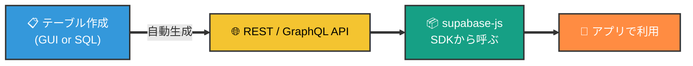

### SDKでの読み書きイメージ

```ts
// 📥 select
const { data } = await supabase
  .from('posts')
  .select('*')
  .eq('user_id', userId)

// 📤 insert
await supabase.from('posts').insert({ title: 'Hi', user_id: userId })

// ✏️ update
await supabase.from('posts').update({ title: 'Hi2' }).eq('id', 1)

// 🗑️ delete
await supabase.from('posts').delete().eq('id', 1)
```

> 📝 内部では [PostgREST](https://postgrest.org/) がテーブル定義からAPIを動的に生成している。**「DBスキーマがそのままAPI仕様になる」**のがSupabaseの肝。

---

## 5. Row Level Security（RLS）— セキュリティの要

フロントから直接DBを叩けるなら、**他人のデータを盗み放題なのでは？** という疑問が出る。これを防ぐのが **RLS**。

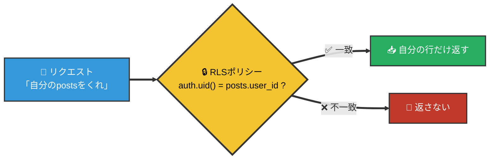

RLSは「**この行を見せていいか／変えていいか**」を**SQLで書くルール**。Postgres本体の機能で、Supabaseが独自に実装したものではない。

### RLSのイメージ（postsテーブル）

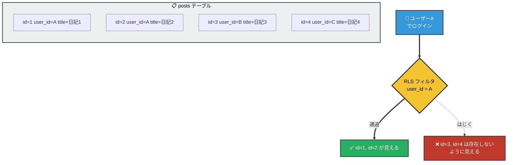

### 実物のSQL — 定番4ポリシー

「**自分の投稿だけ読み書きできる**」を実装する例。コピペで動く。

```sql
-- ① RLSを有効化（これだけだと「全部拒否」状態）
alter table posts enable row level security;

-- ② 読む: 自分の投稿だけ select できる
create policy "Users can read own posts"
  on posts for select
  using ( auth.uid() = user_id );

-- ③ 作る: user_id が自分のものなら insert OK
create policy "Users can insert own posts"
  on posts for insert
  with check ( auth.uid() = user_id );

-- ④ 更新: 自分の投稿だけ update できる
create policy "Users can update own posts"
  on posts for update
  using ( auth.uid() = user_id );

-- ⑤ 削除: 自分の投稿だけ delete できる
create policy "Users can delete own posts"
  on posts for delete
  using ( auth.uid() = user_id );
```

### `using` と `with check` の違い

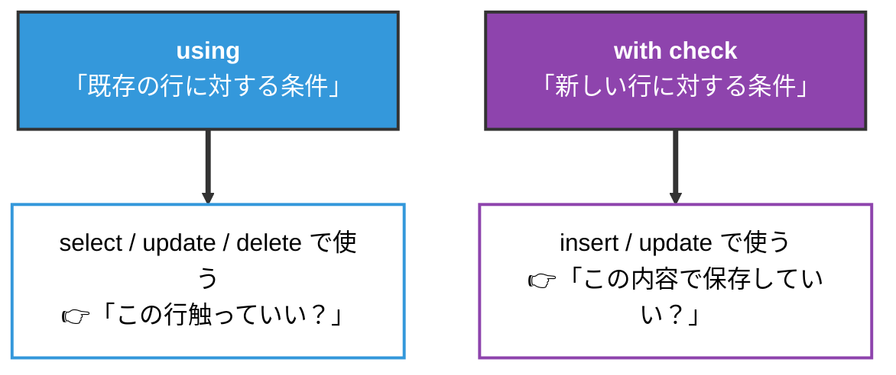

> 📝 update は両方使うことがある（「自分の行だけ更新でき、user_idを他人にすり替えられない」を表現するなら `using = with check`）。

### ⚠️ 鉄則: RLSは「デフォルトで有効化」

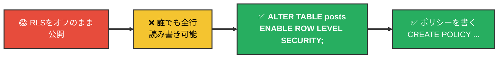

> 🚨 RLSを有効化しただけだと「**何も許可されていない**＝全部拒否」。**ポリシー（CREATE POLICY）を書いて初めて読み書きできる**。Supabaseダッシュボードは「RLS未有効テーブル」を警告してくれる。

---

## 6. Auth — 認証

Supabase Authは、メール／パスワード、Google、GitHub、マジックリンクなど多様なログインを**最初から用意**してくれる。ログインしたユーザーは `auth.users` テーブルに自動で記録される。

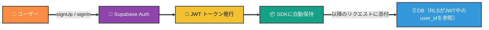

### Auth のコード例

```ts
// サインアップ
await supabase.auth.signUp({ email, password })

// ログイン
await supabase.auth.signInWithPassword({ email, password })

// 現在のユーザー
const { data: { user } } = await supabase.auth.getUser()

// ログアウト
await supabase.auth.signOut()
```

### Auth × RLS の連動

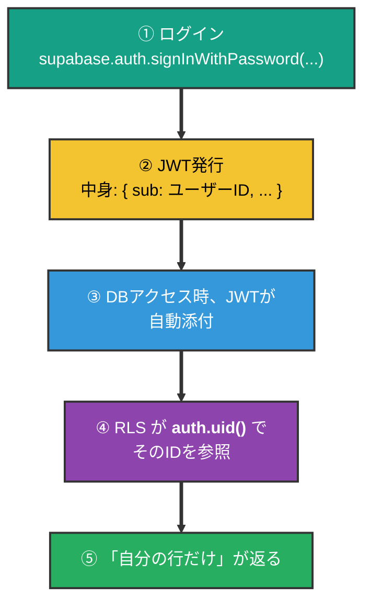

> 📝 RLSポリシーの中で `auth.uid()` と書くと「**今アクセスしてきたユーザーのID**」を取れる。これがAuthとDBをつなぐ橋。

---

## 7. `auth.users` と `public.profiles` — 定番パターン

Supabaseで**みんな最初にハマる**のがこれ。「ユーザー名やアバターをどこに置く？」問題。

### ❌ よくある勘違い

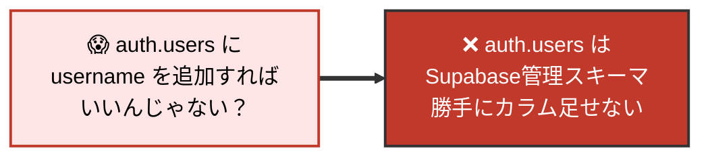

### ⭕ 定番パターン: `public.profiles` を作って外部キーで紐づける

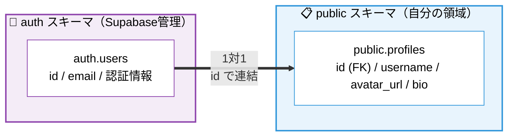

### 実装（コピペで動く）

```sql
-- ① プロフィールテーブルを作る
create table public.profiles (
  id uuid references auth.users on delete cascade primary key,
  username text unique,
  avatar_url text,
  bio text,
  updated_at timestamptz default now()
);

-- ② RLSを有効化 + 「自分のプロフィールだけ編集できる」
alter table public.profiles enable row level security;

create policy "Profiles are viewable by everyone"
  on profiles for select using ( true );

create policy "Users can update own profile"
  on profiles for update using ( auth.uid() = id );

-- ③ サインアップ時、profiles 行を自動作成するトリガー
create function public.handle_new_user()
returns trigger
language plpgsql
security definer set search_path = public
as $$
begin
  insert into public.profiles (id) values (new.id);
  return new;
end;
$$;

create trigger on_auth_user_created
  after insert on auth.users
  for each row execute function public.handle_new_user();
```

### 何が嬉しいの？

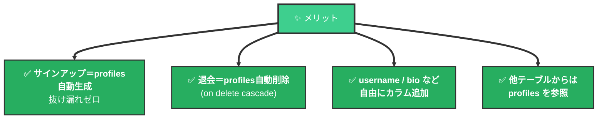

> 📝 公式テンプレートやチュートリアルもほぼ全部このパターン。**「Supabaseの作法」**として覚えてしまうのが早い。

---

## 8. Storage — ファイル保管

画像・動画・PDFなど、DBに入れたくない大きなファイルを置く場所。**バケット（bucket）** 単位で管理する。

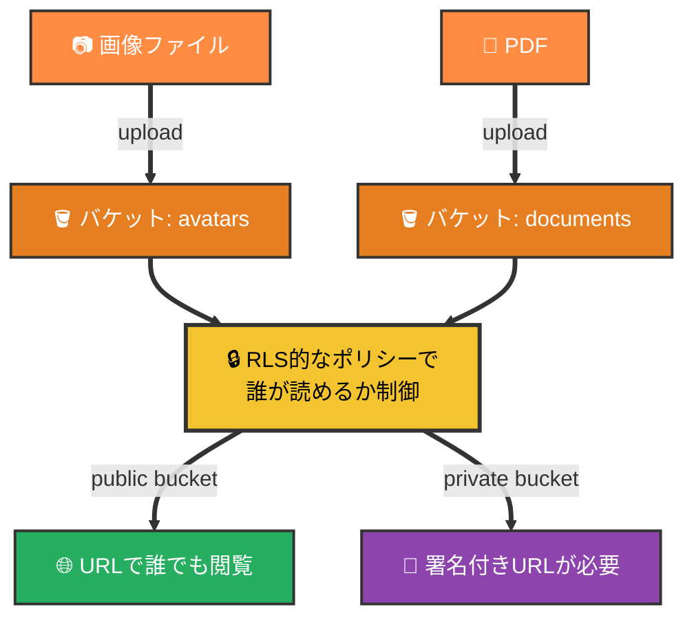

### Storage のコード例

```ts
// アップロード
await supabase.storage
  .from('avatars')
  .upload(`${userId}/avatar.png`, file)

// 公開URLを取得（public バケット）
const { data } = supabase.storage
  .from('avatars')
  .getPublicUrl(`${userId}/avatar.png`)

// 署名付きURL（private バケット, 60秒だけ有効）
const { data } = await supabase.storage
  .from('documents')
  .createSignedUrl(`${userId}/secret.pdf`, 60)
```

> 📝 Storage も内部はPostgresのテーブルでメタデータを持っている。**バケット／オブジェクトに対してRLS的なポリシーが書ける**ので、「自分のアバターは自分しか上書きできない」みたいな制御が同じ発想でできる。

---

## 9. Realtime — 変更を即配信

DBの変更（INSERT/UPDATE/DELETE）を**WebSocketで購読**できる。チャット、共同編集、ダッシュボードなど「即時反映」が必要な用途で使う。

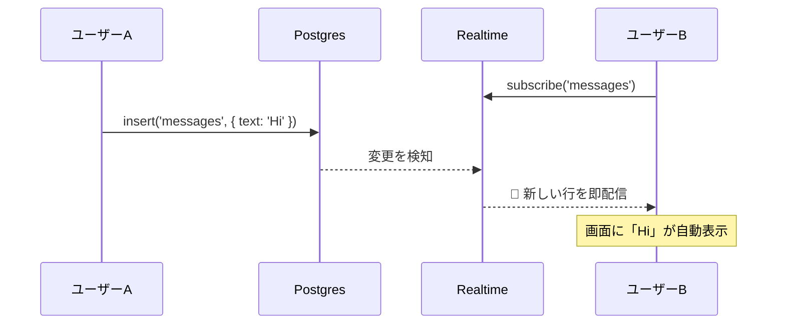

### Realtime のコード例

```ts
const channel = supabase
  .channel('messages-channel')
  .on(
    'postgres_changes',
    { event: 'INSERT', schema: 'public', table: 'messages' },
    (payload) => {
      console.log('新着:', payload.new)
    }
  )
  .subscribe()

// 解除
await supabase.removeChannel(channel)
```

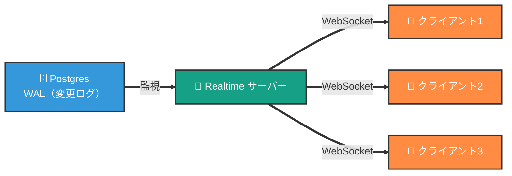

> 📝 仕組み的には Postgres の **論理レプリケーション（WAL）** を読んで配信している。テーブルごとに「Realtime対象にするか」を Dashboard で有効化して使う。

---

## 10. Edge Functions — サーバー処理を書きたいとき

「外部APIを叩く」「決済の確定処理」「Webhookを受ける」など、**フロントに置きたくないロジック**はEdge Functions（Deno製）で書ける。

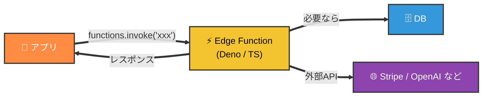

### コード例（hello function）

```ts
// supabase/functions/hello/index.ts
Deno.serve(async (req) => {
  const { name } = await req.json()
  return new Response(
    JSON.stringify({ message: `Hello ${name}!` }),
    { headers: { 'Content-Type': 'application/json' } }
  )
})
```

```ts
// フロントから呼ぶ
const { data } = await supabase.functions.invoke('hello', {
  body: { name: 'Taro' },
})
```

### いつ Edge Functions を使う？

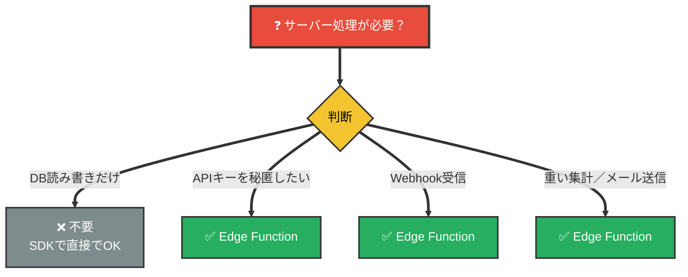

---

## 11. ローカル開発と Migration（CLI）

Supabaseは**ローカルで丸ごと動かせる**（Docker）。本番DBと同じ構造を手元で再現し、スキーマ変更をマイグレーションファイルとしてGitで管理する。

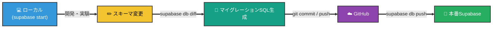

### よく使うCLIコマンド

| コマンド | 説明 |
| -------- | ---- |
| `supabase init` | プロジェクトに `supabase/` フォルダーを作成 |
| `supabase start` | ローカルでDB・Auth・StorageをDocker起動 |
| `supabase stop` | ローカル環境を停止 |
| `supabase db diff -f 名前` | 現在のスキーマ差分をマイグレーションSQLに書き出す |
| `supabase db reset` | ローカルDBを初期化し、マイグレーションを再適用 |
| `supabase link --project-ref xxx` | リモートプロジェクトと紐付け |
| `supabase db push` | ローカルのマイグレーションを本番に適用 |
| `supabase gen types typescript` | DBスキーマからTypeScript型を生成 |

> 📝 イメージは [git.md](../git/git.md) と同じ。**ローカルで作って → 差分を記録 → リモートに反映**。コードだけでなく**DBスキーマもGit管理**するのがモダンな運用。

---

## 12. APIキーの種類 — anon と service_role

Supabaseは2種類のAPIキーを発行する。**取り違えると事故になる**ので最重要ポイント。

```mermaid
flowchart TB
    K1["🔑 <b>anon key</b><br/>公開キー"] ==> U1["📱 フロントエンドに置いてOK<br/>(RLSで守られているため)"]
    K2["🔑 <b>service_role key</b><br/>管理者キー"] ==> U2["🖥️ サーバー側のみ<br/><b>RLSを完全に無視</b>する"]

    U2 ==> W["⚠️ フロントに置いたら<br/>全データ漏洩"]

    style K1 fill:#27AE60,color:#FFFFFF,stroke:#333,stroke-width:2px
    style K2 fill:#E74C3C,color:#FFFFFF,stroke:#333,stroke-width:2px
    style U1 fill:#3498DB,color:#FFFFFF,stroke:#333,stroke-width:2px
    style U2 fill:#F4C430,color:#000,stroke:#333,stroke-width:2px
    style W fill:#C0392B,color:#FFFFFF,stroke:#333,stroke-width:3px
```

### 鉄則

```mermaid
flowchart LR
    R1["✅ anon key"] ==> R1A["フロント / public OK"]
    R2["❌ service_role key"] ==> R2A["絶対に .env で<br/>サーバー側だけ"]

    style R1 fill:#27AE60,color:#FFFFFF,stroke:#333,stroke-width:2px
    style R1A fill:#fff,color:#000,stroke:#27AE60,stroke-width:2px
    style R2 fill:#C0392B,color:#FFFFFF,stroke:#333,stroke-width:2px
    style R2A fill:#fff,color:#000,stroke:#C0392B,stroke-width:2px
```

> 🚨 `service_role` を Git にcommitしてしまったら、**そのキーは即座に Supabase ダッシュボードで再発行**。漏れたキーは取り戻せない。[git.md](../git/git.md) §8の `.gitignore` の話とセットで覚える。

---

## 13. 迷ったらどこを見る？

```mermaid
flowchart LR
    Q["❓ 困った"] ==> S["<b>Dashboard → Table Editor</b><br/>📋 データを直接確認"]
    Q ==> D["<b>Dashboard → SQL Editor</b><br/>🔍 SQLを叩いて検証"]
    Q ==> L["<b>Dashboard → Logs</b><br/>📜 API / Auth / Postgresのログ"]
    Q ==> A["<b>Dashboard → Authentication → Policies</b><br/>🔐 RLSポリシーを確認"]

    style Q fill:#E74C3C,color:#FFFFFF,stroke:#333,stroke-width:3px
    style S fill:#27AE60,color:#FFFFFF,stroke:#333,stroke-width:2px
    style D fill:#27AE60,color:#FFFFFF,stroke:#333,stroke-width:2px
    style L fill:#27AE60,color:#FFFFFF,stroke:#333,stroke-width:2px
    style A fill:#27AE60,color:#FFFFFF,stroke:#333,stroke-width:2px
```

「データが取れない」のほとんどは**RLSポリシー不足**。まずPoliciesを疑う。

---

## 14. 補足: Firebase との違い

```mermaid
flowchart TB
    subgraph FB["🔥 Firebase"]
        direction TB
        FB1["Firestore（NoSQL）"]
        FB2["独自のクエリ言語"]
        FB3["ベンダーロック強め"]
    end

    subgraph SP["⚡ Supabase"]
        direction TB
        SP1["Postgres（SQL）"]
        SP2["標準SQL / SQLが書ける"]
        SP3["OSS / セルフホスト可"]
    end

    style FB fill:#FFF4E5,stroke:#E67E22,stroke-width:2px,color:#000
    style SP fill:#E8F8E8,stroke:#3ECF8E,stroke-width:2px,color:#000
    style FB1 fill:#fff,color:#000,stroke:#E67E22
    style FB2 fill:#fff,color:#000,stroke:#E67E22
    style FB3 fill:#fff,color:#000,stroke:#E67E22
    style SP1 fill:#fff,color:#000,stroke:#3ECF8E
    style SP2 fill:#fff,color:#000,stroke:#3ECF8E
    style SP3 fill:#fff,color:#000,stroke:#3ECF8E
```

**結論: 「Firebaseの代替」と言われがちだが、思想は別物。**

- Firebase: NoSQLとリアルタイムが主役、独自エコシステム
- Supabase: 伝統的なSQL（Postgres）にBaaSの皮を被せたもの
- 「将来データをエクスポートして他のPostgresに引っ越し」も普通にできる
- 既存のSQL知識・PostgresのナレッジがそのままSupabaseに通用する

> 📝 「**Postgres 1個に、Auth/Storage/Realtime/Functions を全部生やしたもの**」というのが一番しっくりくる説明。
